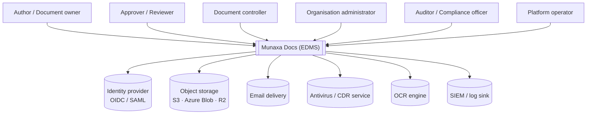
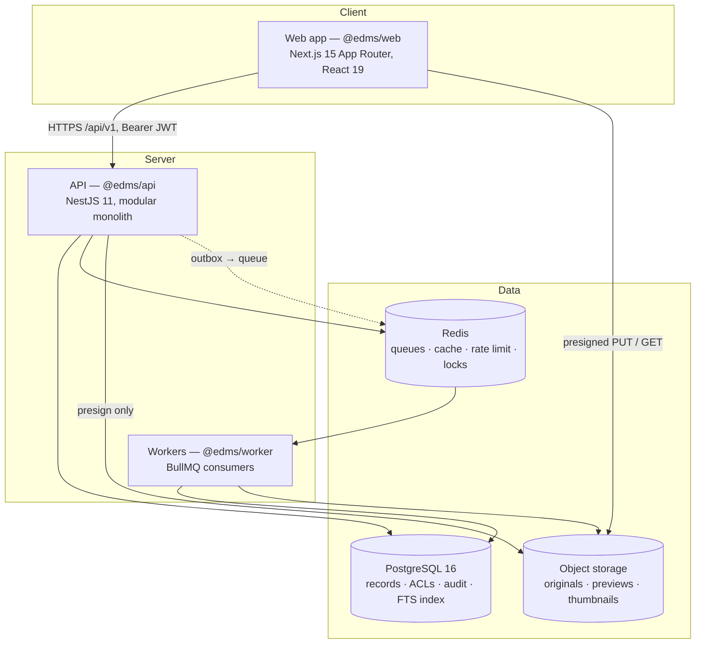
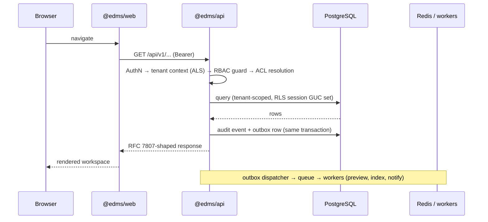

# 00 — System Architecture

**Purpose:** the system at a glance — who uses it, what it talks to, what it is made of.
**Audience:** new joiners, architects, reviewers. Read this first.

## 1. What the system is

Munaxa Docs is a multi-tenant EDMS. A customer organisation subscribes as a **tenant**; inside it,
**companies, entities, branches and departments** own **libraries** and **folders** that contain
**controlled documents**. Every document has an identity, a controlled number, a lifecycle, a chain
of approvals, an ordered set of revisions, and an immutable audit history.

**In scope for the product:** document control, approval workflow, revision control, numbering,
retention, preview, search, audit, reporting, notification, delegation.

**Out of scope, deliberately:** real-time co-authoring, an office editor, a chat product, a
DAM/media library, an LMS. Editing happens in the user's own tools; Munaxa Docs controls the
document around the file.

## 2. Context (C4 level 1)

Every external system is reached through a **port** defined by the application layer, so each one
is replaceable — see [02](./02-backend-architecture.md).

## 3. Containers (C4 level 2)

| Container | Technology | Responsibility |
| --- | --- | --- |
| `@edms/web` | Next.js 15 (App Router), React 19, Tailwind v4, `@axa/platform` | The document workspace. Server components for reads, route handlers for session cookies |
| `@edms/api` | NestJS 11, Prisma 6, PostgreSQL | Every business rule, every permission decision, every audit write |
| `@edms/worker` | NestJS standalone + BullMQ | Preview rendering, OCR, index projection, retention purge, escalation timers, notification delivery |
| PostgreSQL 16 | Managed Postgres | Single source of truth. Tenant-scoped rows, RLS backstop, `tsvector` search index |
| Redis 7 | Managed Redis | Job queues, delayed jobs (deadlines, reminders), cache, distributed locks, rate limiting |
| Object storage | S3 / Azure Blob / R2 / local (dev) | Immutable, content-addressed blobs. The database never stores bytes |

**Bytes never pass through the API.** Upload and download are presigned, direct to storage; the API
issues short-lived, permission-checked URLs and records the transfer. See
[11](./11-storage-architecture.md).

## 4. Request path

## 5. Technology choices and why

| Choice | Why | Alternative rejected |
| --- | --- | --- |
| Modular monolith, not microservices | One transaction spans document + revision + number + audit. Distributed transactions would be the dominant cost of every feature | Service-per-domain — revisit only if a single module's load profile diverges |
| PostgreSQL for records **and** first-generation search | One store to back up, one consistency model; `tsvector` + GIN carries the first millions of documents | A search cluster on day one — added later behind the port ([ADR-0008](./adr/0008-postgres-first-search.md)) |
| Object storage for bytes | Cheap, durable, presignable, lifecycle-tiered | Bytes in Postgres — kills backup and replication |
| Redis + BullMQ | Delayed jobs give approval deadlines, reminders and escalation for free | Cron polling — imprecise and unscalable |
| Reuse `@axa/platform` for all UI | Repository law; the `docs` theme is already authored | A product-local component library |

## 6. Non-functional targets

| Attribute | Target |
| --- | --- |
| Scale | 10M documents, 50M revisions, 10k users, 500 concurrent per tenant |
| Latency | p95 < 300 ms for record reads, < 800 ms for search, < 150 ms for presign |
| Availability | 99.9% monthly for the API; storage inherits the provider's SLA |
| Durability | RPO ≤ 15 min, RTO ≤ 4 h ([20](./20-deployment-architecture.md)) |
| Compliance | Complete, tamper-evident audit trail; configurable retention and legal hold |
| Accessibility | WCAG 2.2 AA at merge time, EN + AR with full RTL |

Detail: [19](./19-performance-and-scalability.md).
