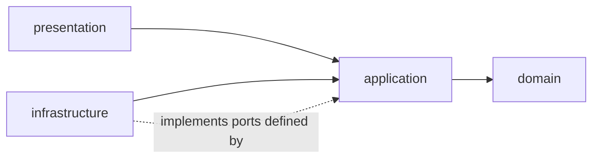

# 01 — Monorepo & Folder Structure

**Purpose:** where every file goes, and the rules that decide it.
**Audience:** every engineer; read before creating any file.

## 1. Position in the repository

Munaxa Docs is a **peer product** of School and Work. Each is its own repository, and each
consumes the shared platform from the registry as a versioned dependency.

```text
                    munaxa-platform          @munaxa/* — shared, frozen, product-agnostic
                           │
        ┌──────────┬───────┴───────┬──────────┐
        ▼          ▼               ▼          ▼
     munaxa   munaxa-school   munaxa-work  munaxa-docs   ← this product
```

The dependency law is absolute: **Munaxa Docs may import `@munaxa/*` and its own packages, and
nothing else in the ecosystem.** No `@school/*` import, ever — not a type, not a helper, not a
permission constant. Repository separation now makes that structurally impossible rather than
merely forbidden, and CI's `boundaries` job fails the build on any attempt. Where School solved
the same problem well, the *pattern* is copied by reading it; the *code* is written fresh here.

> **Historical note.** This document was written when all products shared one monorepo and Docs
> lived at `edms/`. That product root is now this repository's root; [ADR-0001's](./adr/0001-product-root-placement.md)
> `edms/` vs `docs/` question is moot, since there is no longer a sibling documentation index to
> collide with. The dependency rules below are unchanged — the separation strengthens them.

## 2. Product layout

```text
edms/
├── apps/
│   ├── api/                    @edms/api      — NestJS 11
│   ├── web/                    @edms/web      — Next.js 15
│   └── worker/                 @edms/worker   — BullMQ consumers
├── packages/
│   ├── domain/                 @edms/domain    — permissions, roles, enums, pure rules
│   ├── contracts/              @edms/contracts — shared request/response schemas
│   ├── i18n/                   @edms/i18n      — EN + AR catalogues
│   └── utils/                  @edms/utils     — pure helpers
├── prisma/
│   ├── schema.prisma
│   ├── migrations/
│   └── seed.ts
├── infra/                      compose fragments, storage + search bootstrap, load tests
└── docs/                       this design set
```

Registering the product (Phase 0.5) means adding `edms/apps/*` and `edms/packages/*` to
[`pnpm-workspace.yaml`](../../pnpm-workspace.yaml), adding project references to the root
`tsconfig.json`, and letting turbo pick the tasks up from each package's `package.json`. No root
script becomes School-specific or Docs-specific: `pnpm build`, `pnpm lint`, `pnpm typecheck`,
`pnpm test` continue to mean "everything".

> The root `prisma.schema` key in the root `package.json` currently points at School's schema. Docs
> owns its own schema and its own `prisma:*` scripts inside `@edms/api`; the root shortcut stays
> School's until it is made product-explicit — recorded in
> [technical debt](../reports/technical-debt.md).

## 3. Backend layout — one shape for every module

Every domain module has the same four layers and the same folder names. Sameness is the point: a
reviewer should not have to learn a module to review it.

```text
edms/apps/api/src/
├── main.ts
├── app.module.ts
├── core/                       cross-cutting, imported by every module
│   ├── auth/                   authentication, session, token verification
│   ├── tenancy/                tenant context (ALS), isolation guard, Prisma extension
│   ├── authorization/          RBAC guard, ACL resolver, permission decorators
│   ├── audit/                  audit writer, hash chain, interceptor
│   ├── outbox/                 transactional outbox writer + dispatcher
│   ├── config/                 typed configuration, validation at boot
│   ├── errors/                 RFC 7807 mapping, domain error base classes
│   ├── observability/          logging, tracing, metrics, health
│   └── prisma/                 Prisma module and client extensions
├── shared/                     pure helpers with no module ownership
├── ports/                      interfaces implemented by infrastructure adapters
│   ├── storage.port.ts
│   ├── search.port.ts
│   ├── ocr.port.ts
│   ├── preview.port.ts
│   ├── notification.port.ts
│   ├── antivirus.port.ts
│   └── clock.port.ts
├── infrastructure/             adapters: s3/, azure/, r2/, local/, postgres-search/, tesseract/, …
└── modules/
    ├── identity/
    ├── organization/
    ├── administration/
    ├── library/
    ├── document/
    ├── revision/
    ├── workflow/
    ├── storage/
    ├── preview/
    ├── search/
    ├── audit/
    ├── notification/
    ├── retention/
    ├── reporting/
    └── dashboard/
```

### Module standard

```text
modules/<module>/
├── <module>.module.ts
├── domain/                 entities, value objects, domain events, pure rules — no Nest, no Prisma
├── application/            use cases, port interfaces this module defines, transaction scripts
├── infrastructure/         repository implementations (Prisma), adapters
├── presentation/           controllers, DTOs, validation, OpenAPI decorators, view mappers
└── __tests__/              unit tests for domain and application; integration tests for repos
```

**The dependency rule points inward.**



| Layer | May import | May never import |
| --- | --- | --- |
| `domain` | `@edms/domain`, `@edms/utils` | Nest, Prisma, HTTP, any other module |
| `application` | own `domain`, ports, `@edms/contracts` | Prisma, Express, any adapter |
| `infrastructure` | own `application` ports, Prisma, SDKs | another module's internals |
| `presentation` | own `application`, `@edms/contracts` | Prisma, another module's `application` |

**Cross-module calls go through the owning module's application service or a domain event — never
into another module's repository or Prisma model.** Modules that need each other's data at read
time use a read model owned by the consumer ([12](./12-search-architecture.md),
[19](./19-performance-and-scalability.md)).

Circular module dependencies are prohibited and are enforced by the import-boundary lint rule added
in Phase 0.5. The dependency direction between modules is fixed in [03](./03-domain-model.md).

## 4. Frontend layout

```text
edms/apps/web/src/
├── app/
│   ├── (auth)/                 login, forgot password, MFA challenge
│   ├── (workspace)/            the authenticated shell
│   │   ├── libraries/[libraryId]/folders/[folderId]/
│   │   ├── documents/[documentId]/   overview · revisions · approvals · permissions · audit
│   │   ├── inbox/              my approval tasks, my delegations
│   │   ├── search/
│   │   ├── admin/              settings, numbering rules, document types, workflows, roles
│   │   └── reports/
│   └── api/                    route handlers: session cookie exchange only
├── features/<feature>/         components, hooks, queries, schemas for one feature
├── lib/                        api client, auth, query client, permission helpers
└── styles/globals.css          imports the platform `docs` theme
```

Rules: no app-local re-export barrel over `@munaxa/ui`; every user-visible string comes from
`@edms/i18n`; every screen is assembled from platform components plus this product's domain
components. Detail: [16](./16-frontend-architecture.md).

## 5. Placement decision procedure

```text
Is it true for every AXA product, with no business vocabulary?  → platform/, via platform/CONTRIBUTING.md
Does it encode a Munaxa Docs business rule?                      → the owning module's domain/
Is it an external system's specifics (SDK, wire format)?         → infrastructure/, behind a port
Is it needed by API and web both, as a shape?                    → packages/contracts
Is it a permission, role or enum?                                → packages/domain
Is it a pure helper with no domain meaning?                      → packages/utils
Does exactly one screen need it?                                 → that feature folder
```

When two modules need the same rule, the rule belongs to the module that **owns the concept**, and
the other calls it. Copying it is the failure this structure exists to prevent.
