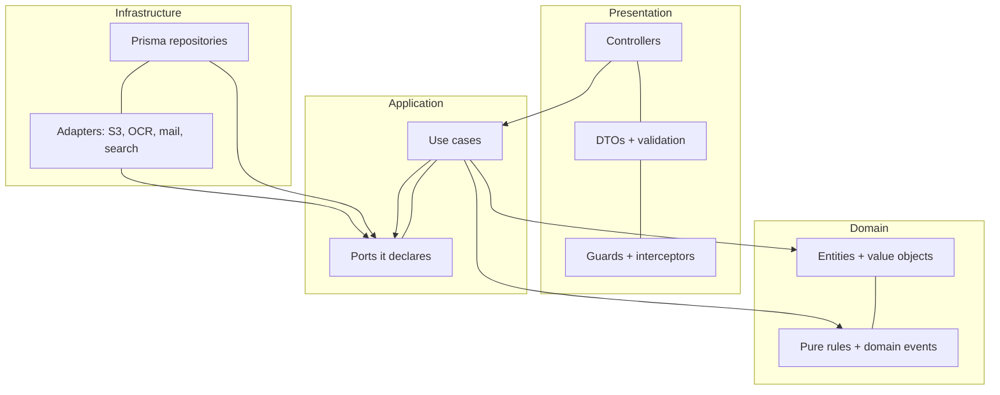
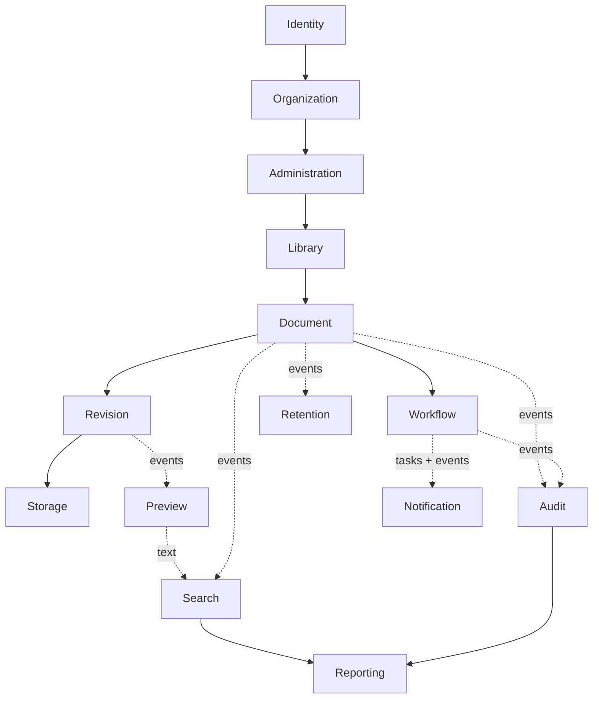
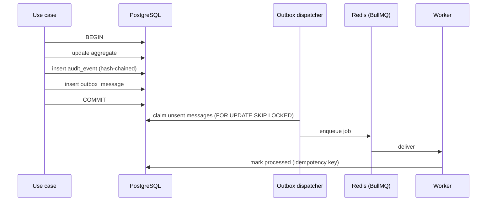

# 02 — Backend Architecture

**Purpose:** how the API is built — layers, modules, ports, dependency injection, transactions.
**Audience:** backend engineers. Read with [01](./01-monorepo-and-folder-structure.md).

## 1. Shape: a modular monolith

One deployable API process, one database, many strictly separated modules. A single user action —
approve a document, assign its number, freeze its revision, write its audit event, enqueue its
notification — is one database transaction. That property is worth more than independent
deployability at this scale, and it is the reason microservices are rejected for now.

The module boundaries are drawn so that a future extraction is mechanical: modules never share
tables they do not own, and never call each other's repositories.

## 2. Clean Architecture layers



| Layer | Responsibility | Must not |
| --- | --- | --- |
| Controllers | HTTP routing, map DTO ↔ use-case input/output | contain a business rule |
| DTOs | Shape and validation (`class-validator` + shared zod schemas) | expose Prisma models |
| Guards | AuthN, RBAC, tenant isolation, ACL pre-checks | make business decisions |
| Interceptors | Correlation id, audit envelope, idempotency, serialisation | mutate domain state |
| Use cases | Orchestrate domain + repositories, own the transaction boundary | know about HTTP |
| Domain | Invariants, state machines, calculations — pure and synchronously testable | touch I/O, Nest or Prisma |
| Repositories | Persistence behind an interface | leak Prisma types upward |
| Adapters | One external system each | contain business rules |

**The domain layer is pure.** Every rule that Phase 0 defines — legal lifecycle transitions,
number formatting, ACL resolution, workflow stage evaluation, retention date arithmetic — is a pure
function or a pure entity method, unit-tested without a database. This is where the tests pay.

## 3. Modules and their dependency direction



Solid arrows are synchronous calls into the owning module's application service. Dashed arrows are
**domain events**, delivered asynchronously through the outbox. The rule: *a module may call
downward and publish upward.* Nothing calls Identity or Organization sideways for a business
decision — it asks the authorization service.

| Module | Owns | Depends on |
| --- | --- | --- |
| Identity | User, Role, RolePermission, session, MFA | — |
| Organization | Company, Entity, Branch, Department | Identity |
| Administration | Settings, DocumentType, Category, NumberingRule, RetentionPolicy, ConfidentialityLevel, MetadataField | Organization |
| Library | Library, Folder, ACL entries on both | Organization, Administration |
| Document | Document, DocumentMetadataValue, Tag, Link, Lock (check-out) | Library, Administration |
| Revision | DocumentRevision, revision compare, restore | Document, Storage |
| Workflow | WorkflowDefinition/Version, Instance, Stage, ApprovalTask, Delegation, Escalation | Document, Identity |
| Storage | FileObject, upload session, presign, dedupe, antivirus gate | — (port only) |
| Preview | PreviewArtifact, thumbnail, OCR result | Storage |
| Search | Index projection, query, permission filter | Document, Preview |
| Audit | AuditEvent, hash chain, export | — (written by everyone via the audit service) |
| Notification | Template, message, delivery, preference, digest | Identity |
| Retention | Retention run, legal hold, disposition, purge | Document, Storage |
| Reporting | Read models, dashboards, exports | Search, Audit, Workflow |

## 4. Ports and dependency injection

Every external capability is an interface declared by the application layer and bound to an
implementation in the composition root. **A use case never names a provider.**

```ts
// ports/storage.port.ts — the application's language, not the vendor's
export interface StoragePort {
  createUploadTarget(input: UploadTargetInput): Promise<UploadTarget>;
  createDownloadUrl(key: StorageKey, options: DownloadOptions): Promise<SignedUrl>;
  head(key: StorageKey): Promise<BlobMetadata>;
  copy(from: StorageKey, to: StorageKey): Promise<void>;
  delete(key: StorageKey): Promise<void>;
}
export const STORAGE_PORT = Symbol('StoragePort');
```

```ts
// composition: chosen by configuration, validated at boot
{ provide: STORAGE_PORT, useClass: storageProviderFor(config.storage.driver) }
```

| Port | Implementations planned | Chosen by |
| --- | --- | --- |
| `StoragePort` | `LocalStorageAdapter` (dev), `S3Adapter`, `AzureBlobAdapter`, `R2Adapter` | `STORAGE_DRIVER` |
| `SearchPort` | `PostgresSearchAdapter`, later `OpenSearchAdapter` | `SEARCH_DRIVER` |
| `OcrPort` | `TesseractAdapter`, later a hosted OCR | `OCR_DRIVER` |
| `PreviewPort` | `RendererRegistry` dispatching to per-format renderers | always the registry |
| `NotificationPort` | `SmtpAdapter`, `ResendAdapter`, in-app writer | `MAIL_DRIVER` |
| `AntivirusPort` | `NoopScanner` (dev, refuses to run outside dev), `IcapScanner`, hosted API | `AV_DRIVER` |
| `ClockPort` | System clock, fixed clock in tests | environment |

Rules that keep this honest:

- **Ports are named for the capability, not the vendor.** `StoragePort`, never `S3Service`.
- **A port's vocabulary is the domain's.** No `Bucket`, no `ContainerClient` in the signature.
- **Adapters contain no business rules.** An adapter that decides *whether* a document may be
  downloaded is misplaced logic.
- **Every port has a test double** used by application-layer tests.
- **Configuration is validated at boot**, and an unconfigured production driver fails startup
  rather than silently degrading.

## 5. Repository pattern

Repository interfaces live in `application/`; Prisma implementations live in `infrastructure/`.

```ts
export interface DocumentRepository {
  findById(id: DocumentId): Promise<Document | null>;
  findByNumber(number: DocumentNumber): Promise<Document | null>;
  save(document: Document): Promise<void>;
  listInFolder(folderId: FolderId, page: PageRequest): Promise<Page<Document>>;
}
```

- Repositories return **domain objects**, never Prisma models. The mapping is explicit and lives in
  the infrastructure layer.
- Repositories are **aggregate-scoped**: `DocumentRepository` loads a document with what its
  invariants need, not with every relation a screen wants. Screens are served by read models.
- **Reads for lists and dashboards bypass repositories** through explicit, typed query services
  that return view shapes. Forcing every list through an aggregate repository is how EDMS systems
  become slow.
- Every repository method runs inside the caller's transaction context.

## 6. Transactions, events and the outbox

One use case = one transaction. Inside it: the aggregate change, the audit event, and any outbox
rows. Nothing is published to a queue inside a transaction — the outbox dispatcher does that after
commit.



Consequences that every module must respect:

- **Handlers are idempotent.** Delivery is at-least-once; every job carries a deterministic key.
- **Event payloads are versioned and additive.** A shipped payload shape never changes
  ([rulebook §12](../../../PLATFORM_ENGINEERING_STANDARDS.md#12-backward-compatibility)).
- **An event is a fact, in the past tense**: `DocumentApproved`, `RevisionCheckedIn`,
  `NumberAssigned`, `RetentionDue`. Never a command.

## 7. Cross-cutting order

```text
CORS → Helmet → rate limit → body/multipart limits → correlation id
  → authentication → tenant resolution (AsyncLocalStorage)
  → tenant isolation guard → RBAC guard → ACL guard
  → idempotency interceptor → validation pipe → controller
  → use case (transaction) → audit interceptor → serialisation → error filter
```

The tenant context is request-scoped `AsyncLocalStorage`, never a parameter threaded by hand, and
the Prisma client extension reads it to scope every query and stamp every write — with PostgreSQL
RLS as the backstop ([ADR-0002](./adr/0002-multi-tenant-isolation-model.md)).

## 8. Workers

`@edms/worker` boots the same modules as a NestJS standalone application and registers BullMQ
consumers. It shares the domain and application layers exactly — a job handler is a thin wrapper
around a use case.

| Queue | Jobs | Notes |
| --- | --- | --- |
| `documents.preview` | render preview, thumbnails | concurrency-limited, per-format renderers |
| `documents.ocr` | extract text | slow lane, separate concurrency |
| `search.index` | project into the index | coalesced per document |
| `workflow.timers` | deadline due, reminder, escalation | BullMQ delayed jobs |
| `notifications.deliver` | email, in-app fan-out, digests | retry with backoff, dead-letter |
| `retention.run` | disposition review, purge | scheduled, tenant-partitioned |
| `audit.export` | evidence bundles | large, streamed to storage |

Failure policy: exponential backoff, capped attempts, dead-letter queue with an operator-visible
reason. A job that fails permanently raises an alert and never silently drops the work.
