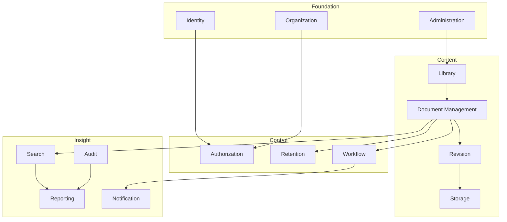

# 03 — Domain Model

**Purpose:** the bounded contexts, their aggregates, and the words we use for them.
**Audience:** everyone. This is the ubiquitous language; naming that contradicts it is a defect.

## 1. The central distinction

> A **file** is bytes. A **revision** is a controlled version of a business record. A **document**
> is the identity that outlives every revision.

Everything in this model follows from that separation
([ADR-0003](./adr/0003-document-identity-revision-file-separation.md)).

## 2. Bounded contexts

| Context | Owns the answer to |
| --- | --- |
| **Identity** | Who is this person, and what may they do anywhere? |
| **Organization** | Where in the organisation does this belong? |
| **Administration** | How is this tenant configured? |
| **Library** | Where do documents live, and who may reach into that place? |
| **Document Management** | What is this document, in the business's terms? |
| **Revision** | What did it look like at each controlled point in time? |
| **Storage** | Where are the bytes, and are they intact? |
| **Workflow** | Who must agree before this becomes official? |
| **Authorization** | May *this* person do *this* to *this* document, right now? |
| **Retention** | How long must it be kept, and what happens then? |
| **Search** | How is it found? |
| **Audit** | What happened, when, by whom — provably? |
| **Notification** | Who needs to be told? |
| **Reporting** | What is the state of the whole? |

## 3. Aggregates

An **aggregate** is the consistency boundary: everything inside it is saved in one transaction, and
outside references are by id only.

### Identity

| Aggregate | Root | Contains | Invariants |
| --- | --- | --- | --- |
| `User` | User | Credentials, MFA enrolment, sessions, preferences | Email unique per tenant; a disabled user holds no active session |
| `Role` | Role | Permission grants | System roles are not editable; a role always belongs to exactly one tenant |
| `Delegation` | Delegation | Scope, period, delegated permissions | End date after start; a delegation may not delegate what the delegator lacks; no cyclic chains |

Value objects: `UserId`, `EmailAddress`, `PermissionKey` (`resource:action`).

### Organization

| Aggregate | Root | Contains | Invariants |
| --- | --- | --- | --- |
| `Company` | Company | Legal identity, defaults | One or more per tenant; code unique per tenant |
| `Entity` | Entity | Legal/operating unit under a company | Belongs to exactly one company |
| `Branch` | Branch | Physical/organisational site | Belongs to exactly one entity |
| `Department` | Department | Functional unit, optionally nested | Parent must be in the same entity; no cycles |

These four form the **scope tree** on which permission inheritance and numbering both depend.

### Administration

| Aggregate | Purpose |
| --- | --- |
| `DocumentType` | Policy pack: which metadata is required, which workflow applies, which numbering rule, default retention and confidentiality |
| `Category` | Business classification, hierarchical, cross-cutting to folders |
| `MetadataField` | Tenant-defined field: type, validation, options, whether it is searchable |
| `NumberingRule` | The document-number recipe ([09](./09-numbering-architecture.md)) |
| `RetentionPolicy` | Trigger, period, disposition ([ADR-0010](./adr/0010-soft-delete-and-retention.md)) |
| `ConfidentialityLevel` | Ordered sensitivity level with its handling rules (watermark, download, print) |
| `TenantSettings` | Locale, timezone, branding, feature switches, security policy |

**Nothing in this list is hardcoded.** A tenant that needs a new document type, field, number
format, retention rule or confidentiality level configures it; it does not need a release.

### Library

| Aggregate | Root | Contains | Invariants |
| --- | --- | --- | --- |
| `Library` | Library | Settings, root folder, ACL | Belongs to exactly one organisation node; code unique per tenant |
| `Folder` | Folder | Children, ACL, inherited settings | Single parent; no cycles; name unique among live siblings; depth ≤ 32 |

### Document Management

| Aggregate | Root | Contains | Invariants |
| --- | --- | --- | --- |
| `Document` | Document | Identity, number, status, metadata values, tags, links, current revision pointer, check-out lock | Exactly one current published revision at most; number immutable once assigned; status changes only along legal transitions ([06](./06-document-lifecycle.md)) |

`Document` is the **root aggregate of the product**. Its identity never changes: not when it is
revised, not when it moves folder, not when it is archived.

Value objects: `DocumentId`, `DocumentNumber`, `DocumentStatus`, `MetadataValue`, `Tag`.

### Revision

| Aggregate | Root | Contains | Invariants |
| --- | --- | --- | --- |
| `DocumentRevision` | Revision | Ordinal + label, file reference, author, approval reference, effective dates | Ordinal strictly increasing per document; a published revision is immutable; exactly one revision may be `PUBLISHED` at a time |

### Storage

| Aggregate | Root | Contains | Invariants |
| --- | --- | --- | --- |
| `FileObject` | FileObject | Storage key, checksum, size, MIME, scan verdict, encryption metadata | Immutable after creation; identical checksum + tenant means one stored blob; unscanned blobs are unreachable |
| `UploadSession` | UploadSession | Target, expiry, parts | Expires; a completed session cannot be reused |

### Workflow

| Aggregate | Root | Contains | Invariants |
| --- | --- | --- | --- |
| `WorkflowDefinition` | Definition | Versions | A published version is immutable |
| `WorkflowInstance` | Instance | Stages, tasks, history | Bound to a definition **version**, so changing a definition never mutates a running approval |
| `ApprovalTask` | Task | Assignee, decision, deadline, delegation trace | A task is decided once; a decision records the acting user *and* the user on whose behalf |

### Retention, Audit, Notification, Search, Reporting

| Aggregate | Notes |
| --- | --- |
| `RetentionSchedule` | Computed per document from its policy; carries hold state |
| `LegalHold` | Suspends disposition regardless of policy; only released by a permission-gated action |
| `AuditEvent` | Append-only, hash-chained ([13](./13-audit-architecture.md)) |
| `NotificationMessage` | Rendered per recipient and channel, with delivery attempts |
| `SearchIndexEntry` | Read model, rebuildable from source at any time |
| `ReportDefinition` | Saved query + presentation, permission-scoped |

## 4. Ubiquitous language

| Term | Means | Does **not** mean |
| --- | --- | --- |
| Document | The controlled business record and its identity | A file |
| Revision | A controlled version of that record | An autosave or a draft edit |
| File / blob | Stored bytes, immutable | A document |
| Library | A governed container owned by an org node | A folder |
| Folder | A hierarchical location inside a library | A category |
| Category | A business classification, orthogonal to location | A tag |
| Tag | A free-form label | A metadata field |
| Approval | The recorded decision of one approver | The workflow |
| Workflow | The configured route a document takes to become official | A status |
| Status | The document's lifecycle state | A workflow stage |
| Check-out | An exclusive editing lock on a document | Downloading it |
| Publish | Making an approved revision the effective one | Making it public |
| Archive | Retiring a document from active use, still readable | Deleting it |
| Purge | Permanent, policy-driven destruction | User deletion |

## 5. Rules that hold across every context

1. A document number is assigned **once**, at approval, and is **never reused**
   ([09](./09-numbering-architecture.md)).
2. The document number **never changes**, whatever happens to revisions
   ([10](./10-revision-architecture.md)).
3. A published revision is **immutable**. Correction means a new revision.
4. Every state change is **audited**, and audit is append-only ([13](./13-audit-architecture.md)).
5. Nothing is destroyed by a user action — only **soft-deleted**, and purged only by retention
   ([ADR-0010](./adr/0010-soft-delete-and-retention.md)).
6. Every read and every write is **permission-checked on the server**
   ([08](./08-permission-model.md)).
7. Every record carries a `tenantId` and is invisible across tenants
   ([ADR-0002](./adr/0002-multi-tenant-isolation-model.md)).
8. **No business behaviour is hardcoded** where a tenant could reasonably need it different: types,
   fields, numbers, workflows, retention, confidentiality are all configuration.
