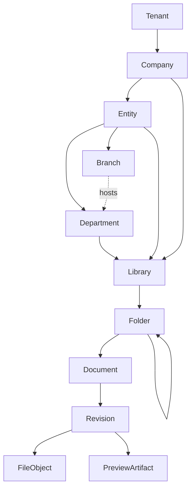

# 04 — Domain Relationships & ERD

**Purpose:** every relationship in the model, with cardinality and the rule that governs it.
**Audience:** backend engineers before any schema or query work.

## 1. The spine

```text
Tenant → Company → Entity → Branch → Department → Library → Folder → Document → Revision → File
```

Read it as: *a document lives in a folder, in a library, owned by a department, in a branch, of an
entity, of a company, inside a tenant; and it has revisions, each pointing at stored bytes.*

This is also the **inheritance spine**: permissions ([08](./08-permission-model.md)), retention,
confidentiality defaults and numbering segments all resolve along it.



**Why a library may hang from a company, an entity or a department:** ownership is real at all three
levels — a group-wide policy library, an entity's quality library, a department's project library.
The owner node is a single polymorphic-by-column reference (`ownerScopeType` + `ownerScopeId`)
constrained to exactly one of the three, which keeps ACL resolution a single upward walk.

## 2. Entity relationship diagram

```mermaid
erDiagram
    TENANT ||--o{ COMPANY : has
    COMPANY ||--o{ ENTITY : has
    ENTITY ||--o{ BRANCH : has
    ENTITY ||--o{ DEPARTMENT : has
    DEPARTMENT ||--o{ DEPARTMENT : "parent of"
    BRANCH ||--o{ DEPARTMENT : "hosts (optional)"

    TENANT ||--o{ USER : has
    TENANT ||--o{ ROLE : has
    USER ||--o{ USER_ROLE : holds
    ROLE ||--o{ USER_ROLE : "granted via"
    ROLE ||--o{ ROLE_PERMISSION : grants
    USER ||--o{ DELEGATION : "delegates as delegator"
    USER ||--o{ DELEGATION : "receives as delegate"
    USER ||--o{ USER_DEPARTMENT : "member of"
    DEPARTMENT ||--o{ USER_DEPARTMENT : "has member"

    TENANT ||--o{ DOCUMENT_TYPE : defines
    TENANT ||--o{ CATEGORY : defines
    TENANT ||--o{ METADATA_FIELD : defines
    TENANT ||--o{ NUMBERING_RULE : defines
    TENANT ||--o{ RETENTION_POLICY : defines
    TENANT ||--o{ CONFIDENTIALITY_LEVEL : defines
    CATEGORY ||--o{ CATEGORY : "parent of"
    DOCUMENT_TYPE }o--|| NUMBERING_RULE : "numbered by"
    DOCUMENT_TYPE }o--o| RETENTION_POLICY : "retained by"
    DOCUMENT_TYPE }o--o| WORKFLOW_DEFINITION : "approved by"
    DOCUMENT_TYPE ||--o{ TYPE_METADATA_FIELD : requires
    METADATA_FIELD ||--o{ TYPE_METADATA_FIELD : "used by"

    LIBRARY ||--o{ FOLDER : contains
    FOLDER ||--o{ FOLDER : "parent of"
    FOLDER ||--o{ DOCUMENT : contains
    LIBRARY }o--|| COMPANY : "owned by (one of)"
    LIBRARY }o--|| ENTITY : "owned by (one of)"
    LIBRARY }o--|| DEPARTMENT : "owned by (one of)"

    DOCUMENT }o--|| DOCUMENT_TYPE : "typed as"
    DOCUMENT }o--o| CATEGORY : "classified as"
    DOCUMENT }o--|| CONFIDENTIALITY_LEVEL : "classified at"
    DOCUMENT ||--o{ DOCUMENT_METADATA_VALUE : has
    METADATA_FIELD ||--o{ DOCUMENT_METADATA_VALUE : "typed by"
    DOCUMENT ||--o{ DOCUMENT_TAG : tagged
    DOCUMENT ||--o{ DOCUMENT_LINK : "relates to"
    DOCUMENT ||--o| DOCUMENT_LOCK : "checked out by"
    DOCUMENT ||--o{ DOCUMENT_REVISION : has
    DOCUMENT ||--o| DOCUMENT_NUMBER_ASSIGNMENT : "numbered by"
    DOCUMENT ||--o{ ACL_ENTRY : "secured by"
    FOLDER ||--o{ ACL_ENTRY : "secured by"
    LIBRARY ||--o{ ACL_ENTRY : "secured by"

    DOCUMENT_REVISION }o--|| FILE_OBJECT : "stores bytes in"
    DOCUMENT_REVISION ||--o{ PREVIEW_ARTIFACT : renders
    DOCUMENT_REVISION ||--o| OCR_RESULT : "text extracted"
    DOCUMENT_REVISION }o--o| WORKFLOW_INSTANCE : "approved through"

    WORKFLOW_DEFINITION ||--o{ WORKFLOW_VERSION : "versioned as"
    WORKFLOW_VERSION ||--o{ WORKFLOW_STAGE_DEF : "stages"
    WORKFLOW_VERSION ||--o{ WORKFLOW_INSTANCE : "instantiated as"
    WORKFLOW_INSTANCE ||--o{ WORKFLOW_STAGE : runs
    WORKFLOW_STAGE ||--o{ APPROVAL_TASK : "assigns"
    APPROVAL_TASK }o--|| USER : "assigned to"
    APPROVAL_TASK }o--o| DELEGATION : "acted under"

    NUMBERING_RULE ||--o{ NUMBER_SEQUENCE : "counts in"
    NUMBER_SEQUENCE ||--o{ NUMBER_RESERVATION : issues
    NUMBER_RESERVATION ||--o| DOCUMENT_NUMBER_ASSIGNMENT : "becomes"

    RETENTION_POLICY ||--o{ RETENTION_SCHEDULE : schedules
    DOCUMENT ||--o| RETENTION_SCHEDULE : "disposed by"
    DOCUMENT ||--o{ LEGAL_HOLD : "held by"

    TENANT ||--o{ AUDIT_EVENT : records
    TENANT ||--o{ OUTBOX_MESSAGE : queues
    DOCUMENT ||--o{ SEARCH_INDEX_ENTRY : "indexed as"
    USER ||--o{ NOTIFICATION_MESSAGE : receives
    NOTIFICATION_TEMPLATE ||--o{ NOTIFICATION_MESSAGE : renders
```



## 3. Relationship rules

### Organisation

| Relationship | Cardinality | Rule |
| --- | --- | --- |
| Tenant → Company | 1 : N | At least one company exists from provisioning |
| Company → Entity | 1 : N | An entity never moves between companies; it is closed and recreated |
| Entity → Branch | 1 : N | Branch codes are unique per entity — they appear in document numbers |
| Entity → Department | 1 : N | Departments may nest; the tree is acyclic and bounded at depth 8 |
| Branch ↔ Department | 0..1 : N | A department may be sited at a branch; this is location, not ownership |
| User ↔ Department | N : M | Membership, with one flag for "primary" used by numbering and routing defaults |

### Content

| Relationship | Cardinality | Rule |
| --- | --- | --- |
| Owner node → Library | 1 : N | Exactly one owner, of type company, entity or department |
| Library → Folder | 1 : N | Every library has an implicit root folder created with it |
| Folder → Folder | 0..1 : N | Acyclic, single parent, max depth 32, unique name among live siblings |
| Folder → Document | 1 : N | A document is in exactly one folder at a time; moving is audited and never changes its number |
| Document → Revision | 1 : N | Ordinals 0,1,2… labelled `Original, R1, R2…` by the type's convention |
| Revision → FileObject | N : 1 | Many revisions may share one blob (identical content is stored once) |
| Revision → PreviewArtifact | 1 : N | One per format/size; derived, disposable, rebuildable |
| Document ↔ Document | N : M | Typed links: `SUPERSEDES`, `REFERENCES`, `ATTACHMENT_OF`, `TRANSLATION_OF`. `SUPERSEDES` is acyclic |
| Document → Lock | 1 : 0..1 | At most one active check-out; the lock names the holder and its expiry |

### Configuration

| Relationship | Cardinality | Rule |
| --- | --- | --- |
| DocumentType → NumberingRule | N : 1 | Required. Changing it affects only documents numbered afterwards |
| DocumentType → WorkflowDefinition | N : 0..1 | Optional; without one, approval is a single-approver default configured on the type |
| DocumentType → RetentionPolicy | N : 0..1 | Inherited by the document at creation and frozen on it, so later policy edits do not silently re-date existing records |
| DocumentType ↔ MetadataField | N : M | With `required`, `order`, `defaultValue` on the join |
| Document → MetadataValue | 1 : N | One row per field; the value column is typed by the field's data type |

### Control

| Relationship | Cardinality | Rule |
| --- | --- | --- |
| Scope node → AclEntry | 1 : N | On library, folder or document; subject is a user, role or department |
| WorkflowDefinition → Version | 1 : N | Only one version is `PUBLISHED`; instances bind to a version, never the definition |
| Instance → Stage → Task | 1 : N : N | Stage completion rule is data (`ALL`, `ANY`, `QUORUM(n)`, `PERCENT(p)`) |
| Task → Delegation | N : 0..1 | A task decided by a delegate records both identities forever |
| Document → RetentionSchedule | 1 : 0..1 | Created when the document is first published; recalculated only by an explicit, audited action |
| Document → LegalHold | 1 : N | Any active hold blocks disposition and hard deletion, whatever the policy says |

## 4. What must never happen

| Never | Why |
| --- | --- |
| A revision without a document | The revision has no identity of its own |
| A document in two folders | Location is single; use a link for the second appearance |
| A document number that changes, or is reissued | Destroys the external references the number exists to serve |
| A file blob referenced by nothing, silently kept | Storage leak — the reference count drives lifecycle |
| An approval task without a stage, or a stage without an instance | The decision loses its context |
| A workflow instance bound to a mutable definition | Rules would change under a running approval |
| A metadata value whose field belongs to another tenant | Cross-tenant leak through configuration |
| A folder that is its own ancestor | Infinite ACL walk |
| A retention schedule that ignores a legal hold | Compliance failure |
