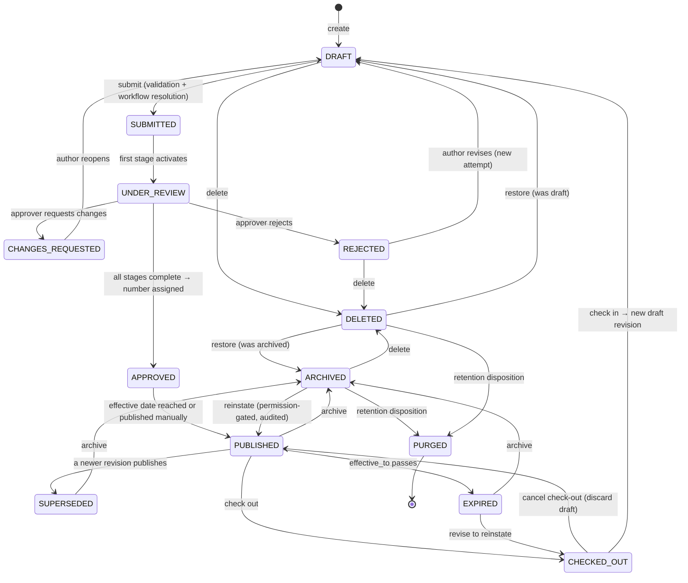

# 06 — Document Lifecycle

**Purpose:** the document state machine — every legal transition, every illegal one.
**Audience:** backend engineers and anyone building UI that offers an action.

The state machine is a **pure function in the domain layer**. Controllers do not decide what is
allowed; they ask it. Every transition is audited, and an attempt at an illegal transition is a
`409 Conflict` with the offending pair named.

## 1. States

| State | Meaning | Content mutable | Visible to |
| --- | --- | --- | --- |
| `DRAFT` | Being prepared | Yes | Author, editors, admins |
| `SUBMITTED` | Handed to the workflow, not yet picked up | No | + approvers |
| `UNDER_REVIEW` | At least one approval stage is active | No | + approvers |
| `CHANGES_REQUESTED` | An approver returned it | Yes (returns to draft edit) | Author, approvers |
| `REJECTED` | Terminal refusal for this attempt | No | Author, approvers, admins |
| `APPROVED` | All stages passed; number assigned; not yet effective | No | + readers, if effective-dated |
| `PUBLISHED` | The effective, controlled revision | No | Everyone with read permission |
| `CHECKED_OUT` | Exclusively locked for the next revision | New draft revision only | As published |
| `SUPERSEDED` | A newer revision is published | No | Readers with history permission |
| `ARCHIVED` | Retired from active use, still readable | No | Readers with archive permission |
| `EXPIRED` | Past `effective_to`, not yet archived | No | As published, flagged |
| `DELETED` | Soft-deleted; recoverable | No | Recycle-bin permission only |
| `PURGED` | Destroyed by retention. Only the audit trail and the number remain | — | Auditors |

`PUBLISHED` and `CHECKED_OUT` describe the **document**; the revision beneath it has its own smaller
state (`DRAFT → IN_APPROVAL → PUBLISHED → SUPERSEDED`) — see [10](./10-revision-architecture.md).

## 2. The machine



## 3. Transition table

| From | To | Trigger | Permission | Guard |
| --- | --- | --- | --- | --- |
| — | `DRAFT` | Create | `document:create` on the folder | Type's required metadata may be incomplete at this point |
| `DRAFT` | `SUBMITTED` | Submit | `document:submit` | Required metadata present; a file attached; workflow resolvable; no active check-out |
| `SUBMITTED` | `UNDER_REVIEW` | Engine activates stage 1 | system | At least one approver resolvable; otherwise submission fails and the document stays `DRAFT` |
| `UNDER_REVIEW` | `CHANGES_REQUESTED` | Approver decision | `document:approve` on the task | Comment required |
| `CHANGES_REQUESTED` | `DRAFT` | Author reopens | `document:edit` | Cancels the workflow instance with reason `RETURNED` |
| `UNDER_REVIEW` | `REJECTED` | Approver decision | `document:reject` | Comment required; any reservation released and the number **not** issued |
| `REJECTED` | `DRAFT` | Author revises | `document:edit` | New workflow instance on resubmission |
| `UNDER_REVIEW` | `APPROVED` | Final stage completes | system | **Number assigned here, atomically** ([09](./09-numbering-architecture.md)) |
| `APPROVED` | `PUBLISHED` | Effective date, or manual publish | `document:publish` | Prior published revision moves to `SUPERSEDED` in the same transaction |
| `PUBLISHED` | `CHECKED_OUT` | Check out | `document:checkout` | No existing live lock |
| `CHECKED_OUT` | `PUBLISHED` | Cancel check-out | Lock holder or `document:force-checkin` | Draft revision discarded, audited |
| `CHECKED_OUT` | `DRAFT` | Check in | Lock holder | Creates revision `n+1` in `DRAFT`; the published revision stays effective until the new one publishes |
| `PUBLISHED` | `SUPERSEDED` | Newer revision publishes | system | Exactly one `PUBLISHED` revision at any time |
| `PUBLISHED`/`SUPERSEDED`/`EXPIRED` | `ARCHIVED` | Archive | `document:archive` | No running workflow |
| `ARCHIVED` | `PUBLISHED` | Reinstate | `document:archive` + `document:publish` | Audited with reason |
| `DRAFT`/`REJECTED`/`ARCHIVED` | `DELETED` | Delete | `document:delete` | No legal hold; no running workflow |
| `DELETED` | previous | Restore | `document:restore` | Within the retention window; name collisions resolved by rename |
| `ARCHIVED`/`DELETED` | `PURGED` | Retention disposition | system, policy-driven | No legal hold; disposition approved if the policy requires review |

## 4. Illegal transitions — and why

| Attempt | Rejected because |
| --- | --- |
| `PUBLISHED` → `DRAFT` | A published revision is immutable. Check out and create a new revision |
| `PUBLISHED` → `DELETED` | A controlled, effective document cannot vanish. Archive first |
| `APPROVED` → `DRAFT` | Approval is a recorded decision; withdrawing it requires a new revision |
| `DRAFT` → `PUBLISHED` | Bypasses approval — the entire point of the product |
| `DRAFT` → `APPROVED` | Same |
| `REJECTED` → `APPROVED` | A decision is not reversible; resubmit instead |
| `SUBMITTED` → `DELETED` | Would destroy an in-flight approval; withdraw first |
| `PURGED` → anything | Purge is terminal by definition |
| `DELETED` → `PUBLISHED` | Restore returns a document to the state it was deleted from, never a higher one |
| `ARCHIVED` → `CHECKED_OUT` | Reinstate first; revising an archived document silently would hide the reinstatement |
| Any transition on a document under **legal hold** that ends in `DELETED` or `PURGED` | Compliance |
| Any content mutation while `SUBMITTED`, `UNDER_REVIEW`, `APPROVED` or `PUBLISHED` | The bytes under review must be the bytes approved |

## 5. Encoding

```ts
// domain/document/lifecycle.ts — pure, exhaustively tested, no I/O
export const LEGAL_TRANSITIONS: Readonly<Record<DocumentStatus, readonly DocumentStatus[]>> = { … };

export function assertTransition(
  from: DocumentStatus,
  to: DocumentStatus,
  context: TransitionContext,   // holds: legal hold, lock, workflow, permissions already resolved
): void;
```

Rules for anyone touching it:

- The table is the **only** source of truth. No `if (status === 'PUBLISHED')` scattered in services.
- The UI asks the API for the available transitions of a document
  (`GET /documents/{id}/transitions`) and renders exactly those. It never hardcodes a status list.
- Adding a state means updating this document, the table, the tests, and the permission matrix in
  [08](./08-permission-model.md) — in one commit.
- Every executed transition writes an `AuditEvent` carrying `from`, `to`, actor, reason and the
  workflow instance if any.

## Phase 4 — the machine runs

Phase 3 created documents and nothing moved them out of `DRAFT`. Phase 4 is what performs the
transitions, and the table is now code: `apps/api/src/modules/document/domain/lifecycle.ts` holds
`LEGAL_TRANSITIONS` exactly as §3 states it, and `isLegalTransition` is consulted on every move. §5's
first rule holds — the table is the only source of truth, and there is no `if (status === …)` in a
service.

`refuseWhenFrozen`, written in Phase 3 against statuses nothing could reach, now fires. Its set moved
into `lifecycle.ts` with the table it belongs to.

**Two tables, and the second is the honest part.** `LEGAL_TRANSITIONS` is the design above, including
the rows owned by Phases 5, 6, 9 and 10. `IMPLEMENTED_TRANSITIONS` is what the product can perform
today, and it is what `GET /documents/{id}/workflow` reports in `availableTransitions`. §5 says the
UI renders exactly what the API offers; offering a transition nothing implements would make a client
draw a button that returns a 404.

| Transition | Performed by |
| --- | --- |
| `DRAFT → SUBMITTED → UNDER_REVIEW` | Submission, in one transaction: the instance, its stages and the first stage's tasks are created together |
| `UNDER_REVIEW → CHANGES_REQUESTED` | An approver's decision. The instance ends with reason `RETURNED` |
| `UNDER_REVIEW → REJECTED` | An approver's decision, per the stage's `onReject` |
| `UNDER_REVIEW → APPROVED` | The final stage completing. The number is assigned through the seam, in the same transaction — see below |
| `SUBMITTED`/`UNDER_REVIEW` `→ DRAFT` | Withdrawal by the author before anybody decided, or an administrative cancellation |

`SUBMITTED` is a state a document passes *through* rather than rests in: the first stage activates
inside the same transaction, because a document left `SUBMITTED` with no tasks would be waiting for a
process that had already been asked to start.

**`APPROVED` assigns the number — Phase 5.** [ADR-0004](./adr/0004-numbering-assigned-at-approval.md)
reserves at submission and assigns at approval, and that is now what the machine does: submission
draws the pending reference reviewers see, completion commits it onto `document.document_number` in
the approval's own transaction, and every ending that is not an approval — rejection, return,
withdrawal, cancellation — voids the reservation without returning the value to the pool
([09](./09-numbering-architecture.md)). The engine's completion path did not change; the seam Phase 4
left unbound was bound, which was the test of whether it was cut correctly.

Publication, check-out, archival and purge are still not performed. `APPROVED → PUBLISHED` needs the
effective-date policy and the "exactly one published revision" rule, which is Phase 6's territory —
though `ck_document_numbered_when_published` already stands, so a publication path that skipped
numbering would be refused by the database before Phase 6 writes a line.

## Phase 6 — publication and the check-out loop

The caveat above is discharged. `IMPLEMENTED_TRANSITIONS` gained the rows this phase performs, and
`GET /documents/{id}/workflow` offers exactly them:

| Transition | Performed by |
| --- | --- |
| `APPROVED → PUBLISHED` | Manual publish (`document:publish`), superseding the prior published revision in the same transaction. An approved, unnumbered document is refused with a sentence pointing at manual assignment — the same rule `ck_document_numbered_when_published` holds below |
| `PUBLISHED → CHECKED_OUT` | Check-out. The race is `uq_document_lock_live`'s to referee; the refusal names the holder |
| `CHECKED_OUT → DRAFT` | Check-in (revision *n+1* in `DRAFT`, the published revision still effective), or a force check-in that preserves the holder's draft |
| `CHECKED_OUT → PUBLISHED` | Cancel by the holder, or force check-in discarding the draft — the draft is `DISCARDED`, retained in history, audited |

§3's "effective date reached or published manually" is built in its manual half: publication is
immediate, the effective-from date defaults to today in the tenant's timezone and may not be in
the future, because scheduled publication needs a timer this phase deliberately did not build.
`FROZEN_STATUSES` gained `CHECKED_OUT` the moment the state became reachable — §1's "new draft
revision only" — and the revision's own machine now moves in step with the document's:
submission freezes the draft into `IN_APPROVAL`, every road back to an editable document returns
it to `DRAFT`, and only publication makes it `PUBLISHED`.

**Phase 6.1 performed archival and expiry, which leaves document-level `SUPERSEDED` as the one
state nothing produces.** Until then `ARCHIVED` was reachable only as a side effect of a retention
disposition — no user action could retire a record — and `EXPIRED` was reachable by nothing at all,
so a document could carry an `effective_to` that never arrived. Both are now ordinary transitions
through `applyLifecycleTransition`, with the same legality check, the same version guard and the
same idempotency rule as every other:

| Transition | Performed by | Actor | Audit action |
| --- | --- | --- | --- |
| `PUBLISHED`/`EXPIRED` → `ARCHIVED` | `POST /documents/{id}/archive`, behind `document:archive` | The person, with a mandatory stated reason | `ARCHIVED`, `via: EXPLICIT` |
| *(any)* → `ARCHIVED` | The retention disposition, on a schedule whose date arrived | The system | `ARCHIVED`, `via: RETENTION` |
| `ARCHIVED` → `PUBLISHED` | `POST /documents/{id}/reinstate`, behind `document:archive` | The person, with a mandatory stated reason | `REINSTATED` |
| `PUBLISHED` → `EXPIRED` | The `documents.expire-effective` sweep, hourly on the `retention.run` lane | The system, never a person | `EXPIRED` |

**The expiry boundary is inclusive and resolved in the tenant's timezone.** `effective_to` is the
last day the revision *is* effective, so a document whose window ends today is current today and
expires when that tenant's own calendar day turns — `calendarDay(now, locale.timezone) >
effective_to`. The sweep is hourly rather than nightly for exactly that reason: one nightly firing
would be after midnight for some tenants and hours before it for others.

**A read never expires anything.** The state changes only in the sweep, in its own transaction per
document, so a document is never expired as a side effect of somebody happening to open it.

Document-level `SUPERSEDED` remains unperformed and that is unchanged: a newer *revision*
supersedes a revision while the document stays `PUBLISHED` (`10-revision-architecture.md` §6).
