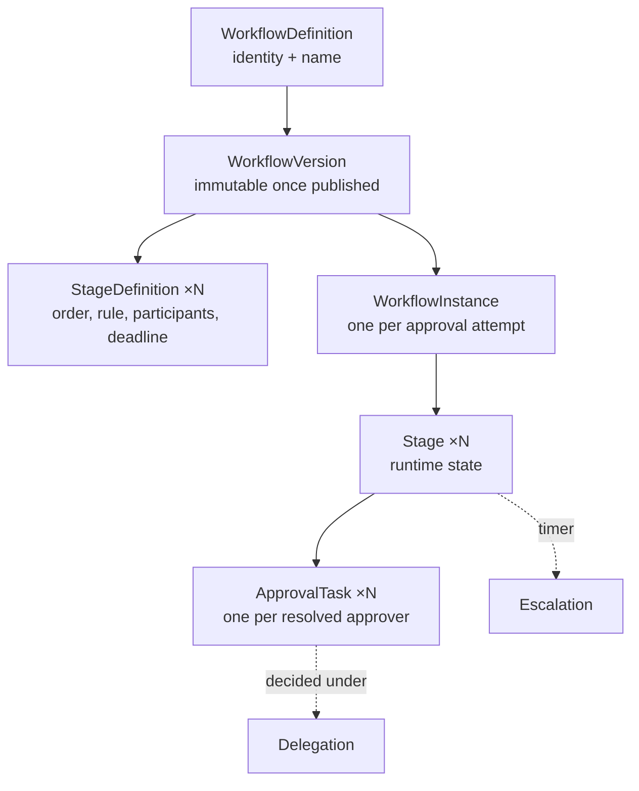
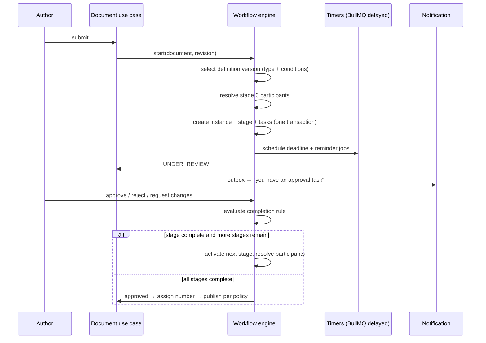

# 07 — Workflow Architecture

**Purpose:** the configurable approval engine — definitions, instances, routing, delegation,
escalation, deadlines.
**Audience:** backend engineers building approvals; administrators configuring them.

**Everything is configurable; nothing is hardcoded.** No document type, department name, role or
approval count appears in engine code. The engine reads a definition and evaluates it
([ADR-0006](./adr/0006-declarative-workflow-engine.md)).

## 1. Model



**An instance binds to a version, never to a definition.** Editing a workflow can therefore never
change the rules of an approval already running — the single most important property of the engine.

## 2. Definition shape

A version is data. This is its shape, stored as validated `jsonb` and typed in `@edms/contracts`:

```jsonc
{
  "key": "quality-procedure-approval",
  "version": 3,
  "appliesTo": { "documentTypes": ["PROC"], "condition": null },
  "stages": [
    {
      "index": 0,
      "name": "Department review",
      "participants": [{ "kind": "MANAGER_OF", "of": "AUTHOR" }],
      "completionRule": "ALL",
      "deadline": { "duration": "P3D", "calendar": "WORKING_DAYS" },
      "reminders": [{ "before": "P1D" }],
      "onOverdue": { "action": "ESCALATE", "to": { "kind": "MANAGER_OF", "of": "ASSIGNEE" } },
      "onReject": "TERMINATE",
      "onRequestChanges": "RETURN_TO_AUTHOR"
    },
    {
      "index": 1,
      "name": "Quality approval",
      "participants": [{ "kind": "ROLE", "roleKey": "QUALITY_MANAGER", "scope": "DOCUMENT_ENTITY" }],
      "completionRule": "QUORUM",
      "quorum": 2,
      "condition": { "field": "confidentiality.rank", "op": ">=", "value": 3 },
      "deadline": { "duration": "P5D", "calendar": "WORKING_DAYS" },
      "onOverdue": { "action": "NOTIFY_ONLY" }
    }
  ],
  "onComplete": { "assignNumber": true, "publish": "ON_EFFECTIVE_DATE" }
}
```

### Participant resolvers

Resolved **at stage activation**, against the document's own context — never stored as raw user ids
in the definition, so an org change does not break a workflow.

| Kind | Resolves to |
| --- | --- |
| `USER` | A named user (rare; discouraged outside pilots) |
| `ROLE` | Every holder of a role, within a named scope (`DOCUMENT_DEPARTMENT`, `DOCUMENT_ENTITY`, `TENANT`) |
| `DEPARTMENT` | Members of a department, optionally only managers |
| `MANAGER_OF` | The manager of the author, of the previous approver, or of the assignee |
| `GROUP` | An approval group configured in Administration |
| `DOCUMENT_FIELD` | The user in a metadata field (e.g. "Reviewer") |
| `OWNER` | The document owner |

If a resolver yields nobody, **submission fails loudly** with a named reason. It never silently
skips a stage.

### Completion rules

| Rule | Stage completes when |
| --- | --- |
| `ALL` | Every task is approved (sequential within the stage if `ordered: true`) |
| `ANY` | Any one task is approved; the rest are withdrawn and marked `SUPERSEDED` |
| `QUORUM(n)` | `n` approvals |
| `PERCENT(p)` | `p`% of tasks approved, rounded up |

Stages run **in order**; tasks **inside** a stage run in parallel unless `ordered` is set. That
gives sequential, parallel and mixed routing from one primitive rather than three code paths.

### Conditions

A stage or a whole definition may carry a condition over document context — type, category,
confidentiality rank, department, any metadata field, and computed facts such as
`revision.isFirst`. Conditions are a small, closed expression language evaluated by a **pure
function**; no expression ever reaches an evaluator that can touch I/O or the database.

## 3. Runtime



Guarantees:

- **One transaction per decision.** The task, the stage, the instance, the document status, the
  number and the audit event commit together, or none of them do.
- **A task is decided once.** `UPDATE approval_task SET … WHERE id = $1 AND decision IS NULL`;
  zero rows affected returns `409`.
- **Timers are BullMQ delayed jobs**, not polling. Cancelling a stage cancels its timers.
- **Every decision is audited** with actor, on-behalf-of, comment, and the revision hash decided on.

## 4. Delegation

| Property | Rule |
| --- | --- |
| Scope | All approvals, or a document type, library, or single document |
| Period | Bounded; open-ended delegations are refused |
| Authority | A delegate can never exercise more than the delegator holds, checked **at decision time**, not at creation |
| Chains | A delegated authority may not be re-delegated by default; a tenant setting allows one hop, never a cycle |
| Visibility | The delegator sees every action taken on their behalf; both identities are recorded on the task and in audit |
| Revocation | Immediate; in-flight tasks revert to the delegator |

Delegation is a **routing overlay**, never a permission grant: the task stays the delegator's, and
the delegate acts on it. This is what makes the audit answer "who actually decided" and "for whom".

### Phase 11 — what §4 turned out to require, and the four decisions it left open

Every row above is built. `assigneeId` is never rewritten by anything, which is the overlay stated
as a property rather than as a sentence: a revocation reassigns nothing because nothing ever moved,
and "in-flight tasks revert to the delegator" is what *already being* the delegator's means.

**Authority is Identity's answer, not the ACL resolver's.** `DelegationService.authorityFor` takes
the permission as a parameter and reads the **delegator's current grants** at the instant of the
decision; nothing about them is stored on the delegation, so there is no stale copy for a role
change to invalidate. There is deliberately no cheaper call — an `isDelegate(a, b)` with no
permission in it is the one that lets a delegate exceed the delegator. See
[08 §3](./08-permission-model.md) for why a delegation is not an ACL subject.

**Approval is by the manager relationship**, from `user_department.is_manager` through
`UserDirectory` — the same relationship Phase 4 added for `MANAGER_OF` — or by a holder of
`user:manage` who is party to neither side. Not `delegation:manage`: 08 §6 marks that `own`, every
author holds it, and a request context carries a permission with no scope beside it. A delegation
approved by a *workflow instance* was considered and refused: `workflow_instance.document_id` is
`NOT NULL` and the engine's every path begins and ends at a document, so a non-document subject
would mean either a fabricated document or a nullable subject widening every query in the engine
for one case that needs one person to agree once.

**A chain is bounded by arithmetic, not by configuration.** The tenant setting
`delegation.allowChaining` opens the first hop and can never open a second; the cycle refusal is
not configurable at all, and is checked *before* the depth rules, because A → B and B → A are two
edges of depth one each and a hop counter would wave them through.

**Emergency delegation bypasses the approval and nothing else.** It is bounded by its own much
shorter setting, and its mandatory stated ground is written to `audit_event.reason` — the column
[13 §5](./13-audit-architecture.md)'s widened digest attests and a verifier can address — rather
than to a payload field. An ordinary delegation leaves that column null, so the difference between
the two paths is legible in the trail rather than only on the row.

**Expiry is a predicate; the schedule only records it.** A delegation past its `ends_at` authorises
nothing from the millisecond it passes, because the period is in the authority query's `WHERE`. The
`identity.expire-delegations` lane exists because `DELEGATION_EXPIRED` is in 13 §2's catalogue and
an action has to be written by something — never because a job is what makes a delegation inert.

**The delegation that authorised a decision stays identifiable forever.**
`approval_task.delegation_id` is a restricting foreign key, so a revoked delegation — exactly the
one an investigation asks about — can never be deleted. The key is the *queryable* link; the
`DELEGATION_USED` audit row written in the same transaction is the *attested* one, because Phase
9's digest covers `on_behalf_of_id` and cannot be extended to a column added after it.

## 5. Escalation

| Trigger | Action options |
| --- | --- |
| Deadline passed | `NOTIFY_ONLY`, `ESCALATE` (create a task for a resolved target, keeping the original open or withdrawing it), `AUTO_APPROVE` (permitted only for stages explicitly marked non-controlling), `TERMINATE` |
| Assignee inactive/disabled | Reassign to the resolver's next candidate; audited |
| Repeated escalation | Capped by `maxEscalations`; then the instance is flagged for an administrator |

`AUTO_APPROVE` exists because some tenants genuinely need informational stages, but it is
configuration a compliance officer must consciously enable, it is prominently marked in the
definition, and every auto-approval is audited as such.

## 6. Deadlines and reminders

- Durations are ISO-8601 (`P3D`, `PT8H`) evaluated against a **working-day calendar** owned by
  Administration (weekend pattern + holiday list per entity).
- Reminders are offsets before the deadline; each fires once, recorded on the task.
- A paused instance (document under legal hold, tenant suspended) pauses its timers and resumes
  them with the remaining duration — never restarting the clock.

## 7. Administration and future designer

The engine takes definitions as data, so the future graphical workflow designer
([Phase 16](../../prompts)) is a **UI over the same JSON** — no engine change. What the
designer must respect is already enforced by the version validator:

- A definition version is validated on publish: stages ordered and contiguous, every resolver
  well-formed, every condition parseable, no unreachable stage, at least one stage.
- Publishing a new version leaves running instances untouched.
- A definition in use cannot be deleted, only deprecated; instances keep their version forever.

## 8. What the engine must never do

| Never | Why |
| --- | --- |
| Name a document type, department or role in code | The engine would need a release per tenant |
| Mutate a published definition version | Rules would change under a running approval |
| Resolve participants at definition time | Org changes would silently break routing |
| Skip a stage whose participants resolve empty | Silent loss of a control |
| Let a delegate exceed the delegator's authority | Privilege escalation |
| Assign a document number before the final stage completes | Numbers would be burned on rejected documents ([09](./09-numbering-architecture.md)) |
| Decide a task twice | Duplicate approvals corrupt the quorum count |

## 9. Phase 4 — what was built, and the two decisions §6 and §2 left open

The engine exists. Submission, approval, rejection, return for modification, comments, sequential and
parallel routing, conditional stages, due dates, reminders, escalation, the approval timeline and the
task inbox are all built and asserted against a real database.

**Timers are rows as well as jobs.** §3's "BullMQ delayed jobs, not polling" is satisfied, and
`workflow_timer` holds what each job is *for* — because a queue alone cannot say which timers belong
to a stage, what one had left when the instance paused, or whether a reminder has already fired.
`fire_at` on resume is `now + remaining_ms`, never re-derived from the definition's duration, which
is §6's rule made unrepresentable to get wrong: a check constraint pairs `PAUSED` with a remainder.

**The working-day calendar was built, not deferred.** §6 says Administration owns it and
Administration did not have one, while `WORKING_DAYS` is the *default* every stage deadline is
authored with — so a seam would have meant every deadline in the product silently counting Saturdays.
`working_calendar` and `working_calendar_holiday` are Administration's, behind `workflow:manage`, per
entity with one tenant-wide default. The arithmetic lives in `@edms/domain` because the engine and
the authoring screen's preview must give the same answer. What it does **not** model is working
*hours*: the calendar knows which days are worked, not which hours of them, so `PT8H` is eight real
hours that do not elapse at a weekend rather than one working day.

**Approval groups were built for the same reason.** `GROUP` is one of the seven resolver kinds in §2
and had no surface behind it, and a resolver that cannot resolve fails a submission loudly — so
shipping the engine without it would have shipped a definition kind nobody could use.

**Delegation is not built** and §4 is untouched. What Phase 4 guaranteed is that it stays buildable:
`approval_task` carries `decided_by_id` and `on_behalf_of_id`, the audit payload reads both, and the
single check that phase relaxes — "the task belongs to you" — is in one place in the engine.

**Numbering is built, through the seam Phase 4 cut.** Phase 4 called `DOCUMENT_NUMBER_ALLOCATOR` at
completion and left the port unbound, so approvals completed with `numberAssigned: false`. Phase 5
bound it — an adapter over Document's number service — and every completed approval is numbered with
no change to the engine's completion path, which was the test of whether the seam was cut correctly.
The engine also reserves at submission and voids on every ending that is not an approval, each in
the same transaction as the move it accompanies ([ADR-0004](./adr/0004-numbering-assigned-at-approval.md),
[09](./09-numbering-architecture.md)).

One property is worth recording because it was a defect the design did not name. Two approvers
deciding at the same instant run in two transactions, and under `READ COMMITTED` neither sees the
other's decision — so a two-person quorum could be met while the stage stayed pending forever. Every
write path now takes a row lock on the instance first, which serialises decisions on one approval and
leaves decisions on different approvals concurrent.
