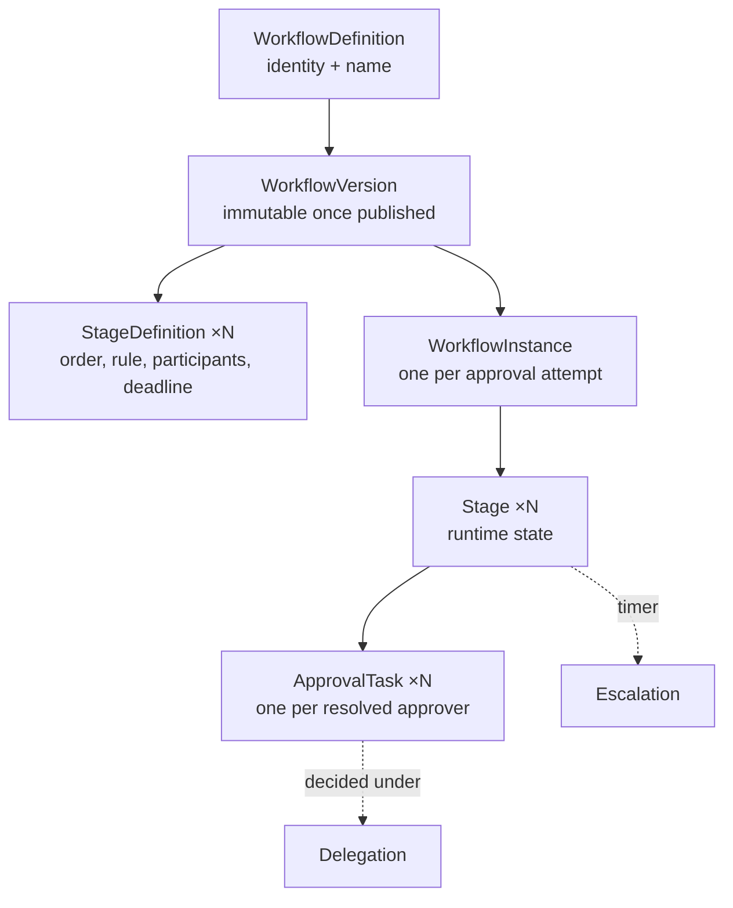
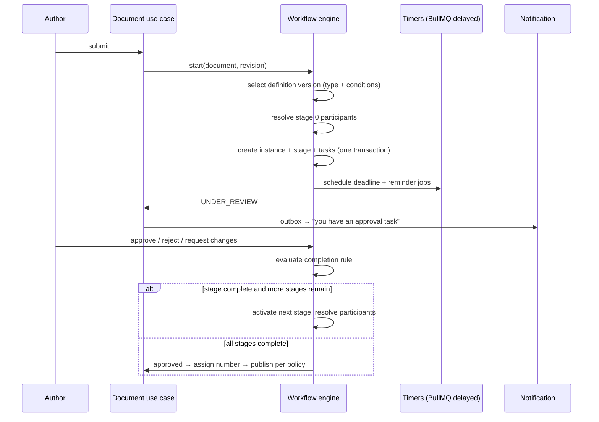

# 07 — Workflow Architecture

**Purpose:** the configurable approval engine — definitions, instances, routing, delegation,
escalation, deadlines.
**Audience:** backend engineers building approvals; administrators configuring them.

**Everything is configurable; nothing is hardcoded.** No document type, department name, role or
approval count appears in engine code. The engine reads a definition and evaluates it
([ADR-0006](./adr/0006-declarative-workflow-engine.md)).

## 1. Model



**An instance binds to a version, never to a definition.** Editing a workflow can therefore never
change the rules of an approval already running — the single most important property of the engine.

## 2. Definition shape

A version is data. This is its shape, stored as validated `jsonb` and typed in `@edms/contracts`:

```jsonc
{
  "key": "quality-procedure-approval",
  "version": 3,
  "appliesTo": { "documentTypes": ["PROC"], "condition": null },
  "stages": [
    {
      "index": 0,
      "name": "Department review",
      "participants": [{ "kind": "MANAGER_OF", "of": "AUTHOR" }],
      "completionRule": "ALL",
      "deadline": { "duration": "P3D", "calendar": "WORKING_DAYS" },
      "reminders": [{ "before": "P1D" }],
      "onOverdue": { "action": "ESCALATE", "to": { "kind": "MANAGER_OF", "of": "ASSIGNEE" } },
      "onReject": "TERMINATE",
      "onRequestChanges": "RETURN_TO_AUTHOR"
    },
    {
      "index": 1,
      "name": "Quality approval",
      "participants": [{ "kind": "ROLE", "roleKey": "QUALITY_MANAGER", "scope": "DOCUMENT_ENTITY" }],
      "completionRule": "QUORUM",
      "quorum": 2,
      "condition": { "field": "confidentiality.rank", "op": ">=", "value": 3 },
      "deadline": { "duration": "P5D", "calendar": "WORKING_DAYS" },
      "onOverdue": { "action": "NOTIFY_ONLY" }
    }
  ],
  "onComplete": { "assignNumber": true, "publish": "ON_EFFECTIVE_DATE" }
}
```

### Participant resolvers

Resolved **at stage activation**, against the document's own context — never stored as raw user ids
in the definition, so an org change does not break a workflow.

| Kind | Resolves to |
| --- | --- |
| `USER` | A named user (rare; discouraged outside pilots) |
| `ROLE` | Every holder of a role, within a named scope (`DOCUMENT_DEPARTMENT`, `DOCUMENT_ENTITY`, `TENANT`) |
| `DEPARTMENT` | Members of a department, optionally only managers |
| `MANAGER_OF` | The manager of the author, of the previous approver, or of the assignee |
| `GROUP` | An approval group configured in Administration |
| `DOCUMENT_FIELD` | The user in a metadata field (e.g. "Reviewer") |
| `OWNER` | The document owner |

If a resolver yields nobody, **submission fails loudly** with a named reason. It never silently
skips a stage.

### Completion rules

| Rule | Stage completes when |
| --- | --- |
| `ALL` | Every task is approved (sequential within the stage if `ordered: true`) |
| `ANY` | Any one task is approved; the rest are withdrawn and marked `SUPERSEDED` |
| `QUORUM(n)` | `n` approvals |
| `PERCENT(p)` | `p`% of tasks approved, rounded up |

Stages run **in order**; tasks **inside** a stage run in parallel unless `ordered` is set. That
gives sequential, parallel and mixed routing from one primitive rather than three code paths.

### Conditions

A stage or a whole definition may carry a condition over document context — type, category,
confidentiality rank, department, any metadata field, and computed facts such as
`revision.isFirst`. Conditions are a small, closed expression language evaluated by a **pure
function**; no expression ever reaches an evaluator that can touch I/O or the database.

## 3. Runtime



Guarantees:

- **One transaction per decision.** The task, the stage, the instance, the document status, the
  number and the audit event commit together, or none of them do.
- **A task is decided once.** `UPDATE approval_task SET … WHERE id = $1 AND decision IS NULL`;
  zero rows affected returns `409`.
- **Timers are BullMQ delayed jobs**, not polling. Cancelling a stage cancels its timers.
- **Every decision is audited** with actor, on-behalf-of, comment, and the revision hash decided on.

## 4. Delegation

| Property | Rule |
| --- | --- |
| Scope | All approvals, or a document type, library, or single document |
| Period | Bounded; open-ended delegations are refused |
| Authority | A delegate can never exercise more than the delegator holds, checked **at decision time**, not at creation |
| Chains | A delegated authority may not be re-delegated by default; a tenant setting allows one hop, never a cycle |
| Visibility | The delegator sees every action taken on their behalf; both identities are recorded on the task and in audit |
| Revocation | Immediate; in-flight tasks revert to the delegator |

Delegation is a **routing overlay**, never a permission grant: the task stays the delegator's, and
the delegate acts on it. This is what makes the audit answer "who actually decided" and "for whom".

## 5. Escalation

| Trigger | Action options |
| --- | --- |
| Deadline passed | `NOTIFY_ONLY`, `ESCALATE` (create a task for a resolved target, keeping the original open or withdrawing it), `AUTO_APPROVE` (permitted only for stages explicitly marked non-controlling), `TERMINATE` |
| Assignee inactive/disabled | Reassign to the resolver's next candidate; audited |
| Repeated escalation | Capped by `maxEscalations`; then the instance is flagged for an administrator |

`AUTO_APPROVE` exists because some tenants genuinely need informational stages, but it is
configuration a compliance officer must consciously enable, it is prominently marked in the
definition, and every auto-approval is audited as such.

## 6. Deadlines and reminders

- Durations are ISO-8601 (`P3D`, `PT8H`) evaluated against a **working-day calendar** owned by
  Administration (weekend pattern + holiday list per entity).
- Reminders are offsets before the deadline; each fires once, recorded on the task.
- A paused instance (document under legal hold, tenant suspended) pauses its timers and resumes
  them with the remaining duration — never restarting the clock.

## 7. Administration and future designer

The engine takes definitions as data, so the future graphical workflow designer
([Phase 16](../../../docs/README.md)) is a **UI over the same JSON** — no engine change. What the
designer must respect is already enforced by the version validator:

- A definition version is validated on publish: stages ordered and contiguous, every resolver
  well-formed, every condition parseable, no unreachable stage, at least one stage.
- Publishing a new version leaves running instances untouched.
- A definition in use cannot be deleted, only deprecated; instances keep their version forever.

## 8. What the engine must never do

| Never | Why |
| --- | --- |
| Name a document type, department or role in code | The engine would need a release per tenant |
| Mutate a published definition version | Rules would change under a running approval |
| Resolve participants at definition time | Org changes would silently break routing |
| Skip a stage whose participants resolve empty | Silent loss of a control |
| Let a delegate exceed the delegator's authority | Privilege escalation |
| Assign a document number before the final stage completes | Numbers would be burned on rejected documents ([09](./09-numbering-architecture.md)) |
| Decide a task twice | Duplicate approvals corrupt the quorum count |
