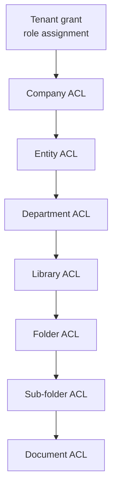

# 08 — Permission Model

**Purpose:** who may do what, where — RBAC, inheritance, overrides, and the permission matrix.
**Audience:** everyone. Read before adding an endpoint or a UI affordance.

## 1. The three questions

An authorisation decision answers them in order:

1. **Capability** — does the caller hold the permission at all (role-based)?
2. **Reach** — does it apply *here*, on this scope node (ACL, inherited)?
3. **State** — does the document's current state and confidentiality allow it right now?

All three are evaluated **on the server**. Hiding a button is a courtesy, not a control.

## 2. Permission catalogue

Permissions are `resource:action` keys, defined once in `@edms/domain` and imported by API and web.
**A permission that is not in the catalogue does not exist**; the UI may never invent one.

```ts
export const Permission = {
  DOCUMENT_VIEW: 'document:view',
  DOCUMENT_DOWNLOAD: 'document:download',
  DOCUMENT_PRINT: 'document:print',
  DOCUMENT_CREATE: 'document:create',
  DOCUMENT_EDIT: 'document:edit',
  DOCUMENT_SUBMIT: 'document:submit',
  DOCUMENT_APPROVE: 'document:approve',
  DOCUMENT_REJECT: 'document:reject',
  DOCUMENT_PUBLISH: 'document:publish',
  DOCUMENT_CHECKOUT: 'document:checkout',
  DOCUMENT_CHECKIN: 'document:checkin',
  DOCUMENT_FORCE_CHECKIN: 'document:force-checkin',
  DOCUMENT_MOVE: 'document:move',
  DOCUMENT_ARCHIVE: 'document:archive',
  DOCUMENT_DELETE: 'document:delete',
  DOCUMENT_RESTORE: 'document:restore',
  DOCUMENT_HISTORY_VIEW: 'document:history:view',
  DOCUMENT_PERMISSION_MANAGE: 'document:permission:manage',
  LIBRARY_VIEW: 'library:view',
  LIBRARY_MANAGE: 'library:manage',
  FOLDER_MANAGE: 'folder:manage',
  WORKFLOW_MANAGE: 'workflow:manage',
  DELEGATION_MANAGE: 'delegation:manage',
  NOTIFICATION_MANAGE: 'notification:manage',
  NUMBERING_MANAGE: 'numbering:manage',
  RETENTION_MANAGE: 'retention:manage',
  LEGAL_HOLD_MANAGE: 'legal-hold:manage',
  AUDIT_VIEW: 'audit:view',
  AUDIT_EXPORT: 'audit:export',
  SEARCH_ALL: 'search:all',
  REPORT_VIEW: 'report:view',
  REPORT_MANAGE: 'report:manage',
  USER_MANAGE: 'user:manage',
  ROLE_MANAGE: 'role:manage',
  ORG_MANAGE: 'org:manage',
  SETTINGS_MANAGE: 'settings:manage',
} as const;
```

Adding a permission means: add the key, add it to the matrix below, gate the endpoint, gate the UI
affordance, and seed it into the roles that should hold it — one commit.

## 3. Scope tree and inheritance

Permission is granted on a **scope node** and flows downward:

```text
Tenant → Company → Entity → Department → Library → Folder → (sub-folder…) → Document
```



Resolution algorithm — pure, cached, and the only place a decision is made:

```text
1. Collect the caller's subjects: user id, role ids, department ids.
2. Walk the scope chain from the document up to the tenant (one query, using the ltree paths).
3. Collect every ACL entry on that chain matching any subject and the requested permission.
4. If any matching entry has effect DENY  → denied. (Deny wins, at any level.)
5. Else if any matching entry has effect ALLOW → allowed.
6. Else fall back to the role grant at tenant level.
7. Else → denied. (Closed by default.)
8. Apply state and confidentiality rules; they can only subtract.
```

[ADR-0005](./adr/0005-hierarchical-acl-with-deny-precedence.md) records why deny wins and why the
default is closed.

**Step 1 said "and active delegations" until Phase 11, and that phase removed it deliberately.**
The clause had been unbound since Phase 0.5 — `AuthorizationSubject.delegationIds` was passed `[]`
by all three of its call sites — and building delegation is what forced the question of whether it
should ever be filled in. The answer is no, and the reason is
[07 §4](./07-workflow-architecture.md)'s own first sentence: delegation is a **routing overlay,
never a permission grant**.

Making a delegation an ACL subject would make it a grant. An ACL entry could then name a delegation
on a scope node, and the delegate would gain *reach* — the ability to see or act on things the
delegator never could — which is precisely the privilege escalation §8's table forbids. It would
also make the authority question unanswerable in the place §4 requires it: the walk answers "may
this subject reach this node", and "does the delegator still hold `document:approve` right now" is
a different question about a different thing.

So delegation is resolved where it belongs. `DelegationService.authorityFor` takes the permission as
a parameter, reads the delegator's current grants at the instant of the decision, and returns the
delegation that authorises the act — or the rule that refused. `AuthorizationSubject.delegationIds`
remains on the interface and remains empty; removing the field would be a wider change than the
decision warrants, and it documents a subject the resolver deliberately does not have.

**Breaking inheritance:** a folder may set `inherit_acl = false`, which stops the walk at that node
for ACL purposes. Administrative permissions (`*:manage`, `audit:*`) are never blocked this way —
otherwise a user could hide a subtree from the administrators responsible for it.

"Stops the walk" had two readings until something had to choose, and Phase 14 chose:
[ADR-0016](./adr/0016-inheritance-break-truncates-the-chain.md) records that a break truncates the
chain for **both** effects. The effective chain begins at the deepest breaking folder; entries above
it are not collected, and neither is step 6's tenant-level role grant. Letting a `DENY` cross a break
that an `ALLOW` cannot would make the flag a one-way valve, and "this folder does not inherit
permissions" would be a false sentence with no true one a checkbox could say instead.

Which permissions are exempt is `survivesBrokenInheritance()` in `@edms/domain` — one definition,
written in Phase 1, with no caller until Phase 14.

## 4. Confidentiality and state modifiers

These **subtract only**; they never grant.

| Modifier | Effect |
| --- | --- |
| Confidentiality level | Each level may forbid download, forbid print, force a watermark, or require a stated reason (recorded in audit) even for users holding the permission |
| Document state | Content edit is impossible outside `DRAFT`/`CHANGES_REQUESTED`; delete is impossible while `PUBLISHED`; approve exists only for the assignee of a live task ([06](./06-document-lifecycle.md)) |
| Check-out lock | Edit and check-in belong to the lock holder; anyone else needs `document:force-checkin` |
| Legal hold | Delete and purge are refused regardless of permission |
| Tenant status | A suspended tenant is read-only |

## 5. Standard roles

Seeded per tenant, editable except where marked system.

| Role | Purpose |
| --- | --- |
| `TENANT_ADMIN` (system) | Full administration of the tenant |
| `DOCUMENT_CONTROLLER` | Owns numbering, types, retention, libraries; the compliance operator |
| `LIBRARY_MANAGER` | Manages one or more libraries, their folders and permissions |
| `AUTHOR` | Creates and revises documents in permitted folders |
| `APPROVER` | Decides approval tasks assigned to them |
| `READER` | Reads and, where allowed, downloads |
| `AUDITOR` | Reads everything in scope plus the audit trail; may never mutate |
| `GUEST` | Time-boxed, explicitly granted single-document or single-folder access |

## 6. Permission matrix

`✓` granted by default · `S` scoped — only where explicitly granted on a node · `T` only on a task
assigned to them · `—` never.

| Permission | Tenant admin | Doc controller | Library manager | Author | Approver | Reader | Auditor | Guest |
| --- | --- | --- | --- | --- | --- | --- | --- | --- |
| `document:view` | ✓ | ✓ | S | S | S | S | ✓ | S |
| `document:download` | ✓ | ✓ | S | S | S | S | ✓ | S |
| `document:print` | ✓ | ✓ | S | S | S | S | ✓ | — |
| `document:create` | ✓ | ✓ | S | S | — | — | — | — |
| `document:edit` | ✓ | ✓ | S | S (own/draft) | — | — | — | — |
| `document:submit` | ✓ | ✓ | S | S | — | — | — | — |
| `document:approve` | — | — | T | — | T | — | — | — |
| `document:reject` | — | — | T | — | T | — | — | — |
| `document:publish` | ✓ | ✓ | S | — | — | — | — | — |
| `document:checkout` | ✓ | ✓ | S | S | — | — | — | — |
| `document:checkin` | ✓ | ✓ | S | S (own lock) | — | — | — | — |
| `document:force-checkin` | ✓ | ✓ | S | — | — | — | — | — |
| `document:move` | ✓ | ✓ | S | — | — | — | — | — |
| `document:archive` | ✓ | ✓ | S | — | — | — | — | — |
| `document:delete` | ✓ | ✓ | S | S (own draft) | — | — | — | — |
| `document:restore` | ✓ | ✓ | S | — | — | — | — | — |
| `document:history:view` | ✓ | ✓ | S | S | S | S | ✓ | — |
| `document:permission:manage` | ✓ | ✓ | S | — | — | — | — | — |
| `library:view` | ✓ | ✓ | S | S | S | S | ✓ | S |
| `library:manage` | ✓ | ✓ | S | — | — | — | — | — |
| `folder:manage` | ✓ | ✓ | S | — | — | — | — | — |
| `workflow:manage` | ✓ | ✓ | — | — | — | — | — | — |
| `delegation:manage` | ✓ | ✓ | — | own | own | — | — | — |
| `notification:manage` | own | own | own | own | own | own | own | own |
| `numbering:manage` | ✓ | ✓ | — | — | — | — | — | — |
| `retention:manage` | ✓ | ✓ | — | — | — | — | — | — |
| `legal-hold:manage` | ✓ | ✓ | — | — | — | — | — | — |
| `audit:view` | ✓ | ✓ | S | — | — | — | ✓ | — |
| `audit:export` | ✓ | ✓ | — | — | — | — | ✓ | — |
| `search:all` | ✓ | ✓ | — | — | — | — | ✓ | — |
| `report:view` | ✓ | ✓ | S | S | S | — | ✓ | — |
| `report:manage` | ✓ | ✓ | — | — | — | — | — | — |
| `user:manage` | ✓ | — | — | — | — | — | — | — |
| `role:manage` | ✓ | — | — | — | — | — | — | — |
| `org:manage` | ✓ | — | — | — | — | — | — | — |
| `settings:manage` | ✓ | — | — | — | — | — | — | — |

Three deliberate rows:

- **`notification:manage` is `own` for every role, including `GUEST`** — the only row in this matrix
  that is granted to everybody, and the only one where that is not a mistake. It is not reach over
  anything of the tenant's: it is a person's own inbox and their own preferences, and 18 §3 makes
  the in-app inbox authoritative, so everybody who can *receive* a notification must be able to read
  it. It exists at all because 15 §5 asserts at boot that every mutating route declares a
  permission, and no existing one fits: `document:view` was the near miss and is wrong, because
  somebody holding no document permission still receives the security notifications 18 §4 says they
  must, and could then not read them. The `own` scope is enforced by **absence** — no route under
  `/notifications` takes a recipient identifier — which is the same enforcement `delegation:manage`
  uses for its delegator.


- **Tenant admin cannot approve.** Approval authority comes from being assigned a task, never from
  seniority. An administrator who needs to approve is assigned or delegated the task, and the audit
  says so.
- **Auditor can never mutate.** Read plus export, nothing else, at any scope.

## 7. Enforcement

| Point | Mechanism |
| --- | --- |
| Route | `@RequirePermission(Permission.X)` on every mutating endpoint; a route without one fails a boot-time assertion |
| Object | `AclGuard` resolves the scope chain for the target id before the use case runs, on every route carrying `@ScopedTo` |
| Query | List endpoints filter by a permission predicate pushed into SQL — never fetch-then-filter, which leaks totals and pagination |
| Search | The index carries the ACL fingerprint; results are filtered before scoring ([12](./12-search-architecture.md)) |
| UI | `usePermission()` reads the server-provided capability set for the current object and hides affordances; it decides nothing |
| Audit | Every denied attempt on an existing object is audited as `ACCESS_DENIED` |

**Cross-scope reads return `404`, not `403`**, so existence is not leaked. A chain that cannot be
assembled — because the object does not exist, or because an ancestor was removed — produces the
same refusal as a chain that resolves to a denial, which is what makes the two indistinguishable
from outside.

The UI row is a rule about *direction*, not about effort: a screen may hide anything it likes, and
it may decide nothing. A button hidden by inferring from a status is a second implementation of a
permission; a button hidden because the server said `false` is a rendering.

### The boot assertion catches an unguarded route, and cannot catch an unused permission

The first row above fails the boot when a mutating route declares no permission. It has nothing to
say about the opposite defect: a permission that is in this catalogue, granted by the matrix above,
seeded to roles, offered in the role editor — and named by **no route at all**. Nothing fails, no
test goes red, and an administrator who grants it is granting a control that does not exist. That is
strictly worse than an absent permission, because it reads as applied.

`document:archive` was in exactly that state from Phase 1 until Phase 6.1: two roles held it and no
endpoint asked for it. Phase 6.0 found it by counting non-seed references per catalogue entry and
getting zero, which is the check a boot assertion cannot make — the API cannot tell a permission
awaiting its phase from one whose phase shipped without it.

`POST /documents/{id}/archive` and `POST /documents/{id}/reinstate` now declare it, both `@ScopedTo`
the document, so it is enforced at the route, at the object and in the query predicate like every
other row. **Two entries remain unenforced** and are named here so the next reader does not have to
count again: `library:view`, which is a real gap, and `report:manage`, which is deliberate and
documented in `report-definition.service.ts` — it exists for *shared* report definitions, and no
definition is shared yet.

## 8. Caching

Resolved decisions are cached per `(userId, scopeId, permission)` in Redis with a short TTL, and
invalidated by event: an ACL change, role change, delegation change, department membership change,
or document move publishes an invalidation. The cache is an optimisation only — a cold cache
produces the same answer.

**Phase 14 built it, and it caches three things rather than one.** The *decision*, on §8's own key.
The *chain*, per `(tenant, scope)` — the expensive half and the half that changes least, since a
folder's ancestry changes only when somebody moves it. And the *visibility filter*, per
`(user, roles, permission)`, which matters more than the decision cache does: a dashboard asks for it
once per widget and a list once per count, so an uncached filter repeats the same six reads across
one request rather than across one session.

Invalidation is **by prefix, inside the transaction that caused it** — `acl:<tenant>:` — rather than
by TTL alone. A cache keyed by node cannot express "and everything under it" without walking the
tree it was added to avoid walking, and an entry on a company changes answers about documents six
levels below it. The TTL is the backstop for what prefix invalidation cannot see: another process's
write to shared ancestry.

`ACL_CACHE_TTL_SECONDS=0` disables it entirely, which is the switch to reach for when an
authorisation answer is under investigation. That a cold cache gives the same answer as a warm one
is asserted in `acl.integration.spec.ts` rather than asserted *to*.

## 9. What Phase 8 built

`ACL_RESOLVER` binds its first real implementation — `PrismaAclResolver`, in the Library
module — because the search index must materialise `acl_subjects` from "the same pure resolver
the API uses" (12 §3) and a deny-all placeholder cannot serve an index anybody may see. It
resolves §3's algorithm over what genuinely exists: no ACL entry table yet, so steps 3–5 find
nothing, every decision falls through to step 6's tenant-level role grant, and step 7 keeps it
closed by default. `visibilityFilter` (the query-side call site) and `aclSubjectsFor` (the
projection's) are two methods of one class over one domain vocabulary
(`library/domain/acl-subjects.ts`), so §7's Query and Search rows can no longer diverge. The
entries, the walk, deny precedence, `@ScopedTo` on object routes, capabilities in responses and
§8's cache remain the ACL phase's — they extend this binding rather than replace anything that
now calls it.

## 10. What Phase 9 added

Two rows of §7 stopped being aspirations.

**`ACCESS_DENIED` has a writer.** The Audit row of §7 — "every denied attempt on an existing object
is audited" — had none: `writeStandalone` was written in Phase 1 for exactly this caller and nothing
in `core/authorization/` had ever called it. `AccessDenialRecorder` is that caller, and it is one
recorder with two call sites — `AclGuard` and the audit timeline's own refusal — because a refusal
recorded differently in two places is a compliance report that has to know which path denied it.

The "on an *existing* object" condition is a security condition: a trail that separated "denied"
from "absent" would answer, for whoever later reads it, the existence question the `404` withholds.
It cannot arise today, because `PrismaAclResolver` decides from the caller's role grants without
consulting the object at all (§9) — a refusal is a fact about the caller and carries no information
about whether the identifier names anything. When the walk arrives and decisions become
object-dependent, the condition starts to matter, and it matters in the recorder rather than in each
guard.

**A second call site for the resolver, and why it is not a second predicate.** An audit timeline is
"filtered to what the caller may see" (13 §6), and the audit row model has no scope to push a
`visibilityFilter` against — a row carries `(subject_type, subject_id)`, and a `SEARCH` row carries
the actor's own user id. So the timeline resolves the *subject* once, through `ACL_RESOLVER.resolve`,
before the query runs: one object, one question, one decision covering the whole page. That is the
same port, binding and algorithm §9 recorded, asked at a third call site rather than reimplemented —
which is what this section exists to require.

The audit **search** is not filtered by ACLs at all, and that is deliberate rather than an omission.
It crosses every subject in the tenant, so there is no object to resolve; §6's `audit:view` gates
it, and that grant is the filter. Narrowing an auditor's search by document ACLs would produce an
auditor who cannot audit — the opposite of the row §5 writes for them. The matrix's one `S` on
`audit:view`, the library manager's, is a scoped grant and arrives with the ACL entries; until then
the resolver answers it as the tenant-level grant it currently is.

## 11. What Phase 14 built

The entries, the walk, deny precedence, `@ScopedTo` on object routes, capabilities in responses and
§8's cache — the six things §9 listed as "the ACL phase's". They **extend** what Phase 8 bound
rather than replacing it: `PrismaAclResolver` keeps its four method signatures, and `AclGuard`, the
dashboard, search's query side and search's projection all call exactly what they called before.

### The entries

`acl_entry` is ADR-0005's table, built for the first time. Steps 3–5 of §3 have found nothing since
Phase 8 because what they read did not exist; they read it now, and the model is unchanged —
capability from `role_permission`, reach from here, both required.

Three properties are structural rather than validated. `uq_acl_entry` means one subject holds at most
one effect per permission per node, so the walk never breaks a tie *at* a node — every tie it
resolves is between nodes, which is where deny-wins applies and where it is auditable by inspection.
`scope_id` is never null, so a `TENANT` entry needs no special case. And the table carries **no
`deleted_at`**: a revoked entry has no reader, and its record is the `ACL_REVOKED` audit event, which
is append-only and hash-chained.

### The walk, and what it costs

`acl-walk.ts` is the decision as arithmetic over a chain that has already been read, so the same
rules are asserted without a database and the two call sites that must agree — a direct read and the
index's materialised subjects — are one implementation. `PrismaScopeChainReader` assembles the chain:
at worst five reads, one per *table* the tree crosses, and never one per ancestor. That is what
ADR-0014's materialised paths buy, and the resolver caches the result so twenty permission questions
about one document — which is what `capabilitiesFor` is — cost one chain read.

### `@ScopedTo`, and what it found

Phase 9 recorded that `ACCESS_DENIED` was "wired but unreached": `AclGuard` was composed as a global
guard, `AccessDenialRecorder` wrote the row, and `@ScopedTo` was used by **zero routes**. It is now
on every object route — documents, previews, revisions, the approval endpoints that name a document,
libraries and folders — and the guard fires.

Making it fire found a defect six phases old. A JWT carries `roles` as role **keys**;
`role_permission.role_id` and `acl_entry.subject_id` are UUIDs. `PrismaAclResolver` had compared the
two directly since Phase 8 and matched nothing, which was invisible because nothing that could
*observe* a grant ran with a non-empty role list. It is resolved in one place —
`AclRepository.roleIdsFor` — rather than at each of the six call sites.

### The query side

The document list consumes `visibilityFilter`, inside `PrismaDocumentRepository.whereFor` rather than
in the service. That placement is the whole of how Phase 13's claim came true: the dashboard's counts
are built from that function, so they inherited the predicate in the same commit and
`dashboard.service.ts` did not change. A document the caller cannot reach is **absent** from the list
and from its total.

[ADR-0016](./adr/0016-inheritance-break-truncates-the-chain.md) records the shape:
`VisibilityFilter` carries subject tokens for the index *and* regions for a relational list, both
produced by one resolution.

### Capabilities, and the screen

`capabilitiesFor` was already consumed by Phase 13. What Phase 14 adds is the reader ADR-0005 asked
for by name — `documents/[documentId]/permissions/`, showing the **effective** permission and the
**node that decided it**. `Decision.decidedAt` had carried that field since Phase 0.5 with nothing
reading it.

### What was deliberately left

**Step 8 is not applied in the resolver.** State and confidentiality remain where Phase 6 and Phase 7
put them — in the use cases that perform the acts they modify. Folding them into `resolve` would make
every refusal a `404`, and "you may not print this document" would become "this document does not
exist" for somebody holding `document:print` who is looking at it. §4's modifiers subtract from what
an *act* may do, not from whether an object may be reached.

**The matrix's `S` rows are now expressible and are not seeded.** `document:view` marked `S` for
`AUTHOR` means "only where explicitly granted on a node", and an entry can now say that. What the
Phase 1 seed grants is unchanged, because changing it would silently narrow every existing tenant on
deploy. The `S` is what an administrator may now build, not what they are given.
