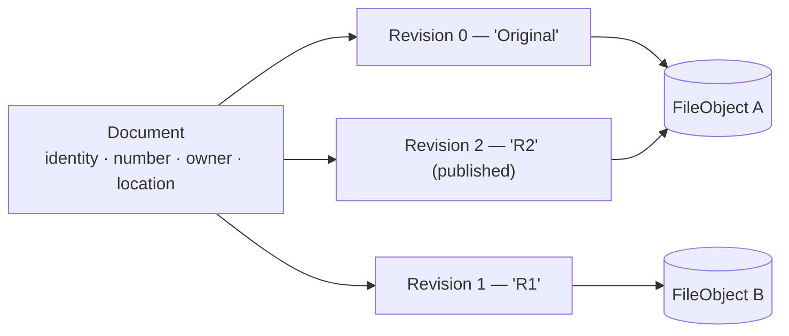
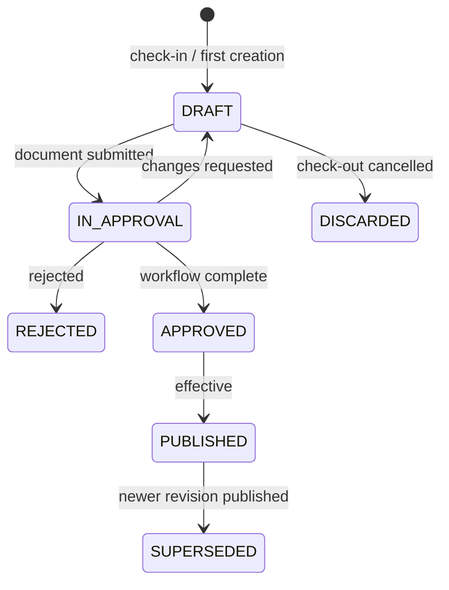
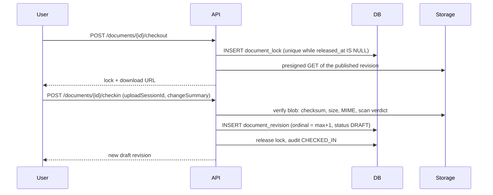

# 10 — Revision Architecture

**Purpose:** how versions of a controlled document are created, published, compared and restored.
**Audience:** backend engineers; anyone building the revision UI.

## 1. Three layers, three lifetimes



| Layer | Lives as long as | Mutable |
| --- | --- | --- |
| Document | The record exists — through every revision | Metadata and location only |
| Revision | Forever, once published | No |
| FileObject | Until no revision references it | Never |

Revision 2 pointing at FileObject A is not an error: content-addressed storage stores identical
bytes once ([11](./11-storage-architecture.md)). Reverting content therefore costs no storage.

## 2. Rules

1. **The document number never changes.** Revisions are labelled beside it, never inside it.
2. **Ordinals are contiguous and strictly increasing** per document: `0, 1, 2 …`, `uq (document_id, ordinal)`.
3. **Labels are a display convention** owned by the document type: `Original, R1, R2…`, or
   `A, B, C…`, or `1.0, 1.1, 2.0` for major/minor. The ordinal is the truth; the label is rendered.
4. **A published revision is immutable** — content, metadata snapshot, approval record and file
   reference are all frozen.
5. **Exactly one revision is `PUBLISHED`** at a time; publishing revision *n* moves *n-1* to
   `SUPERSEDED` in the same transaction.
6. **A superseded revision remains readable** to anyone with `document:history:view`. Revision
   history is compliance evidence, not clutter.

### Revision states



Only one revision may be in `DRAFT` or `IN_APPROVAL` at a time — enforced by the check-out lock,
which is what makes "who is working on this" answerable.

## 3. Check-out / check-in



| Property | Rule |
| --- | --- |
| Exclusivity | One live lock per document; a second check-out gets `409` naming the holder |
| Expiry | Locks expire after a tenant-configured period; expiry is audited and notifies the holder |
| Force check-in | `document:force-checkin` releases another user's lock, requires a reason, is audited, and preserves any uploaded draft |
| Cancel | Discards the draft revision (`DISCARDED`, retained in history) and releases the lock |
| Offline edit | Check-out is the contract: the file is edited in the user's own tools and checked back in |

**A check-out does not change the published revision.** Readers keep seeing the effective document
throughout, flagged as "being revised" if the tenant enables it.

## 4. Comparison

Comparison is a **read-only, derived** service — never a mutation, never authoritative.

| Layer compared | Method |
| --- | --- |
| Metadata | Structured field-by-field diff from the stored metadata snapshot on each revision |
| Approval | Who approved which revision, when, with what comment |
| Text content | Extracted text (from the preview/OCR pipeline) diffed by paragraph, with word-level highlighting |
| Rendered pages | Page-image comparison for formats where text extraction is unreliable (drawings, scans) |
| Binary | Checksum equality only — reported as "identical" or "changed", never diffed |

Text and page comparison consume artefacts produced by [14](./14-preview-architecture.md); if an
artefact is missing, the comparison is queued and the UI says so rather than showing a partial diff.

## 5. Restore

Restoring revision *k* **creates revision *n+1*** whose content is that of *k*.

```text
Original → R1 → R2 (published)
restore(Original)  ⇒  R3 (content of Original, restored_from_revision_id = R0)
```

- The restored revision enters the normal lifecycle: `DRAFT → approval → publish`. Restoring is not
  a way around approval.
- `restored_from_revision_id` is recorded and shown in history.
- History is never rewritten and revisions are never deleted. "Deleting a revision" is not an
  operation this product has.

## 6. Metadata across revisions

| Kind | Belongs to | Why |
| --- | --- | --- |
| Title, type, category, confidentiality, owner, location | Document | They describe the record, not a version |
| Change summary, author, approval record, effective dates, file reference | Revision | They describe one controlled version |
| Snapshot of all metadata values at publish | Revision | So an approved revision can prove what was approved, even after the document's live metadata is edited |

The snapshot is what makes the audit answer "what did the approver actually see".

## 7. Storage impact

- Every revision references a `FileObject`; identical content across revisions or documents is
  stored once and reference-counted.
- Old revisions are lifecycle-tiered to cold storage after a configurable age; retrieval from cold
  storage is transparent but slower, and the UI says so ([11](./11-storage-architecture.md)).
- Purging a document decrements every reference; blobs at zero are deleted after a grace period.

## Phase 6 — what was built

Phase 3 created ordinal zero and called it the whole of Revision; Phase 6 built everything above.

**The lock is `document_lock`, and the race is the index's.** One live lock per document is
`uq_document_lock_live` — partial on `released_at IS NULL`, the same shape as
`uq_workflow_instance_live` — so two check-outs racing produce one lock and one refusal naming the
holder, never a read-then-check answer. The lock order against the document row is fixed and
stated in `revision-control.service.ts`: the document row first (under its optimistic version),
the lock row second, revision rows last. Expiry is a tenant setting
(`documents.checkoutExpiryHours`); an expired live lock is swept aside by the next operation that
wants the document — released as `EXPIRED`, audited — rather than by a background job, because a
lock nobody wants to take over excludes nobody. §3's error-shape note said `409`; the platform's
error catalogue maps `LOCKED` to `423 Locked`, which is what the refusal carries, holder named.

**Check-in creates the draft; cancel can discard one.** §3's cancel row ("draft revision
discarded") is reachable through `keepCheckedOut`: a check-in may record the new revision as the
lock's working draft and keep the claim, a further check-in replaces it (`DISCARDED`, ordinal
spent, blob dereferenced), and a cancel discards it and returns the document to `PUBLISHED`
untouched. Force check-in preserves the holder's draft by default, exactly as the table above
says, and requires the reason its audit event records. "Multiple file check-in" is many
*documents* in one request — one file per revision is ADR-0003, so several files for one document
is refused by the contract's construction, not modelled around.

**Publication supersedes in the same transaction, and the database referees.**
`uq_revision_published` (partial on `status = 'PUBLISHED'`) is the second half of rule 5;
`uq_document_current_revision` was already the first. Publication writes `published_at`, the
effective window and the **metadata snapshot** of §6 onto the revision, moves the prior published
revision to `SUPERSEDED` (its own `published_at` kept), and points `current_revision_id` at the
new one — one transaction, refused whole under a race. Effective dates live on the revision, as
§6 states, not on the document as the 05 sketch once drew them.

**Restore costs a row, not a copy — proven in rows.** The restored revision references the old
blob (`ref_count` up by one, no new `file_object`), records `restored_from_revision_id` — with a
trigger refusing a source from another document — and enters the normal lifecycle as a draft.
Mechanically it is a check-out and check-in in one transaction, so the lock history says it
happened.

**The compare API answers what the pipeline can answer honestly.** Content by checksum, metadata
by the published snapshots (a draft has none, and the response says `available: false` rather
than diffing live values), approval history via the approval timeline that already exists. Text
and page comparison state `UNAVAILABLE`: they consume [14](./14-preview-architecture.md)'s
artefacts, and rendering them is Phase 7's.
