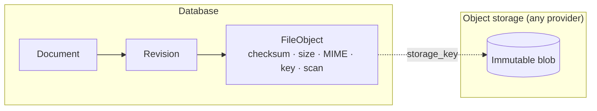
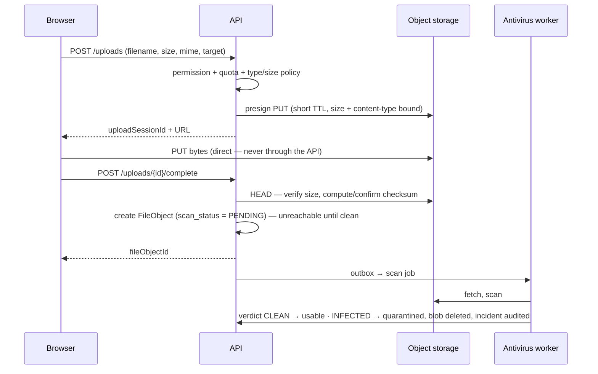

# 11 — Storage Architecture

**Purpose:** how bytes are stored, addressed, protected and retired — independently of any provider.
**Audience:** backend engineers.

## 1. Principle

**The business document and the physical file are separate things.** The database owns records; the
object store owns bytes. Nothing in the domain layer knows what a bucket is
([ADR-0007](./adr/0007-storage-port-and-content-addressing.md)).



## 2. The port

```ts
export interface StoragePort {
  createUploadTarget(input: UploadTargetInput): Promise<UploadTarget>;   // presigned PUT / multipart
  completeUpload(sessionId: UploadSessionId): Promise<BlobMetadata>;
  createDownloadUrl(key: StorageKey, options: DownloadOptions): Promise<SignedUrl>;
  head(key: StorageKey): Promise<BlobMetadata>;
  copy(from: StorageKey, to: StorageKey): Promise<void>;
  delete(key: StorageKey): Promise<void>;
  setStorageClass(key: StorageKey, tier: StorageTier): Promise<void>;
}
```

| Adapter | Use |
| --- | --- |
| `LocalStorageAdapter` | Development and single-node on-premise installs |
| `S3Adapter` | AWS S3 and any S3-compatible store (MinIO, LocalStack in dev) |
| `AzureBlobAdapter` | Azure deployments |
| `R2Adapter` | Cloudflare R2 |

Adding a provider means one adapter class and one configuration value. **No use case changes.** The
port's vocabulary is deliberately provider-neutral: no `Bucket`, no `ContainerClient`, no
`PutObjectCommand` above the adapter boundary.

## 3. Content addressing and deduplication

```text
storage_key = <tenantId>/<sha256[0:2]>/<sha256[2:4]>/<sha256>
```

- The key is derived from the content hash, so **identical content is stored once per tenant**
  (`uq (tenant_id, checksum_sha256)`), and revisions or documents that share bytes share a blob.
- Blobs are **never overwritten**. A changed file is different content and therefore a different
  key — which is what makes "the approved bytes are still the approved bytes" provable.
- **Dedupe never crosses tenants**, even for identical content. Cross-tenant dedupe would let one
  tenant's storage costs and existence signals leak into another's.
- `ref_count` on `file_object` tracks references; it is maintained transactionally with revision
  writes, and reconciled by a periodic sweeper that reports (never silently fixes) drift.

## 4. Upload path



Rules:

- **Bytes never transit the API.** Presigned, direct-to-storage, both ways. The API stays stateless
  and small, and a 2 GB upload does not occupy an application process.
- A file with `scan_status <> 'CLEAN'` **cannot be attached to a revision or downloaded**. Enforced
  in the use case and by a database check, not only in the UI.
- Validation is by **content sniffing, not extension**: declared MIME must match the detected type,
  the type must be in the tenant's allow-list, and size must be within the type's limit.
- Uploads are quota-checked per tenant before presigning.
- Presigned URLs are single-purpose, short-lived (default 5 minutes), bound to method, size and
  content type, and their issuance is audited.

## 5. Download path

- `GET /documents/{id}/revisions/{revId}/content` resolves permission, confidentiality rules and
  document state, then returns a short-lived signed URL with `Content-Disposition` set from the
  document number and revision label.
- Every download and print is audited **before** the URL is issued, with the reason if the
  confidentiality level requires one ([13](./13-audit-architecture.md)).
- Confidentiality levels that forbid download return only a watermarked preview stream, never the
  original ([14](./14-preview-architecture.md)).

## 6. Encryption, integrity, lifecycle

| Concern | Approach |
| --- | --- |
| In transit | TLS 1.2+ everywhere, including presigned URLs |
| At rest | Provider-managed encryption by default; customer-managed keys (SSE-KMS) supported per tenant, with the key reference stored on the tenant, never the key |
| Integrity | SHA-256 stored at creation; a background verifier re-hashes a rolling sample and any blob fetched for preview, reporting mismatches as security incidents |
| Immutability | Object-lock / WORM supported where the provider offers it, for tenants with regulatory retention |
| Tiering | Hot for the published revision; warm after 90 days; cold for superseded revisions older than the tenant's threshold. Configured per tenant, applied by the retention worker |
| Deletion | Only via retention purge, only at `ref_count = 0`, after a grace period, and audited |

## 7. Derived artefacts

Previews, thumbnails and OCR outputs are `FileObject`s too, marked `derived = true`. They are
**disposable**: deleting one loses nothing, because it can be regenerated from the original. They
are excluded from quota accounting, tiered aggressively, and purged with their source.

## 8. Failure behaviour

| Failure | Behaviour |
| --- | --- |
| Storage unreachable on upload | `503` with retry hint; no partial record is created |
| Upload completed but `complete` never called | Session expires; the orphan blob is swept after 24 h |
| Blob missing on download | `500` plus a `STORAGE_OBJECT_MISSING` incident; never a silent empty file |
| Checksum mismatch | Download refused, incident raised, blob quarantined |
| Provider migration | Copy-through migration: new writes to the new provider, background copy of the old, `storage_driver` recorded per blob so both are readable throughout |
