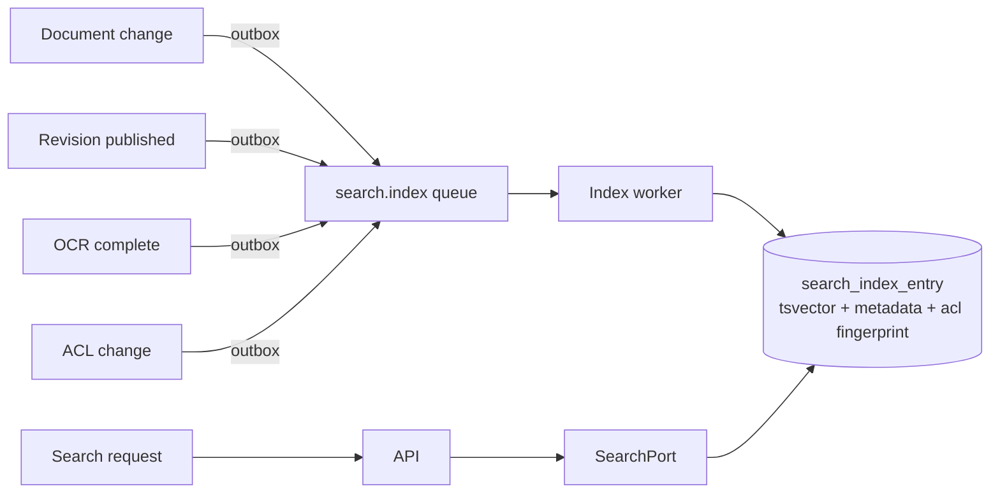

# 12 — Search Architecture

**Purpose:** how documents are found — metadata, full text, OCR — without ever leaking one.
**Audience:** backend engineers; anyone building search UI.

## 1. Requirements

| Requirement | Consequence |
| --- | --- |
| Find by number, title, tag, author, approver, department, entity, type, status, revision, date | A structured index, not just a text blob |
| Find by content, including scanned paper | Extracted text + OCR feed the same index |
| Never return a document the caller may not see | Permission filtering happens **in** the query, not after it |
| Arabic and English | Language-aware analysis and a normalisation step |
| Sub-second at millions of documents | An index, never a scan of the live tables |
| Provider-replaceable | Everything behind `SearchPort` ([ADR-0008](./adr/0008-postgres-first-search.md)) |

## 2. Design



The index is a **read model**. It is never authoritative, it is rebuildable from source at any time,
and a rebuild is a routine operation rather than an incident.

### Index entry

| Field | Purpose |
| --- | --- |
| `document_id`, `tenant_id` | Identity and isolation |
| `tsv tsvector` | Weighted text: number and title (A), tags and metadata (B), summary (C), body/OCR text (D) |
| `number_exact`, `title_raw` | Exact and prefix matching, unaffected by stemming |
| `metadata jsonb` | Typed values for filtering and faceting |
| `type_id`, `category_id`, `status`, `confidentiality_rank`, `entity_id`, `branch_id`, `department_id`, `folder_path`, `owner_id`, `approver_ids[]`, `revision_ordinal`, dates | Filters and facets |
| `acl_subjects text[]` | The subject ids allowed to view, materialised for filtering |
| `acl_deny_subjects text[]` | Subjects explicitly denied |
| `indexed_at`, `source_version` | Staleness detection and safe re-projection |

Weighting: `setweight(to_tsvector(…number, title…), 'A') || setweight(…tags, metadata…, 'B') || …`.
A GIN index on `tsv`, B-tree indexes on the filter columns, GIN on `acl_subjects`.

## 3. Permission filtering

The hard rule: **a user must never learn that a document exists.** That excludes fetch-then-filter,
which leaks through result counts, pagination and facets.

```sql
WHERE tenant_id = current_setting('app.tenant_id')::uuid
  AND acl_subjects && $callerSubjects           -- allowed by user, role or department
  AND NOT (acl_deny_subjects && $callerSubjects)
  AND confidentiality_rank <= $callerMaxRank
  AND tsv @@ websearch_to_tsquery($lang, $query)
```

- `acl_subjects` is computed by the same pure resolver the API uses
  ([08](./08-permission-model.md)) — one implementation, two call sites, so the index can never
  disagree with a direct read.
- An ACL change re-projects the affected subtree asynchronously. Because the index can briefly lag,
  **every result is re-checked at open time**; the index narrows, the object check decides.
- Users with `search:all` (auditors, controllers) bypass the ACL predicate but not the tenant
  predicate, and their searches are audited.

## 4. Text extraction

| Source | Producer |
| --- | --- |
| Native text (PDF, Office, TXT, HTML) | Preview pipeline's text extractor |
| Scanned images and image-only PDFs | OCR worker via `OcrPort` ([14](./14-preview-architecture.md)) |
| Metadata and tags | Directly from the record |

Extraction is asynchronous and does not block publishing. A document is findable by number, title
and metadata immediately, and by content when extraction completes; the UI shows content indexing
as pending rather than pretending it is done.

Arabic handling: normalise alef/hamza/ya forms, strip tashkeel, index both the normalised and the
original forms, use the `arabic` text-search configuration, and detect language per revision rather
than per tenant.

## 5. Query features

| Feature | Behaviour |
| --- | --- |
| Simple query | `websearch_to_tsquery` — quotes, `OR`, `-` exclusion |
| Field query | `number:QMS-*`, `type:PROC`, `status:PUBLISHED`, `approver:me`, `updated:>2026-01-01` — parsed into structured filters, never into raw SQL |
| Facets | Type, category, status, department, entity, year, confidentiality, tag — counted post-filter, so counts never leak |
| Sorting | Relevance (`ts_rank_cd`), recency, number, title |
| Pagination | Keyset (`(rank, document_id)`) — offsets degrade badly at depth |
| Saved searches | Stored per user, shareable by ACL |
| Highlighting | `ts_headline` over the stored text, permission-checked |
| Did-you-mean | Trigram similarity (`pg_trgm`) on titles and numbers |

## 6. Freshness

| Change | Target latency |
| --- | --- |
| Create, publish, metadata edit, move | < 2 s |
| ACL change on a folder subtree | < 30 s for the subtree |
| OCR of a large scan | Minutes; visibly pending |
| Full rebuild of a tenant | Offline-capable, resumable, no downtime for reads (indexes are rebuilt into a shadow table and swapped) |

Coalescing: multiple changes to one document within the debounce window produce one projection.

## 7. When PostgreSQL stops being enough

Migration triggers, monitored from the start: p95 query latency > 800 ms at expected concurrency,
index write lag > 60 s sustained, or a requirement Postgres cannot serve (semantic search,
cross-tenant analytics at scale, per-field multilingual analyzers).

Because everything goes through `SearchPort`, migrating means writing `OpenSearchAdapter`,
dual-writing during backfill, comparing results on a sample, and flipping a configuration value.
No use case and no controller changes. This is the entire reason for the port
([ADR-0008](./adr/0008-postgres-first-search.md)).
