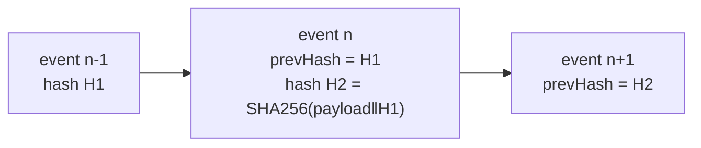
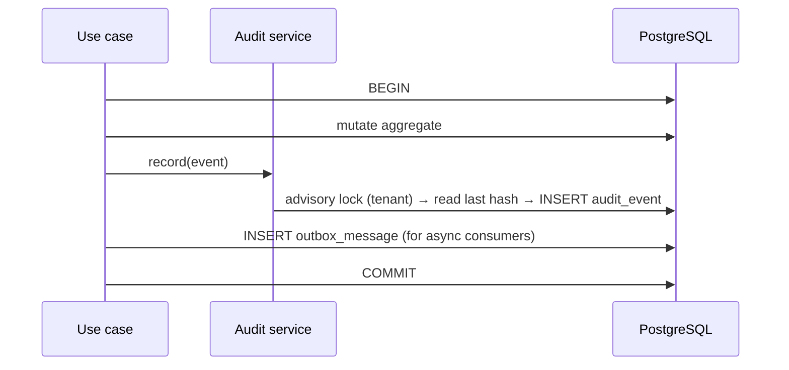

# 13 — Audit Architecture

**Purpose:** what is audited, how it is written, and why it can be trusted.
**Audience:** backend engineers; auditors and compliance officers.

## 1. Principles

1. **Every action is auditable** — reads included, not just writes.
2. **Audit is append-only.** No update path, no delete path, no exception for administrators.
3. **Audit is written in the same transaction as the change it records.** Either both happened or
   neither did; there is no "the change succeeded but the audit was lost".
4. **Audit is tamper-evident.** Records are hash-chained per tenant, so removal or alteration is
   detectable ([ADR-0009](./adr/0009-append-only-hash-chained-audit.md)).
5. **Audit outlives its subject.** Purging a document does not purge its audit trail.
6. **Audit records facts, not opinions**: actor, action, target, time, before/after, context.

## 2. Event catalogue

| Group | Events |
| --- | --- |
| Document | `CREATED`, `VIEWED`, `DOWNLOADED`, `PRINTED`, `METADATA_CHANGED`, `MOVED`, `LINKED`, `ARCHIVED`, `REINSTATED`, `DELETED`, `RESTORED`, `PURGED` |
| Revision | `UPLOADED`, `CHECKED_OUT`, `CHECKED_IN`, `CHECKOUT_CANCELLED`, `CHECKOUT_FORCED`, `PUBLISHED`, `SUPERSEDED`, `RESTORED_FROM` |
| Workflow | `SUBMITTED`, `STAGE_ACTIVATED`, `APPROVED`, `REJECTED`, `CHANGES_REQUESTED`, `TASK_REASSIGNED`, `ESCALATED`, `AUTO_APPROVED`, `WITHDRAWN`, `WORKFLOW_PUBLISHED`, `WORKFLOW_CHANGED` |
| Numbering | `NUMBER_RESERVED`, `NUMBER_ASSIGNED`, `NUMBER_VOIDED`, `RULE_CHANGED` |
| Permission | `ACL_GRANTED`, `ACL_REVOKED`, `INHERITANCE_BROKEN`, `ROLE_ASSIGNED`, `ROLE_PERMISSION_CHANGED`, `ACCESS_DENIED` |
| Delegation | `DELEGATION_CREATED`, `DELEGATION_USED`, `DELEGATION_REVOKED`, `DELEGATION_EXPIRED` |
| Retention | `SCHEDULE_SET`, `HOLD_PLACED`, `HOLD_RELEASED`, `DISPOSITION_APPROVED`, `PURGE_EXECUTED` |
| Security | `LOGIN_SUCCEEDED`, `LOGIN_FAILED`, `MFA_ENROLLED`, `MFA_FAILED`, `PASSWORD_CHANGED`, `SESSION_REVOKED`, `FILE_DOWNLOAD_ISSUED`, `FILE_SCANNED`, `INTEGRITY_MISMATCH`, `NOTIFICATION_SUPPRESSED` |
| Administration | `SETTING_CHANGED`, `TYPE_CHANGED`, `FIELD_CHANGED`, `POLICY_CHANGED`, `USER_CREATED`, `USER_CHANGED`, `USER_DISABLED`, `ORG_CHANGED`, `LIBRARY_CHANGED`, `FOLDER_CHANGED` |
| Document (Phase 3) | `DOCUMENT_CHANGED`, `DOCUMENT_MOVED`, `DOCUMENT_VIEWED`, `DOCUMENT_PRINTED`, `FILE_UPLOADED` |
| Workflow (Phase 4) | `SUBMITTED`, `STAGE_ACTIVATED`, `APPROVED`, `REJECTED`, `CHANGES_REQUESTED`, `ESCALATED`, `AUTO_APPROVED`, `WITHDRAWN`, `WORKFLOW_PAUSED`, `TIMER_FIRED`, `ROUTING_CHANGED` |
| Revision (Phase 6) | `CHECKED_OUT`, `CHECKED_IN`, `CHECKOUT_CANCELLED`, `CHECKOUT_FORCED`, `PUBLISHED`, `SUPERSEDED`, `RESTORED_FROM` |
| Numbering (Phase 5) | `NUMBER_RESERVED`, `NUMBER_ASSIGNED`, `NUMBER_VOIDED` |
| Search (Phase 8) | `SEARCH_PERFORMED`, `SEARCH_REBUILD_REQUESTED` |
| Export | `AUDIT_EXPORTED`, `REPORT_EXPORTED`, `BULK_DOWNLOAD` |

**The table above is the whole catalogue, and Phase 9 is where it became so.** The rows from
`Document (Phase 3)` down were previously only in the per-phase addenda at the foot of this
document, which meant the one table a compliance report reads did not name most of the actions the
product writes. The addenda remain — they carry the *reasoning* for each split — and the table now
carries the vocabulary.

`SIGNED_URL_ISSUED` was renamed to **`FILE_DOWNLOAD_ISSUED`**, and `SCAN_INFECTED` to
**`FILE_SCANNED`**, to match the code rather than the other way round. Phase 3 wrote both actions
under those names and the catalogue was never reconciled, so a filter written from this document
would have matched nothing. The code's names are also the better ones: a download URL is issued for
a *file*, and a scan is recorded whatever its verdict — `SCAN_INFECTED` could not express a clean
scan, which is most of them.

### Which rows still have no writer, and whose they are

| Rows | Owner |
| --- | --- |
| `ACL_GRANTED`, `ACL_REVOKED`, `INHERITANCE_BROKEN` | The phase that builds ACL entries |
| ~~`DELEGATION_CREATED`, `DELEGATION_USED`, `DELEGATION_REVOKED`, `DELEGATION_EXPIRED`~~ | Phase 11 — written |
| ~~`SCHEDULE_SET`, `HOLD_PLACED`, `HOLD_RELEASED`, `DISPOSITION_APPROVED`, `PURGE_EXECUTED`, `PURGED`~~ | Phase 10 — written |
| `MFA_ENROLLED`, `MFA_FAILED`, `SESSION_REVOKED` | Phase 14 — security |
| `REPORT_EXPORTED` | Phase 15 — reporting |
| `ARCHIVED`, `REINSTATED`, `LINKED` | The phase that builds each capability |
| `INTEGRITY_MISMATCH` | Phase 18 — the integrity sweep that would detect one |

Phase 9's own are `AUDIT_EXPORTED`, `BULK_DOWNLOAD` and `ACCESS_DENIED`, and all three are written.
A row here with no owner is an oversight; a row with an owner is a schedule.

**Phase 12's one, and why the group has one rather than several.** `NOTIFICATION_SUPPRESSED` is
added to the Security group and written by the delivery service when repeated hard bounces suppress
an address (`18-notification-architecture.md` §7). It is the only notification act in this
catalogue, and that is the decision rather than the starting point.

Most notification acts do not belong here, because of 18 §8's second prohibition: a notification is
**never the only record of anything**. Every fact one carries is already an audited act — a
document was approved, a delegation revoked, a chain failed verification — so a row saying "and we
told somebody" would be a second entry per event, on a table that already carries one per document
view, answering no question the first does not. A *preference* is somebody's own arrangement about
their own mail; it grants nothing and withdraws nothing from anyone else, and a row per checkbox
would bury this one in a table of them.

Suppressing an address is the exception because it is not a record of somebody being told. It is a
record of somebody **ceasing to be told**, and nothing else in the product writes it down: the
messages that follow are `SUPPRESSED` rows in a table nobody reads for compliance, and the state
that caused them is one column an administrator may clear at any time. "When did this account stop
receiving mail, and on what grounds" would otherwise be unanswerable — and it is exactly the
question asked after somebody says they were never told about an approval.

It is filed in **Security** rather than in a Notification group of its own because §2 "names one
action per area, not one per resource and verb", and one row does not make an area. It sits beside
`SESSION_REVOKED` for a reason: both are the product deciding to stop doing something for an
account, on evidence, without the account's consent. The provider's bounce reason goes in the
trail's own attested `reason` column, and the address is **masked** in both the reason and the
payload — §3 requires payloads to minimise personal data, and an administrator needs to recognise
which mailbox stopped working rather than to find a copy of the directory in the trail.

A **template** edit is audited as `SETTING_CHANGED`, not as a Notification action: a template is
tenant configuration in exactly the way a setting is, and the payload names which template changed.
The bodies are deliberately absent from `before`/`after` — a template is up to twenty thousand
characters, and copying two of them into a payload would make the trail a second store of the thing
it is describing (§3).

**Phase 11's four, and where each is written.** `DELEGATION_CREATED`, `DELEGATION_REVOKED` and
`DELEGATION_EXPIRED` are Identity's. `DELEGATION_USED` is the **workflow engine's**, written through
`AdministeredWriter.record` in the same transaction as the decision it describes — §1's third
principle admits no other placement, and the act being recorded is a decision on an approval task
rather than a change to a delegation.

All four are filed against a new subject type, `DELEGATION`, for the reason `EXPORT` was added in
Phase 9: a delegation is not a `USER`. It is an arrangement *between* two people, and filing it
under either party's user timeline would hide it from the other.

Two absences in this group are decisions rather than gaps. There is **no fifth action for an
emergency delegation**: the catalogue names four, and the emergency path is distinguished by
something stronger than a name — its `DELEGATION_CREATED` event carries the stated ground in the
trail's own `reason` column, which §5's widened digest attests and a verifier can address, where an
ordinary delegation leaves it null. And there is **no action for a declined request**: a delegation
that never came into force authorised nothing, and the refusal with its ground is on the row.

The catalogue names **one action per area**, not one per resource and verb. A company, an entity, a
branch and a department all write `ORG_CHANGED`; a library created, renamed, deleted or restored writes
`LIBRARY_CHANGED`. What actually happened is in the record: `before`, `after`, and an `operation` of
`CREATED`, `UPDATED`, `MOVED`, `DELETED` or `RESTORED`. The alternative — `COMPANY_CREATED`,
`COMPANY_RENAMED`, `DEPARTMENT_MOVED` and thirty more — is thirty strings every compliance report has to
learn in order to say what six and a payload already say.

Three names are exceptions, and each earns it by being the answer to a question asked on its own.
`RULE_CHANGED` is separate from `POLICY_CHANGED` because a numbering rule decides the identifiers
printed on documents, and "when did this series change shape" stands alone. `WORKFLOW_PUBLISHED` is
separate from `WORKFLOW_CHANGED` because publishing is the moment a version becomes immutable and starts
binding approvals — "which rules was this document approved under, and when did they take effect".
`USER_CHANGED` is separate from `USER_CREATED` and `USER_DISABLED` because an account being created,
having its sign-in address changed, and being disabled are three different questions, and answering the
middle one by filtering the payloads of the first would make it the only question in the trail that
needs a payload filter.

`VIEWED` and `DOWNLOADED` matter for controlled documents — "who has read the current procedure" is
a compliance question — so read auditing is on by default for documents above a configurable
confidentiality rank, and always for downloads, prints and exports.

## 3. Record shape

```jsonc
{
  "id": "01948f…",                 // UUID v7 — ordering without a sequence
  "tenantId": "…",
  "sequence": 84213,               // per-tenant monotonic, gap-free
  "occurredAt": "2026-07-31T09:14:02.117Z",
  "actor": { "userId": "…", "onBehalfOfUserId": null, "roles": ["AUTHOR"], "ip": "…", "userAgent": "…" },
  "action": "DOCUMENT_APPROVED",
  "target": { "type": "DOCUMENT", "id": "…", "number": "QMS-JO-AMM-QA-PROC-2026-0042", "revision": 2 },
  "context": { "workflowInstanceId": "…", "stageIndex": 1, "correlationId": "…", "reason": "…" },
  "before": { "status": "UNDER_REVIEW" },
  "after":  { "status": "APPROVED", "documentNumber": "QMS-JO-AMM-QA-PROC-2026-0042" },
  "prevHash": "9c2f…",
  "hash": "4b71…"                  // SHA-256 over the canonical serialisation incl. prevHash
}
```

- `before`/`after` carry **only changed fields**, and never a secret, credential, token or file
  content.
- Personal data in payloads is minimised: identifiers, not copies of records.
- `correlationId` ties every event of one request together, and ties audit to application logs.

## 4. Integrity



- The chain is **per tenant**, with a gap-free `sequence`. Deleting or editing a record breaks the
  chain at that point and every point after it.
- A daily job verifies the chain, records a signed checkpoint (`sequence`, `hash`, timestamp), and
  alerts on any break. Checkpoints are written to a separate store so an attacker with database
  access alone cannot rewrite history undetected. Built in Phase 9 — see the section at the foot of
  this document for the store, the key and why resuming from a checkpoint is only sound because it
  is signed.
- Database grants: the application role has `INSERT` and `SELECT` on `audit_event` and **no
  `UPDATE` or `DELETE`**. A `BEFORE UPDATE OR DELETE` trigger raises unconditionally, so even the
  migration role cannot quietly alter a row.
- Chain computation happens inside the writing transaction, serialised per tenant by an advisory
  lock on the tenant id — cheap, because audit writes are short.

## 5. Write path



An audit failure fails the whole operation. There is no path where the change commits and the audit
does not — that is the property the whole design exists to guarantee.

Read auditing (`VIEWED`) is the one exception to synchronous writing: it is buffered and flushed in
batches, because it must not cost a transaction per page view. Buffered events are still
hash-chained, and a flush failure raises an alert. Phase 9 is where this became true of the code;
until then every audited view took the tenant's audit advisory lock inline. A **print** is not
exempt — §2's prints are audited unconditionally and synchronously.

## 6. Reading, retention and export

| Surface | Behaviour |
| --- | --- |
| Document timeline | The events for one document, filtered to what the caller may see |
| Activity feed | Recent events across the caller's scope |
| Audit search | `audit:view`, filterable by actor, action, target, date, correlation id |
| Evidence export | `audit:export` produces a signed bundle (CSV/JSONL + checkpoint hashes + a manifest) written to storage and downloaded via a signed URL. The export itself is audited |
| SIEM | Optional per-tenant streaming of security events to an external sink |

Retention: audit is kept for the tenant's compliance period (default 7 years), partitioned monthly,
and moved to cold storage after 12 months. **Partitioning is still not built** — Phase 9 added the
action index this section's audit search needs and deferred the partitions to Phase 10; Phase 10
re-deferred them with a *new* trigger, because the reason for the first deferral turned out to
survive it. See "Phase 10 — the trigger fired, and the answer was still no" at the foot of this
document. **Audit is never deleted with its subject**; when a document is purged, its audit trail
remains, with the document number preserved so the record is still meaningful — Phase 10 is where
that stopped being a sentence and became a table, `document_tombstone`, because the number cannot
be added to payloads already written.

## 7. What audit must never do

| Never | Why |
| --- | --- |
| Update or delete an event | The trail's value is that it cannot be edited |
| Be written outside the transaction | Divergence between reality and record |
| Contain a password, token, key or file content | Audit becomes a breach target |
| Be readable across tenants | Audit is tenant data |
| Be skipped for administrator actions | Privileged actions are the ones most worth recording |
| Silently drop on failure | A dropped event is an unnoticed gap in evidence |

## Phase 3 — the actions the document library writes

The catalogue's convention is one action per *area*, with the operation in the payload. Phase 3 adds
five, and the split between them is the split between questions an investigation asks separately.

| Action | Subject | Written when |
| --- | --- | --- |
| `DOCUMENT_CHANGED` | `DOCUMENT` | Created, edited, reclassified, deleted or restored |
| `DOCUMENT_MOVED` | `DOCUMENT` | Folder changed — and therefore the permission chain did |
| `DOCUMENT_VIEWED` | `DOCUMENT` | Somebody opened it |
| `FILE_UPLOADED` | `FILE` | A target was issued, an upload completed, or one was abandoned |
| `FILE_DOWNLOAD_ISSUED` | `FILE` | A signed download URL was issued |

Two of these are worth justifying.

**`DOCUMENT_VIEWED` is its own action rather than an operation on `DOCUMENT_CHANGED`.** A compliance
report asking "who has read this" must not have to filter a stream that also contains every rename,
and reads outnumber writes by orders of magnitude — grouping them would make the common query the
expensive one. The confidentiality level and its rank are in the payload, because that is what
decides whether the event had to be written at all.

**`FILE_DOWNLOAD_ISSUED` is written *before* the URL exists.** A signed URL outlives the request that
produced it and can be redeemed by whoever holds it, so the record of who was handed one is the only
evidence of how bytes could have left the system. A window in which a URL exists and nothing says so
is exactly where a failure would hide.

**What is deliberately not audited: favourites.** Whether somebody bookmarked a document is a fact
about a menu, not about a controlled record. One hash-chained, immutable, retention-governed row per
click on a star would dilute the trail with the one kind of event that can never matter.

## Phase 4 — the actions the approval engine writes

The catalogue's convention is one action per *area* with the operation in the payload, and the
Workflow group is where that convention is deliberately not followed. Everything Phase 2 wrote was
somebody *configuring* approvals; everything below is somebody *deciding*, and "who approved this
document and when" is asked more often than any other question this product answers. It must not
have to filter a stream that also contains every workflow rename.

| Action | Subject | Written when |
| --- | --- | --- |
| `SUBMITTED` | `DOCUMENT` | A document was handed to its workflow. Records the **version** it bound to, not merely the definition |
| `STAGE_ACTIVATED` | `WORKFLOW` | Tasks exist for a stage's approvers |
| `APPROVED` | `TASK` | An approver agreed |
| `REJECTED` | `TASK` | An approver refused. The comment is required and is in the payload |
| `CHANGES_REQUESTED` | `TASK` | An approver sent it back to its author |
| `ESCALATED` | `WORKFLOW` | A deadline passed and the task went to somebody else |
| `AUTO_APPROVED` | `WORKFLOW` | The engine decided under a stage marked non-controlling |
| `WITHDRAWN` | `WORKFLOW` | An approval ended without a decision |
| `WORKFLOW_PAUSED` | `WORKFLOW` | Timers stopped, or started again |
| `TIMER_FIRED` | `WORKFLOW` | A deadline or reminder arrived, whatever effect it had |
| `ROUTING_CHANGED` | `CONFIGURATION` | An approval group or a working calendar changed |

Four of these are worth justifying.

**A decision event carries the revision it was taken on.** "Prove what was approved" resolves
instance → revision → file → checksum, and putting the revision in the payload means the answer does
not depend on a join whose result a later revision would change.

**`SUBMITTED` records the workflow version, not the definition.** A definition identifier alone would
answer "which rules was this approved under" with whatever the definition says today, which is the
one thing versioning exists to prevent.

**Both identities travel on every decision.** `decidedBy` and `onBehalfOf` are in the payload before
delegation exists, so the trail answers "who decided" and "for whom" without a migration when it does.

**`AUTO_APPROVED` is its own action rather than an `APPROVED` with a flag.** An approval nobody made
is the one entry in this trail an auditor will want to find by searching for it, and a flag inside a
payload is not something anybody searches for.

**`TIMER_FIRED` is written even when nothing changed.** A `NOTIFY_ONLY` deadline changes no state, and
a trail that recorded only the firings which caused one could not distinguish a stage nobody chased
from one the engine never noticed.

## Phase 8 — the actions search writes

| Action | Subject | Written when |
| --- | --- | --- |
| `SEARCH_PERFORMED` | `SEARCH` | A `search:all` query ran — the ACL predicate was bypassed |
| `SEARCH_REBUILD_REQUESTED` | `SEARCH` | An operator asked for a full index rebuild |

Both are worth justifying.

**`SEARCH_PERFORMED` is written only for `search:all`.** 12 §3's rule is that the bypass is
audited, not that curiosity is: auditing every ordinary search would hash-chain a row per
keystroke, and the ordinary search discloses nothing the caller could not read directly. The
payload carries the query text and filters, because "what did the auditor search for" is the
question the row exists to answer. `SEARCH` joined `audit_subject_type` for these two actions —
a search is about the capability, not about any one document.

**The rebuild has two records for two facts.** `SEARCH_REBUILD_REQUESTED` is the operator act,
in the trail; `search.rebuild-completed` is the outcome, in the event stream — the same split
as a decision's audit row against its domain event.

**What is deliberately not audited: saved and recent searches.** One person's shortcuts are
facts about a menu, exactly as favourites are (Phase 3's row above).

## Phase 9 — what the read path made true, and what it made honest

Phase 1 built the write path and the chain. Phase 9 builds everything that *reads* them, and in
doing so it had to settle four things this document asserted and the code did not do. Each is
recorded here because the document, not the code, was the thing that had to change in two of them.

### The digest was widened, and versioned rather than backdated

Phase 1's digest covered nine fields — event id, tenant, instant, actor, action, subject type,
subject id, outcome and payload — and left seven uncovered: `sequence`, `channel`, `reason`,
`on_behalf_of_id`, `correlation_id`, `ip_address` and `user_agent`. Three of those are evidence in
their own right. A confidentiality level can *require* a stated reason for access (08 §4); a
delegation puts a second identity on an act; and the sequence is the entire argument that nothing
was removed from the end. An evidence bundle claiming to prove them would have claimed more than
the chain proved.

So `chain_hash_version` is now a column, `2` covers every field but the hashes themselves, and new
appends are written under it. **Existing rows keep the digest they were written with**, because
they cannot be rehashed: `audit_event` refuses `UPDATE` to every role including the owner, and that
refusal is the property the whole design exists for. Verification dispatches on the row's own
version, and an evidence bundle's manifest states, per version present in its range, exactly which
columns that version's hash attests. The cost is a permanent branch in the verifier and a bundle
that says two different things about two halves of a long trail — which is the honest description
of what a widened digest can offer a table nobody may edit.

### Checkpoints exist, outside the database, signed

§4 promised a daily signed checkpoint "written to a separate store so an attacker with database
access alone cannot rewrite history undetected", and there was no table, no key and no store. There
is now no table either, deliberately: a checkpoint beside the events it attests is rewritten by the
same access that rewrote them. The store is **object storage**, keyed so that lexicographic order
is chronological order, and the checkpoint is signed with `AUDIT_CHECKPOINT_SECRET` — held in the
deployment's own secret material, in neither the database nor the bucket. Production refuses to
boot without one.

The signature is what makes resuming safe. A pass resumes from the last checkpoint rather than from
genesis, and the store refuses to return a checkpoint whose signature does not recompute — so
"start from sequence 84,213 with digest 9c2f…" is an authenticated claim rather than a note an
attacker could move.

### The verification job runs, on the lane the catalogue already gave it

`audit.verify-chain` was in `SCHEDULE` with a cron expression and nothing to fire it. It now fires:
`QueuePort.schedule` upserts a **named** cron schedule in the broker, so every instance that boots
declares the same one and there is one firing rather than one per instance — strictly stronger than
the lock around a timer that `ScheduledJob.lockKey` anticipated, because there was only ever one
pass to run. The firing is tenant-less and fans out one job per tenant, since each tenant has its
own database and its own chain.

It consumes in the **API process**, behind `queue.consumersEnabled`, which is where every consumer
since Phase 4 lives. `apps/worker` composes none of the domain modules, so moving this there would
mean composing them twice or having one flag mean two different things in two processes.

A pass is bounded by `AUDIT_VERIFY_MAX_EVENTS` and checkpoints wherever it stopped, so a deployment
meeting seven years of trail on its first night catches up over several and then verifies one day
at a time.

### Read auditing is buffered, as §5 always said it was

§5 has said since Phase 0 that `VIEWED` "is buffered and flushed in batches, because it must not
cost a transaction per page view". It was not: every audited view took
`pg_advisory_xact_lock(hashtext(tenant))` inline, and `audit.readEventsAboveRank` defaults to `0`,
so *every* view did. A document everybody reads throttled every approval, upload and publication in
the same organisation.

`READ_AUDIT_BUFFER` is the buffer. Flushes take the lock once and chain the whole batch under it,
so a hundred views cost one lock and the chain cannot tell the difference afterwards. `occurredAt`
is captured when somebody looked, not when the flush ran. Nothing is dropped: a failed flush
retains its batch and retries, and past the hard bound `record` writes synchronously — Phase 1's
behaviour, slower rather than lossy, which is the only degradation §7 permits.

**A print stays synchronous.** §5 exempts `VIEWED` and nothing else, prints are rare and deliberate,
and a print is the act a confidentiality level most wants a hard record of.

### Reading, and how a timeline is filtered

§6's "filtered to what the caller may see" has one shape the row model supports. An audit row
carries `(subject_type, subject_id)` and no scope chain, and since Phase 8 a `SEARCH` row carries
the *actor's own user id* as its subject — the first subject in the product that is not a domain
object. So the decision is resolved **once, at the subject**, before the query: a timeline names one
object, whether the caller may see that object is one question, and it is asked of `ACL_RESOLVER` —
the same port and binding Phase 8 bound for search. Every row on the page is about that object, so
one decision covers the page exactly.

A per-row lookup would also have been wrong where it worked. Audit outlives its subject (§1): a
purged document's trail remains, deliberately. A filter resolving each row's object would silently
hide the history of a thing that no longer exists, which is the history that matters most.

The **audit search** crosses subjects, so there is no object to resolve; `audit:view` gates it, and
that grant *is* the filter. Narrowing an auditor's search by document ACLs would produce an auditor
who cannot audit — the opposite of the row §5 of 08 writes for them.

### Volume: what this phase does, and what it defers

§6 specifies 7 years, monthly range partitions and cold storage after 12 months. This phase adds
**an index on `(tenant_id, action, occurred_at)`** — §6's own audit search filters by action first,
and without it that query is a sequential scan of the trail — and it does **not** partition.

Partitioning is deferred on purpose rather than forgotten. Converting `audit_event` to a partitioned
table is a rewrite of the one table that may not be rewritten while the application is writing to
it, the retention that would detach a partition is Phase 10's, and the immutability trigger already
leaves DDL uncovered so that a detach will work when it arrives. Doing it now would mean building
the mechanism a month before anything could use it, against a table whose size no deployment has yet.
The trigger for doing it is Phase 10 or the first tenant whose trail passes tens of millions of rows,
whichever comes first.

### The export

§6's signed bundle exists: `events.jsonl`, `events.csv`, `manifest.json` and `manifest.sig` under
one prefix in storage, produced on the `audit.export` lane, downloaded through signed URLs, and
audited three times — the request, the outcome, and every issuance of the links. The rows stream:
`StoragePort.put` writes an artefact a part at a time, so the lane's own description ("streamed to
storage rather than held in memory") is true rather than aspirational.

It is a prefix of objects rather than one archive. A ZIP would mean either a compression dependency
and a second assembly pass — precisely the in-memory hold the lane forbids — or hand-rolling an
archive format nobody asked for. The manifest is the bundle's entry point, and the auditor gets four
links instead of one.


## Phase 10 — the trigger fired, and the answer was still no

Phase 9 deferred monthly range partitions and cold-storage tiering with a stated trigger: "Phase
10, or the first tenant past tens of millions of rows, whichever comes first". Phase 10 arrived.
This section records why it did not build them, and what the new trigger is — because a trigger
that fires and is quietly reset is a deferral nobody is accountable for.

**The reason for the first deferral survived the trigger.** Phase 9's argument was that
partitioning is "building the mechanism a month before anything could use it", and that the
retention which would detach a partition is Phase 10's. The second half is what turned out to be
wrong. Phase 10's retention purges **documents**, and its central constraint is that it must not
touch `audit_event` at all — 13 §1's "audit outlives its subject", enforced by a trigger that
refuses `DELETE` to every role. Nothing this phase built detaches an audit partition, and nothing
it built ever will: a document's disposition and the trail's own retention are different clocks
with different periods, and conflating them is the failure mode §6 exists to prevent.

So the mechanism would still have no user. What a partition *would* be detached by is a sweep over
the trail's own compliance period — §6's seven years — and no deployment of this product is seven
years old. Building the detach path now would mean writing, and maintaining, the one destructive
operation on the one table that may not be rewritten, against a size no tenant has, for a clock
that has not started.

**The new trigger, stated so it cannot be reset silently:** the first of

1. a tenant whose `audit_event` passes **twenty million rows**, or
2. the phase that gives audit its *own* retention period a disposition — the sweep that would drop
   a month once the compliance period has elapsed.

Neither is Phase 11's, 12's or 13's by any reading, which is the point of naming both. The
groundwork Phase 9 laid still holds: `ix_audit_occurred` is the partition key, and the immutability
trigger deliberately leaves DDL uncovered so a detach will work when it arrives.

**What Phase 10 did add to this section's concerns** is the tombstone. §6's promise that a purged
document's trail keeps "the document number preserved so the record is still meaningful" was true
of nothing: the number lived on the `document` row, and the purge removes it. It could not be
back-filled into the payloads of events already written — that is an `UPDATE`, and this table
refuses one for every role including the owner, which is the property the whole design exists for.
`document_tombstone` is where it lives instead: written by the purge, in the purge's transaction,
keyed by the document identifier that every one of those rows already carries as `subject_id`.

The cost is honest and worth stating in this document rather than only in the phase report. For
events written **before** Phase 10, the number is one join away rather than in the row — a reader
of an old trail resolves it through the tombstone. For events written since, the `PURGED` row
carries it in its payload as well, so the last event of a document's life is legible on its own.
There is no version of this that puts the number into a row already hashed, and a design that
offered one would be a design in which the trail can be edited.
