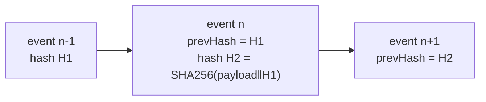
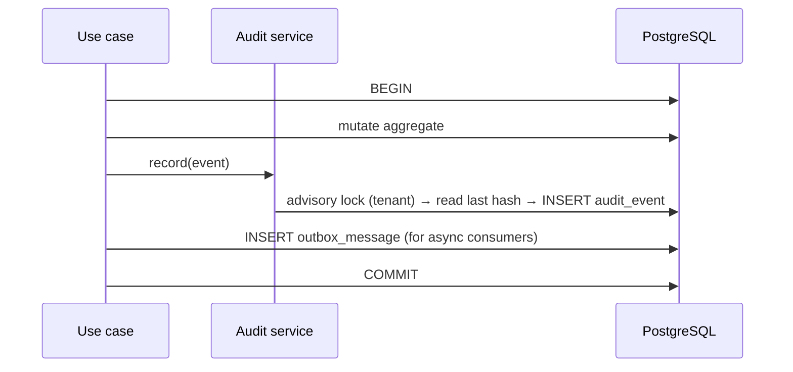

# 13 — Audit Architecture

**Purpose:** what is audited, how it is written, and why it can be trusted.
**Audience:** backend engineers; auditors and compliance officers.

## 1. Principles

1. **Every action is auditable** — reads included, not just writes.
2. **Audit is append-only.** No update path, no delete path, no exception for administrators.
3. **Audit is written in the same transaction as the change it records.** Either both happened or
   neither did; there is no "the change succeeded but the audit was lost".
4. **Audit is tamper-evident.** Records are hash-chained per tenant, so removal or alteration is
   detectable ([ADR-0009](./adr/0009-append-only-hash-chained-audit.md)).
5. **Audit outlives its subject.** Purging a document does not purge its audit trail.
6. **Audit records facts, not opinions**: actor, action, target, time, before/after, context.

## 2. Event catalogue

| Group | Events |
| --- | --- |
| Document | `CREATED`, `VIEWED`, `DOWNLOADED`, `PRINTED`, `METADATA_CHANGED`, `MOVED`, `LINKED`, `ARCHIVED`, `REINSTATED`, `DELETED`, `RESTORED`, `PURGED` |
| Revision | `UPLOADED`, `CHECKED_OUT`, `CHECKED_IN`, `CHECKOUT_CANCELLED`, `CHECKOUT_FORCED`, `PUBLISHED`, `SUPERSEDED`, `RESTORED_FROM` |
| Workflow | `SUBMITTED`, `STAGE_ACTIVATED`, `APPROVED`, `REJECTED`, `CHANGES_REQUESTED`, `TASK_REASSIGNED`, `ESCALATED`, `AUTO_APPROVED`, `WITHDRAWN`, `WORKFLOW_PUBLISHED`, `WORKFLOW_CHANGED` |
| Numbering | `NUMBER_RESERVED`, `NUMBER_ASSIGNED`, `NUMBER_VOIDED`, `RULE_CHANGED` |
| Permission | `ACL_GRANTED`, `ACL_REVOKED`, `INHERITANCE_BROKEN`, `ROLE_ASSIGNED`, `ROLE_PERMISSION_CHANGED`, `ACCESS_DENIED` |
| Delegation | `DELEGATION_CREATED`, `DELEGATION_USED`, `DELEGATION_REVOKED`, `DELEGATION_EXPIRED` |
| Retention | `SCHEDULE_SET`, `HOLD_PLACED`, `HOLD_RELEASED`, `DISPOSITION_APPROVED`, `PURGE_EXECUTED` |
| Security | `LOGIN_SUCCEEDED`, `LOGIN_FAILED`, `MFA_ENROLLED`, `MFA_FAILED`, `PASSWORD_CHANGED`, `SESSION_REVOKED`, `SIGNED_URL_ISSUED`, `SCAN_INFECTED`, `INTEGRITY_MISMATCH` |
| Administration | `SETTING_CHANGED`, `TYPE_CHANGED`, `FIELD_CHANGED`, `POLICY_CHANGED`, `USER_CREATED`, `USER_CHANGED`, `USER_DISABLED`, `ORG_CHANGED`, `LIBRARY_CHANGED`, `FOLDER_CHANGED` |
| Export | `AUDIT_EXPORTED`, `REPORT_EXPORTED`, `BULK_DOWNLOAD` |

The catalogue names **one action per area**, not one per resource and verb. A company, an entity, a
branch and a department all write `ORG_CHANGED`; a library created, renamed, deleted or restored writes
`LIBRARY_CHANGED`. What actually happened is in the record: `before`, `after`, and an `operation` of
`CREATED`, `UPDATED`, `MOVED`, `DELETED` or `RESTORED`. The alternative — `COMPANY_CREATED`,
`COMPANY_RENAMED`, `DEPARTMENT_MOVED` and thirty more — is thirty strings every compliance report has to
learn in order to say what six and a payload already say.

Three names are exceptions, and each earns it by being the answer to a question asked on its own.
`RULE_CHANGED` is separate from `POLICY_CHANGED` because a numbering rule decides the identifiers
printed on documents, and "when did this series change shape" stands alone. `WORKFLOW_PUBLISHED` is
separate from `WORKFLOW_CHANGED` because publishing is the moment a version becomes immutable and starts
binding approvals — "which rules was this document approved under, and when did they take effect".
`USER_CHANGED` is separate from `USER_CREATED` and `USER_DISABLED` because an account being created,
having its sign-in address changed, and being disabled are three different questions, and answering the
middle one by filtering the payloads of the first would make it the only question in the trail that
needs a payload filter.

`VIEWED` and `DOWNLOADED` matter for controlled documents — "who has read the current procedure" is
a compliance question — so read auditing is on by default for documents above a configurable
confidentiality rank, and always for downloads, prints and exports.

## 3. Record shape

```jsonc
{
  "id": "01948f…",                 // UUID v7 — ordering without a sequence
  "tenantId": "…",
  "sequence": 84213,               // per-tenant monotonic, gap-free
  "occurredAt": "2026-07-31T09:14:02.117Z",
  "actor": { "userId": "…", "onBehalfOfUserId": null, "roles": ["AUTHOR"], "ip": "…", "userAgent": "…" },
  "action": "DOCUMENT_APPROVED",
  "target": { "type": "DOCUMENT", "id": "…", "number": "QMS-JO-AMM-QA-PROC-2026-0042", "revision": 2 },
  "context": { "workflowInstanceId": "…", "stageIndex": 1, "correlationId": "…", "reason": "…" },
  "before": { "status": "UNDER_REVIEW" },
  "after":  { "status": "APPROVED", "documentNumber": "QMS-JO-AMM-QA-PROC-2026-0042" },
  "prevHash": "9c2f…",
  "hash": "4b71…"                  // SHA-256 over the canonical serialisation incl. prevHash
}
```

- `before`/`after` carry **only changed fields**, and never a secret, credential, token or file
  content.
- Personal data in payloads is minimised: identifiers, not copies of records.
- `correlationId` ties every event of one request together, and ties audit to application logs.

## 4. Integrity



- The chain is **per tenant**, with a gap-free `sequence`. Deleting or editing a record breaks the
  chain at that point and every point after it.
- A daily job verifies the chain, records a signed checkpoint (`sequence`, `hash`, timestamp), and
  alerts on any break. Checkpoints are written to a separate store so an attacker with database
  access alone cannot rewrite history undetected.
- Database grants: the application role has `INSERT` and `SELECT` on `audit_event` and **no
  `UPDATE` or `DELETE`**. A `BEFORE UPDATE OR DELETE` trigger raises unconditionally, so even the
  migration role cannot quietly alter a row.
- Chain computation happens inside the writing transaction, serialised per tenant by an advisory
  lock on the tenant id — cheap, because audit writes are short.

## 5. Write path



An audit failure fails the whole operation. There is no path where the change commits and the audit
does not — that is the property the whole design exists to guarantee.

Read auditing (`VIEWED`) is the one exception to synchronous writing: it is buffered and flushed in
batches, because it must not cost a transaction per page view. Buffered events are still
hash-chained, and a flush failure raises an alert.

## 6. Reading, retention and export

| Surface | Behaviour |
| --- | --- |
| Document timeline | The events for one document, filtered to what the caller may see |
| Activity feed | Recent events across the caller's scope |
| Audit search | `audit:view`, filterable by actor, action, target, date, correlation id |
| Evidence export | `audit:export` produces a signed bundle (CSV/JSONL + checkpoint hashes + a manifest) written to storage and downloaded via a signed URL. The export itself is audited |
| SIEM | Optional per-tenant streaming of security events to an external sink |

Retention: audit is kept for the tenant's compliance period (default 7 years), partitioned monthly,
and moved to cold storage after 12 months. **Audit is never deleted with its subject**; when a
document is purged, its audit trail remains, with the document number preserved so the record is
still meaningful.

## 7. What audit must never do

| Never | Why |
| --- | --- |
| Update or delete an event | The trail's value is that it cannot be edited |
| Be written outside the transaction | Divergence between reality and record |
| Contain a password, token, key or file content | Audit becomes a breach target |
| Be readable across tenants | Audit is tenant data |
| Be skipped for administrator actions | Privileged actions are the ones most worth recording |
| Silently drop on failure | A dropped event is an unnoticed gap in evidence |

## Phase 3 — the actions the document library writes

The catalogue's convention is one action per *area*, with the operation in the payload. Phase 3 adds
five, and the split between them is the split between questions an investigation asks separately.

| Action | Subject | Written when |
| --- | --- | --- |
| `DOCUMENT_CHANGED` | `DOCUMENT` | Created, edited, reclassified, deleted or restored |
| `DOCUMENT_MOVED` | `DOCUMENT` | Folder changed — and therefore the permission chain did |
| `DOCUMENT_VIEWED` | `DOCUMENT` | Somebody opened it |
| `FILE_UPLOADED` | `FILE` | A target was issued, an upload completed, or one was abandoned |
| `FILE_DOWNLOAD_ISSUED` | `FILE` | A signed download URL was issued |

Two of these are worth justifying.

**`DOCUMENT_VIEWED` is its own action rather than an operation on `DOCUMENT_CHANGED`.** A compliance
report asking "who has read this" must not have to filter a stream that also contains every rename,
and reads outnumber writes by orders of magnitude — grouping them would make the common query the
expensive one. The confidentiality level and its rank are in the payload, because that is what
decides whether the event had to be written at all.

**`FILE_DOWNLOAD_ISSUED` is written *before* the URL exists.** A signed URL outlives the request that
produced it and can be redeemed by whoever holds it, so the record of who was handed one is the only
evidence of how bytes could have left the system. A window in which a URL exists and nothing says so
is exactly where a failure would hide.

**What is deliberately not audited: favourites.** Whether somebody bookmarked a document is a fact
about a menu, not about a controlled record. One hash-chained, immutable, retention-governed row per
click on a star would dilute the trail with the one kind of event that can never matter.

## Phase 4 — the actions the approval engine writes

The catalogue's convention is one action per *area* with the operation in the payload, and the
Workflow group is where that convention is deliberately not followed. Everything Phase 2 wrote was
somebody *configuring* approvals; everything below is somebody *deciding*, and "who approved this
document and when" is asked more often than any other question this product answers. It must not
have to filter a stream that also contains every workflow rename.

| Action | Subject | Written when |
| --- | --- | --- |
| `SUBMITTED` | `DOCUMENT` | A document was handed to its workflow. Records the **version** it bound to, not merely the definition |
| `STAGE_ACTIVATED` | `WORKFLOW` | Tasks exist for a stage's approvers |
| `APPROVED` | `TASK` | An approver agreed |
| `REJECTED` | `TASK` | An approver refused. The comment is required and is in the payload |
| `CHANGES_REQUESTED` | `TASK` | An approver sent it back to its author |
| `ESCALATED` | `WORKFLOW` | A deadline passed and the task went to somebody else |
| `AUTO_APPROVED` | `WORKFLOW` | The engine decided under a stage marked non-controlling |
| `WITHDRAWN` | `WORKFLOW` | An approval ended without a decision |
| `WORKFLOW_PAUSED` | `WORKFLOW` | Timers stopped, or started again |
| `TIMER_FIRED` | `WORKFLOW` | A deadline or reminder arrived, whatever effect it had |
| `ROUTING_CHANGED` | `CONFIGURATION` | An approval group or a working calendar changed |

Four of these are worth justifying.

**A decision event carries the revision it was taken on.** "Prove what was approved" resolves
instance → revision → file → checksum, and putting the revision in the payload means the answer does
not depend on a join whose result a later revision would change.

**`SUBMITTED` records the workflow version, not the definition.** A definition identifier alone would
answer "which rules was this approved under" with whatever the definition says today, which is the
one thing versioning exists to prevent.

**Both identities travel on every decision.** `decidedBy` and `onBehalfOf` are in the payload before
delegation exists, so the trail answers "who decided" and "for whom" without a migration when it does.

**`AUTO_APPROVED` is its own action rather than an `APPROVED` with a flag.** An approval nobody made
is the one entry in this trail an auditor will want to find by searching for it, and a flag inside a
payload is not something anybody searches for.

**`TIMER_FIRED` is written even when nothing changed.** A `NOTIFY_ONLY` deadline changes no state, and
a trail that recorded only the firings which caused one could not distinguish a stage nobody chased
from one the engine never noticed.
