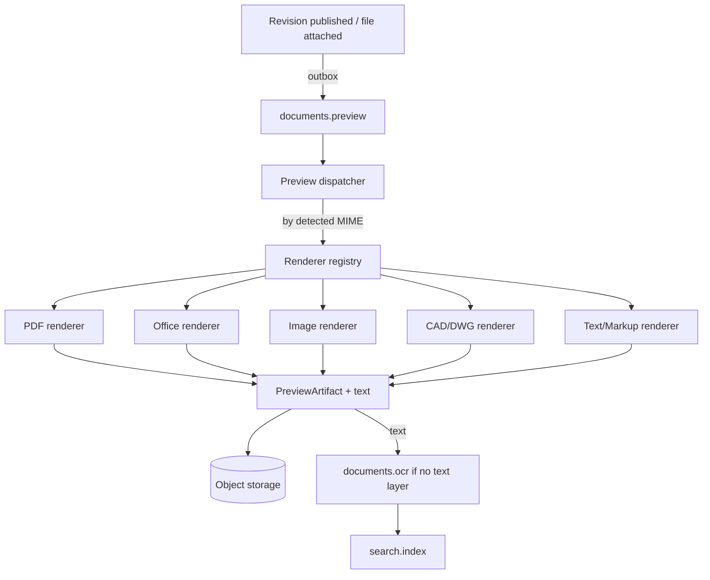

# 14 — Preview Architecture

**Purpose:** how documents are viewed without downloading them, and how their text is extracted.
**Audience:** backend engineers building the preview and OCR pipeline.

## 1. Why preview is architecture, not a feature

Preview is how a confidentiality level can say "readable, not downloadable" and mean it. It is also
the source of the text that search and revision comparison depend on. It must therefore be
reliable, sandboxed and format-extensible without touching the core.

## 2. Design: a registry of independent renderers



Every renderer implements the same small contract and knows nothing about documents, permissions or
tenants:

```ts
export interface PreviewRenderer {
  readonly key: string;                 // 'pdf', 'office', 'image', 'cad', 'text'
  readonly version: string;             // recorded on every artifact it produces
  supports(mime: MimeType): boolean;
  render(input: RenderInput): Promise<RenderOutput>;   // pages, thumbnail, extracted text
}
```

| Renderer | Formats | Approach |
| --- | --- | --- |
| PDF | `application/pdf` | Page raster + text layer extraction |
| Office | Word, Excel, PowerPoint | Convert to PDF in a sandboxed converter, then the PDF path |
| Image | PNG, JPEG, TIFF, HEIC | Normalise, resize, multi-page TIFF split; OCR candidate |
| CAD | DWG, DXF | Convert to PDF/SVG; large-file and page-count limits |
| Text/Markup | TXT, CSV, MD, HTML, XML | Sanitised render; text taken directly |

**Renderers are independent.** Adding DWG support is one class plus one registration; a failing
renderer degrades only its own formats. Nothing in the document module knows which renderers exist.

## 3. Artefacts

| Artefact | Kind | Notes |
| --- | --- | --- |
| Page images | `PAGE_IMAGE` | Per page; for image formats the source serves as its own single page |
| Preview PDF | `PDF` | The rendition a viewer draws and a print serves; watermarked on demand. For a PDF source it *is* the source, referenced rather than copied |
| Thumbnail | `THUMBNAIL` | First page, list and card views |
| Extracted text | `TEXT` | Per page where the format has pages, feeds search and revision comparison |
| OCR text | `OCR` | Only when no usable text layer exists; `ocr_result` carries engine, version, language and confidence |

All artefacts are `FileObject`s marked `derived = true`: disposable, excluded from quota,
regenerable, purged with their source ([11](./11-storage-architecture.md)). `renderer` and
`renderer_version` are stored so an improved renderer can re-generate only what it supersedes.

## 4. Serving a preview

```mermaid
sequenceDiagram
    participant U as Browser
    participant API
    participant ST as Storage

    U->>API: GET /documents/{id}/revisions/{rev}/preview?page=1
    API->>API: permission → state → confidentiality
    alt artefact ready
        API->>ST: presign GET (short TTL, page image)
        API-->>U: URL (+ watermark parameters if required)
    else not ready
        API-->>U: 202 with status; client polls or subscribes
    end
    API->>API: audit VIEWED
```

- Preview URLs are short-lived and single-page; there is no directory-listing URL that would let a
  caller walk the pages of a document they may not read.
- **Watermarking** (user, timestamp, document number, "CONTROLLED COPY") is applied at render time
  for levels that require it, and the watermarked artefact is cached per user only when the tenant
  demands per-user marks — otherwise a shared, time-stamped watermark is used.
- Print goes through the preview path, never the original, so a print is auditable and watermarks
  survive.

## 5. Sandboxing

Rendering untrusted files is the product's largest attack surface. Therefore:

| Control | Rule |
| --- | --- |
| Process isolation | Renderers run in the worker tier, in a container with no database credentials and no network egress |
| Resource limits | CPU, memory, wall-clock and output-size caps per job; exceeded means a failed artefact, never a stuck worker |
| No macros, no scripting | Office conversion runs with macros disabled and external references blocked |
| Antivirus first | Nothing is rendered before the scan verdict is `CLEAN` |
| Input validation | Detected type must match the declared type; page and dimension limits enforced |
| Least privilege | Workers receive a presigned URL for one blob, not storage credentials |

## 6. OCR

- Runs only when text extraction yields nothing usable (a scan or an image-only PDF).
- Behind `OcrPort`: `TesseractAdapter` first (ara+eng), a hosted engine later, chosen by
  configuration.
- Output is stored as an artefact with engine, version, language and confidence, and low-confidence
  results are flagged in the UI rather than presented as authoritative.
- OCR never modifies the original file. It is metadata about the file, and the file remains the
  approved bytes.

## 7. Failure behaviour

| Failure | Behaviour |
| --- | --- |
| Unsupported format | No preview; download offered if permitted; the UI says the format is not previewable |
| Renderer crash or timeout | Retry with backoff, then mark `FAILED` with a reason visible to administrators. The document remains usable |
| Partial render | Pages produced so far are served; the rest are marked pending |
| Renderer upgrade | Old artefacts stay valid; regeneration is a background campaign, never a blocking migration |

## Phase 3 — the upload-time thumbnail

Phase 3 owned **one** artefact kind: a `THUMBNAIL`, drawn once when content arrives. Everything
above — the renderer registry, the sandboxed plugins, page images, the PDF rendition, OCR text
and the viewer — was Phase 7's to build, and it is built; the caveat this section carried
("`RENDERER_REGISTRY` is still deliberately unbound") is discharged below.

What is built now is the `preview_artifact` table in its full shape, plus one producer, so a document
uploaded today has a thumbnail and Phase 7 inherits a schema rather than a migration.

**PNG only.** A PDF's first page, an Office document's cover and a DWG's viewport each need a real
renderer, and each of those is a sandboxed subprocess with CPU, memory and time caps — a phase's
worth of work, and building a fraction of it early would mean building the fraction with no sandbox.
Every other format has no thumbnail until Phase 7, which the library renders as its format's label.

**The encoder is written out rather than pulled in.** `sharp` is a native binding that has to build
or download per architecture, which is exactly the dependency an air-gapped on-premise installer
meets badly; a box-filter downscale and a PNG encoder are a couple of hundred lines with no
dependency. The decoder refuses a decompression bomb from the header, before allocating — a
twenty-five-byte header can honestly declare fourteen gigabytes of pixels, and that is the one
security-relevant thing in the format.

**Generating a thumbnail never fails a document.** The port returns nothing, deliberately: a
thumbnail carries no information the document does not already have, and a create rolled back over
one would lose a document in order to protect a picture.

## Phase 7 — what was built

The registry of §2 binds, with four plugins — `munaxa-pdf`, `munaxa-office`, `munaxa-image`,
`munaxa-text` — each claiming its formats and knowing nothing about documents, permissions or
tenants. The renderer contract settled on **bytes in, bytes out**: the Phase 0.5 sketch had
renderers exchanging storage keys, which would have handed every plugin a reach into storage —
the opposite of §5's least-privilege row — so the orchestrator fetches the source through a
presigned URL and stores what comes back, and a renderer *cannot* hold a credential rather than
being told not to.

**The server rasterises nothing.** A page raster needs a canvas; a canvas in Node is a native
binding, and the air-gapped installer meeting native bindings badly has been the standing
constraint since Phase 3's hand-written PNG codec. So the PDF path serves the rendition and the
browser's own canvas draws it (pdf.js, bundled — no CDN); the server reads only the text layer,
through the one pure-JS dependency this phase pulls in rather than writes out (`pdfjs-dist` —
a PDF parser is years of format, not two hundred lines). Office documents get their text from a
direct parse of the OOXML parts (a ZIP reader and a tag scan, written out, under §5's archive
caps) and their pagination from LibreOffice, which is a subprocess per conversion — killed at
the wall clock, throwaway profile, macros never executed, minimal environment — and a
deployment decision: `OFFICE_DRIVER=NONE` degrades to text-only preview, honestly.

**DWG has no renderer, deliberately.** Every real CAD engine is either proprietary or a native
toolchain, both exactly what the installer meets badly, for a format whose fidelity errors are
the kind an engineer acts on. §7's unsupported-format row — no preview, download offered where
permitted, the UI saying so — is the shipped behaviour, and adding a CAD renderer later is one
plugin. TIFF is the same decision at smaller stakes: browsers cannot draw it, OCR reads it
directly, so it becomes searchable without becoming a picture.

**Serving is §4 as routes**, with the order owned where the words mean something: permission on
the route (`document:view` — never `document:download`; preview is what "readable, not
downloadable" means), state in the document module (readers are served the current revision,
drafts only through history behind `document:history:view`), confidentiality last and
subtract-only — `allow_print` finally refuses, and `watermark` decides whether the issued URL
points at bytes that carry the stamp. URLs are minted capabilities onto a preview stream
(single artefact, short TTL, domain-separated HMAC — the `LOCAL` transfer token's construction),
because a watermark must be burned in before a byte leaves and a presigned storage URL cannot
do that. The mark is **per user, per request, cached never**: §4 allowed a shared cached mark;
the stamp costs milliseconds against a size-capped rendition, so this deployment takes the
stronger mark. "202 with status" is real (`preview_render`, one row per revision), prints go
through the rendition and are audited as 13 §2's `PRINTED`, and a served view writes
`DOCUMENT_VIEWED` gated by `audit.readEventsAboveRank` — that setting's first consumer.

**The pipeline is §2's diagram running.** The outbox dispatcher fans `document.created` and the
`revision.*` events to `documents.preview` beside `search.index` (one event, two lanes, two
costs); nothing renders before the verdict is `CLEAN`; handlers are idempotent in the database —
`uq_preview_artifact` recreated `NULLS NOT DISTINCT`, because the original index treated NULL
pages as distinct and would have stored two thumbnails under redelivery. OCR is §6 exactly:
Tesseract first (`ara+eng`), subprocess, only when extraction yielded nothing usable, flagged
below seventy confidence, never touching the original. An image-only **PDF** stays unread —
rasterising its pages is the rendering job the server deliberately does not do — and that
limitation is recorded here rather than worked around badly.
