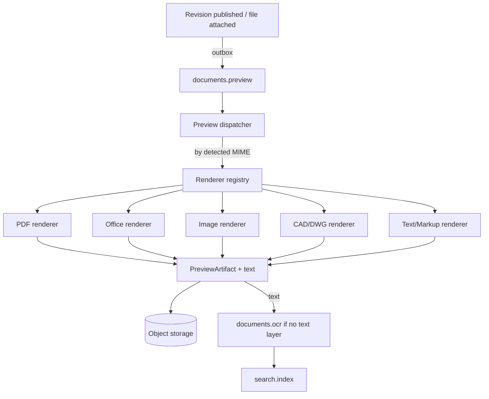

# 14 — Preview Architecture

**Purpose:** how documents are viewed without downloading them, and how their text is extracted.
**Audience:** backend engineers building the preview and OCR pipeline.

## 1. Why preview is architecture, not a feature

Preview is how a confidentiality level can say "readable, not downloadable" and mean it. It is also
the source of the text that search and revision comparison depend on. It must therefore be
reliable, sandboxed and format-extensible without touching the core.

## 2. Design: a registry of independent renderers



Every renderer implements the same small contract and knows nothing about documents, permissions or
tenants:

```ts
export interface PreviewRenderer {
  readonly key: string;                 // 'pdf', 'office', 'image', 'cad', 'text'
  readonly version: string;             // recorded on every artifact it produces
  supports(mime: MimeType): boolean;
  render(input: RenderInput): Promise<RenderOutput>;   // pages, thumbnail, extracted text
}
```

| Renderer | Formats | Approach |
| --- | --- | --- |
| PDF | `application/pdf` | Page raster + text layer extraction |
| Office | Word, Excel, PowerPoint | Convert to PDF in a sandboxed converter, then the PDF path |
| Image | PNG, JPEG, TIFF, HEIC | Normalise, resize, multi-page TIFF split; OCR candidate |
| CAD | DWG, DXF | Convert to PDF/SVG; large-file and page-count limits |
| Text/Markup | TXT, CSV, MD, HTML, XML | Sanitised render; text taken directly |

**Renderers are independent.** Adding DWG support is one class plus one registration; a failing
renderer degrades only its own formats. Nothing in the document module knows which renderers exist.

## 3. Artefacts

| Artefact | Kind | Notes |
| --- | --- | --- |
| Page images | `PAGE` | Web-optimised (WebP), per page, produced lazily beyond the first N pages |
| Preview PDF | `PREVIEW_PDF` | For formats converted for viewing; watermarked on demand |
| Thumbnail | `THUMBNAIL` | First page, list and card views |
| Extracted text | `TEXT` | Per page, feeds search and revision comparison |
| OCR text | `OCR` | Only when no usable text layer exists; carries engine, version and confidence |

All artefacts are `FileObject`s marked `derived = true`: disposable, excluded from quota,
regenerable, purged with their source ([11](./11-storage-architecture.md)). `renderer` and
`renderer_version` are stored so an improved renderer can re-generate only what it supersedes.

## 4. Serving a preview

```mermaid
sequenceDiagram
    participant U as Browser
    participant API
    participant ST as Storage

    U->>API: GET /documents/{id}/revisions/{rev}/preview?page=1
    API->>API: permission → state → confidentiality
    alt artefact ready
        API->>ST: presign GET (short TTL, page image)
        API-->>U: URL (+ watermark parameters if required)
    else not ready
        API-->>U: 202 with status; client polls or subscribes
    end
    API->>API: audit VIEWED
```

- Preview URLs are short-lived and single-page; there is no directory-listing URL that would let a
  caller walk the pages of a document they may not read.
- **Watermarking** (user, timestamp, document number, "CONTROLLED COPY") is applied at render time
  for levels that require it, and the watermarked artefact is cached per user only when the tenant
  demands per-user marks — otherwise a shared, time-stamped watermark is used.
- Print goes through the preview path, never the original, so a print is auditable and watermarks
  survive.

## 5. Sandboxing

Rendering untrusted files is the product's largest attack surface. Therefore:

| Control | Rule |
| --- | --- |
| Process isolation | Renderers run in the worker tier, in a container with no database credentials and no network egress |
| Resource limits | CPU, memory, wall-clock and output-size caps per job; exceeded means a failed artefact, never a stuck worker |
| No macros, no scripting | Office conversion runs with macros disabled and external references blocked |
| Antivirus first | Nothing is rendered before the scan verdict is `CLEAN` |
| Input validation | Detected type must match the declared type; page and dimension limits enforced |
| Least privilege | Workers receive a presigned URL for one blob, not storage credentials |

## 6. OCR

- Runs only when text extraction yields nothing usable (a scan or an image-only PDF).
- Behind `OcrPort`: `TesseractAdapter` first (ara+eng), a hosted engine later, chosen by
  configuration.
- Output is stored as an artefact with engine, version, language and confidence, and low-confidence
  results are flagged in the UI rather than presented as authoritative.
- OCR never modifies the original file. It is metadata about the file, and the file remains the
  approved bytes.

## 7. Failure behaviour

| Failure | Behaviour |
| --- | --- |
| Unsupported format | No preview; download offered if permitted; the UI says the format is not previewable |
| Renderer crash or timeout | Retry with backoff, then mark `FAILED` with a reason visible to administrators. The document remains usable |
| Partial render | Pages produced so far are served; the rest are marked pending |
| Renderer upgrade | Old artefacts stay valid; regeneration is a background campaign, never a blocking migration |
