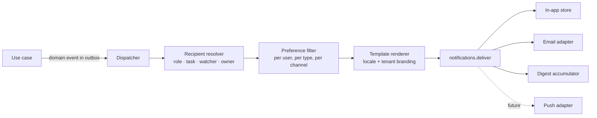

# 18 — Notification Architecture

**Purpose:** how people are told what needs their attention, without being drowned.
**Audience:** backend engineers adding anything that reaches a human.

## 1. Principles

1. **Notifications are generated from domain events, never from controllers.** A use case emits a
   fact; the notification module decides who hears about it.
2. **The recipient's preferences decide the channel**, not the sender's code.
3. **Delivery is at-least-once and idempotent**, keyed per `(event, recipient, channel)` — a retry
   never sends twice.
4. **A notification carries a deep link and enough context to act**, never "something changed".
5. **Volume is a feature.** Digests and per-type preferences exist from day one; an approver who
   receives 200 emails a day stops reading them, and the control is lost.

## 2. Flow

Every step is testable in isolation, and the resolver is pure: given an event and the org state, it
returns recipients.

## 3. Channels

| Channel | Status | Notes |
| --- | --- | --- |
| In-app | Phase 12 | The authoritative inbox: every notification lands here regardless of other channels, with read state and a deep link |
| Email | Phase 12 | Behind `NotificationPort` — SMTP for on-premise, a hosted provider for SaaS. Bounces and complaints are recorded and suppress further sends |
| Digest | Phase 12 | Hourly or daily rollup per user, replacing individual sends for types the user has digested |
| Push (web/mobile) | Future | The port and the message model already accommodate it; no code is written in anticipation |
| Webhook | Phase 17 | Per-tenant outbound webhooks for integration, signed, retried, and audited |

## 4. Event → notification map

| Event | Recipients | Default channels | Urgency |
| --- | --- | --- | --- |
| `ApprovalTaskAssigned` | Assignee (and delegate, if active) | In-app + email | High — never digested by default |
| `ApprovalDeadlineApproaching` | Assignee | In-app + email | High |
| `ApprovalOverdue` | Assignee + escalation target | In-app + email | High |
| `DocumentApproved` / `DocumentRejected` / `ChangesRequested` | Author, owner, watchers | In-app + email | Normal |
| `DocumentPublished` | Watchers, subscribers of the folder or type, and readers where the type marks the document as requiring acknowledgement | In-app + email | Normal |
| `RevisionPublished` | Everyone who acknowledged the previous revision | In-app + email | Normal — this is how "read the current version" is enforced |
| `CheckedOutByOther` / `LockExpiring` | Lock holder | In-app | Low |
| `DelegationCreated` / `Revoked` | Delegate and delegator | In-app + email | Normal |
| `RetentionDue` / `DispositionRequiresReview` | Document controller | In-app + email | Normal |
| `LegalHoldPlaced` / `Released` | Controller, owner | In-app + email | High |
| `SecurityEvent` (new device, MFA reset, infected upload) | User and administrators | Email always, ignoring preferences | High |
| `ImportCompleted` / `ExportReady` | Requester | In-app + email with a signed link | Low |

Security notifications ignore preferences deliberately: a user must be told their account changed.

## 5. Preferences

Resolved in order: **tenant policy → user preference → notification type default**. A tenant may
mark a type mandatory (approval assignment, security), in which case the user may choose the
channel but not silence it.

Per type, a user chooses: immediate, digest, or off (where allowed); plus quiet hours with a
timezone, during which non-urgent notifications are held and released afterwards.

## 6. Templates

- Stored per `(type, locale, channel)`, with tenant branding (logo, colours from
  `platform/themes/docs/brand.ts` — the one place raw hexes are permitted, for email HTML).
- Rendered with a strict, logic-free template language: no arbitrary expressions, all values
  escaped, all links absolute and signed where they carry access.
- EN and AR, with RTL email layouts.
- **Templates contain no secret and no document content** — a notification says a document changed
  and links to it; it never attaches it. Email is not a permission boundary.

## 7. Reliability

| Concern | Handling |
| --- | --- |
| Lost events | Transactional outbox — the event commits with the change ([ADR-0011](./adr/0011-transactional-outbox-for-async-work.md)) |
| Duplicates | Idempotency key per `(eventId, recipientId, channel)`; a second delivery is a no-op |
| Provider outage | Exponential backoff, capped attempts, dead-letter queue with operator visibility; in-app delivery is unaffected because it is a database write |
| Bounces | Recorded, repeated hard bounces suppress the address and alert an administrator |
| Ordering | Not guaranteed across types; each message carries the event timestamp and the UI orders by it |
| Storm control | Bulk operations (import 5 000 documents, re-permission a subtree) emit **one summary notification**, never one per object |

## 8. What notifications must never do

Carry document content or credentials; be the only record of anything (the audit trail is the
record); grant access by virtue of a link (every link resolves through normal authorisation); be
sent to an address not verified for that user; or be silently dropped on failure.
