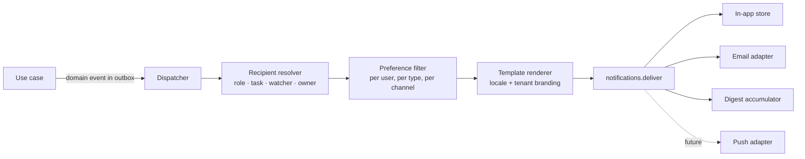

# 18 — Notification Architecture

**Purpose:** how people are told what needs their attention, without being drowned.
**Audience:** backend engineers adding anything that reaches a human.

## 1. Principles

1. **Notifications are generated from domain events, never from controllers.** A use case emits a
   fact; the notification module decides who hears about it.
2. **The recipient's preferences decide the channel**, not the sender's code.
3. **Delivery is at-least-once and idempotent**, keyed per `(event, recipient, channel)` — a retry
   never sends twice.
4. **A notification carries a deep link and enough context to act**, never "something changed".
5. **Volume is a feature.** Digests and per-type preferences exist from day one; an approver who
   receives 200 emails a day stops reading them, and the control is lost.

## 2. Flow

Every step is testable in isolation, and the resolver is pure: given an event and the org state, it
returns recipients.

## 3. Channels

| Channel | Status | Notes |
| --- | --- | --- |
| In-app | Phase 12 — built | The authoritative inbox: every notification lands here regardless of other channels, with read state and a deep link |
| Email | Phase 12 — hosted provider; **SMTP added in Phase 18** | Behind `NotificationPort`, two adapters. `RESEND` for the hosted service; `SMTP` for the on-premise deployment this row has wanted since Phase 0, hand-written over `node:net`/`node:tls` with the message building pure and unit-tested and the session driven against transcripts of real servers. Credentials are refused on an unencrypted channel, and production refuses `MAIL_SMTP_SECURITY=NONE` outright. Bounces are recorded and suppress the address; over SMTP the classification is RFC 5321's own — 5xx permanent, 4xx and any transport failure not |
| Digest | Phase 12 — built | Hourly, daily or weekly rollup per user, replacing individual **emails** for types the user has digested. In-app is never digested: §3's first row calls it authoritative |
| Push (web/mobile) | Future | The port and the message model already accommodate it; no code is written in anticipation |
| Webhook | Phase 17 — built, and **not on this path** | Per-tenant outbound webhooks, signed, retried and audited. `NotificationChannel.WEBHOOK` is a value nothing uses; see below |

### The webhook channel binds, and it binds outside this module

[ADR-0019](./adr/0019-webhooks-are-not-notifications.md). Phase 17 built the row above and
deliberately did **not** write a `NotificationPort` adapter for the `WEBHOOK` channel, because §8's
central safety property — *no recipient list derived from a document reaches a renderer without
every name in it passing the ACL resolver* — is a statement about **people**. A notification is
addressed to a person, and "may this human be told that this document exists" is a permission
question with a subject. An endpoint is not a user, holds no roles, appears in no ACL entry, and has
no reach to resolve.

Riding this path would have meant either inventing a subject for the endpoint so the walk had
something to check — load-bearing fiction in a disclosure decision — or writing
`if (channel !== WEBHOOK)` inside the one code path whose whole value is that it has no exceptions.

Everything else confirms it. A notification has preferences, quiet hours, a digest frequency, a
locale and a rendered template; none means anything for an endpoint. A webhook has a signature, a
replay window, a visible retry schedule and a dead-letter state; none means anything for a person.

So webhooks live in `modules/integration/` with their own tables, lane and retries, and
**`NotificationChannel.WEBHOOK` is a value nothing will ever use**. It is not removed: it sits in a
PostgreSQL enum that `notification_preference.channels` is an array of, and dropping a value from
an enum a column depends on is a migration with no benefit at the end of it. This paragraph is the
correction; the enum is left alone.

One consequence is a gap rather than a decision, and it is recorded as such in Phase 17's report:
**no notification is produced when an endpoint disables itself after twenty consecutive failures.**
The disablement is on the row, in the trail and on the screen — but nobody is told, and closing that
means reaching back into the path this ADR just separated from.

## 4. Event → notification map

| Event | Recipients | Default channels | Urgency |
| --- | --- | --- | --- |
| `ApprovalTaskAssigned` | Assignee (and delegate, if active) | In-app + email | High — never digested by default |
| `ApprovalDeadlineApproaching` | Assignee | In-app + email | High |
| `ApprovalOverdue` | Assignee + escalation target | In-app + email | High |
| `DocumentApproved` / `DocumentRejected` / `ChangesRequested` | Author, owner, watchers | In-app + email | Normal |
| `DocumentPublished` | Watchers, subscribers of the folder or type, and readers where the type marks the document as requiring acknowledgement | In-app + email | Normal |
| `RevisionPublished` | Everyone who acknowledged the previous revision | In-app + email | Normal — this is how "read the current version" is enforced |
| `CheckedOutByOther` / `LockExpiring` | Lock holder | In-app | Low |
| `DelegationCreated` / `Revoked` | Delegate and delegator | In-app + email | Normal |
| `RetentionDue` / `DispositionRequiresReview` | Document controller | In-app + email | Normal |
| `LegalHoldPlaced` / `Released` | Controller, owner | In-app + email | High |
| `SecurityEvent` (new device, MFA reset, infected upload) | User and administrators | Email always, ignoring preferences | High |
| `ImportCompleted` / `ExportReady` | Requester | In-app + email with a signed link | Low |

Security notifications ignore preferences deliberately: a user must be told their account changed.

### What Phase 12 built from this table, and what it deliberately did not

Every row above has a catalogue entry in `notification-types.ts` and a producer, **except two**
— a claim that was **false for a third row until Phase 6.4**, and worth leaving visible rather than
quietly editing. `DocumentApproved` / `DocumentRejected` had a catalogue entry, `en` and `ar`
templates, a branch in `NotificationEventService`, a route to the notification lane and an assertion
that the route exists. What they did not have was a **publisher**: approval and rejection both run
through `DocumentService.transition`, which wrote an audit row and no outbox row, so neither
notification had ever reached anybody. Phase 6.4 publishes both from that transition. The lesson is
narrow and general: a route is not a producer, and a test that hands a consumer a synthetic event
proves translation rather than production.

The two that genuinely gain nothing:

- **`RevisionPublished` to "everyone who acknowledged the previous revision"** needs an
  acknowledgement model, and there is none in the product. A notification type keyed to a table
  that does not exist is the entry Phase 1's rule forbids — "a catalogue entry for a notification
  nothing sends is an entry nobody can test".
- **`LockExpiring`** needs a timer on the check-out lock. Phase 6 built expiry as a *predicate* a
  later operation sweeps against rather than as a scheduled event, so nothing fires and nothing
  can notify. `CheckedOutByOther` is built.

Two rows are narrower in the code than in the table, and both are recorded as limits rather than
quietly widened. **"Watchers, subscribers of the folder or type"** do not exist: there is no
subscription model, and the built recipient list is the document's owner and author. **"Readers
where the type marks the document as requiring acknowledgement"** is the same absence.

Three rows gained an event that did not exist, because `workflow.stage-activated` was carrying
three meanings at once — activation, reminder, and a deadline passing under `NOTIFY_ONLY`. They are
now `workflow.task-assigned`, `workflow.reminder-due` and `workflow.overdue`, and each carries the
document and the stage name a notification needs to name itself.

**Every recipient list computed from a document is filtered through `ACL_RESOLVER` before anything
is written.** A notification that tells somebody a document exists is a disclosure even when the
link then refuses them — §8's third and fourth prohibitions, read together — and an approval task
assigned before a permission change outlives the permission that justified it.

## 5. Preferences

Resolved in order: **tenant policy → user preference → notification type default**. A tenant may
mark a type mandatory (approval assignment, security), in which case the user may choose the
channel but not silence it.

Per type, a user chooses: immediate, digest, or off (where allowed); plus quiet hours with a
timezone, during which non-urgent notifications are held and released afterwards.

**How Phase 12 built it.** A held message is a **state**, `HELD`, with a `release_at` that gates
the delivery claim — not a `QUEUED` row the query happens to skip. The alternative was considered
and rejected because an operator asking "what is waiting to go out" would get one number covering
both a mail outage and a quiet-hours hold, which are the two conditions that most need telling
apart. A digested message is `DIGESTED`, never `SUPPRESSED`: suppression means an address that must
not be written to, and overloading it would make "how many addresses are we refusing" a question
the table answers wrongly.

"Non-urgent" is `NotificationUrgency`, this section's own last column made a value. It is a
different question from both `mandatory` (may a preference silence this?) and `digestible` (may a
rollup delay it?), and neither of those could answer whether waking somebody at 03:00 is warranted.

Quiet hours are stored **per person**, not per type: nobody wants to be quiet for approvals and
loud for publications at three in the morning. The window is minutes past local midnight and an
IANA zone, because "do not write to me between 19:00 and 07:00" is a rule about a clock face and
two timestamps would expire.

**A digest is a list, and the renderer does not do lists.** §6's template language substitutes and
does nothing else, for the security reason §6 gives. So the list of collected subjects is composed
in code and handed to the renderer as a single `items` *value*, escaped for an HTML body exactly as
a document title is. The template language gained no loop; the digest gained a list.

## 6. Templates

- Stored per `(type, locale, channel)`, with tenant branding (logo, colours from
  `platform/themes/docs/brand.ts` — the one place raw hexes are permitted, for email HTML).
  **Phase 12's note:** the API depends on no `@munaxa/*` package — it renders no UI — so the three
  branding values are *settings* whose defaults carry the Docs brand hex with its provenance. That
  is also the stronger reading of "tenant branding": a tenant with its own brand gets its own
  colour, which a fixed import could never have given.
- Rendered with a strict, logic-free template language: no arbitrary expressions, all values
  escaped, all links absolute and signed where they carry access.
- EN and AR, with RTL email layouts.
- **Templates contain no secret and no document content** — a notification says a document changed
  and links to it; it never attaches it. Email is not a permission boundary.

## 7. Reliability

| Concern | Handling |
| --- | --- |
| Lost events | Transactional outbox — the event commits with the change ([ADR-0011](./adr/0011-transactional-outbox-for-async-work.md)) |
| Duplicates | Idempotency key per `(eventId, recipientId, channel)`; a second delivery is a no-op |
| Provider outage | Exponential backoff, capped attempts, dead-letter state with operator visibility; in-app delivery is unaffected because it is a database write. **Built in Phase 6.4**, and the only row in this table that nothing had built: a transient failure wrote `FAILED`, `claimQueued` selects `QUEUED`, and `DeliveryState.FAILED` was read by no query in the product — so a provider unreachable for one minute lost every email queued in that minute, permanently and silently. A retryable failure now returns to `QUEUED` behind a `release_at` on the same curve the outbox dispatcher uses, five attempts; the fifth leaves `FAILED` as the dead letter, and `notification.delivery.failures{outcome}` separates a blip from a loss |
| Bounces | Recorded, repeated hard bounces suppress the address and alert an administrator. **Built in Phase 12**: `notification_suppression` is keyed by the *address* rather than by a user, because suppression is a fact about a mailbox — a corrected address is reachable again at once, and an inherited one does not inherit its predecessor's bounces. The threshold is a tenant setting; the crossing writes `NOTIFICATION_SUPPRESSED` to the trail and alerts **once** |
| Ordering | Not guaranteed across types; each message carries the event timestamp and the UI orders by it |
| Storm control | Bulk operations (import 5 000 documents, re-permission a subtree) emit **one summary notification**, never one per object. **Built in Phase 12** as `notification_batch`: an open window per operation that *increments*. A delayed job keyed on the batch would coalesce too and would keep the first payload, so a summary of five hundred purges would say "1". The idempotency key above does nothing here — it prevents duplicates of *one* event, and a sweep produces five hundred distinct ones. **First exercised in Phase 16**, which is the first thing in this product that produces a storm: `bulk.operation-completed` is the second coalesced family after `retention.due`, keyed on `bulk:{requesterId}` |

### Which families are coalesced, and who a summary goes to

Two, as of Phase 16. Phase 12's own report stated plainly that **nothing then produced a storm** —
`retention.due` was the only coalesced family and its window is a *day* rather than an operation,
because the nightly sweep has no identifier. Phase 16's bulk operations are the case the row above
was written for.

| Family | Window key | Recipients |
| --- | --- | --- |
| `retention.review-due` | the tenant's day | everybody holding `retention:manage` |
| `bulk.operation-completed` | the requester | **the requester alone** |

**The second row's recipient is the decision worth arguing.** The obvious alternative is to tell
whoever would have been told about each object — the owners of four hundred restored documents —
and it is wrong twice. It is a disclosure risk: §8 and Phase 12's `RecipientVisibilityService`
require every name in a recipient list derived from documents to pass the ACL resolver, and a
*summary* cannot satisfy that, because "412 documents were restored" describes a set the recipient
may only partly reach and there is no honest per-recipient count without resolving 412 times per
recipient. And it is noise: those people already receive the per-object notifications their own
documents produce, which are the ones they act on. So the summary tells the person who pressed the
button what happened, once, with the tally — the one message in the family that discloses nothing
its recipient did not already cause.

The window is keyed on the requester rather than on the operation, deliberately: six imports in a
morning are one message, which is what coalescing is for, and an operation that exceeds
`bulk.synchronousLimit` may be split across several requests by an operator — the window is what
makes those one arrival.

## 8. What notifications must never do

Carry document content or credentials; be the only record of anything (the audit trail is the
record); grant access by virtue of a link (every link resolves through normal authorisation); be
sent to an address not verified for that user; or be silently dropped on failure.

Phase 12 turned the third and fourth into code rather than into prose. The third is
`RecipientVisibilityService`: no recipient list derived from a document reaches the renderer
without every name in it having passed `ACL_RESOLVER.resolve(subject, document, document:view)`.
The fourth is an **absence** — no route under `/notifications` takes a recipient identifier, and no
preference names an address, so redirecting somebody else's notifications is not a request this API
can express. The fifth is why a suppressed address still produces a `SUPPRESSED` row rather than no
row: "we did not try, because this address is dead" is what somebody investigating needs to read.
