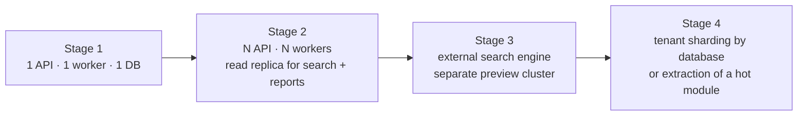

# 19 — Performance & Scalability

**Purpose:** the targets, the design decisions that meet them, and the limits that will be hit next.
**Audience:** backend engineers, ops.

## 1. Targets

| Dimension | Target | Notes |
| --- | --- | --- |
| Documents | 10M per deployment, 1M per large tenant | The dominant table |
| Revisions | 50M | ~5 per document |
| Files | 60M blobs, 200 TB | Deduplicated |
| Users | 10k per tenant, 500 concurrent | Peak at month-end and audit season |
| Approvals | 50k open tasks; 500 decisions/minute at peak | |
| Uploads | 2 GB single file; 100 concurrent uploads | Direct-to-storage, so the API is unaffected by size |
| Audit events | 500M, 10k/minute peak | Partitioned monthly |

| Operation | p95 | p99 |
| --- | --- | --- |
| Folder listing (100 items) | 200 ms | 500 ms |
| Document detail | 300 ms | 700 ms |
| Search (filtered, 1M docs) | 800 ms | 1.5 s |
| Presign upload/download | 150 ms | 400 ms |
| Approval decision | 400 ms | 900 ms |
| First preview page (cached) | 300 ms | 800 ms |

## 2. The decisions that make these reachable

| Decision | Effect |
| --- | --- |
| Bytes never pass through the API | File size is decoupled from application capacity; a 2 GB upload costs the API one presign |
| `ltree` paths on folders, departments and categories | Ancestor resolution is one indexed query, not a recursive CTE per request |
| Permission predicate pushed into SQL | No fetch-then-filter; pagination and counts stay correct and cheap |
| Search read model with GIN | Search never touches the live document tables |
| Decision cache in Redis, event-invalidated | ACL resolution is not repeated per row of a list |
| Everything slow is a job | Preview, OCR, indexing, exports, purge — none block a request |
| Keyset pagination | Deep pages cost the same as the first |
| Content-addressed dedupe | Storage grows with distinct content, not with copies |
| Partitioned audit and notification tables | Old data never slows current queries; retention is a partition drop |

## 3. Query discipline

- **No N+1, ever.** List endpoints use a single query with joins or a batched second query; the
  test suite asserts query counts on the hot endpoints.
- **Every list endpoint has a bounded page size** (≤ 100) and a covering index for its default sort.
- **Counts are estimated** above a threshold (`hasMore` plus an approximate total) — an exact count
  over a million filtered rows is the classic EDMS list-page killer.
- **No `SELECT *`** across wide rows; list projections select what the view shows.
- **Indexes are designed with the query**, and every index added in a phase names the query it
  serves in the migration comment.

## 4. Caching

| Layer | Content | Invalidation |
| --- | --- | --- |
| CDN | Preview images, thumbnails, static assets | Content-addressed URLs — immutable, never invalidated |
| Redis | Permission decisions, folder trees, tenant configuration, document type definitions | Event-driven, per-key |
| Application memory | Permission catalogue, enum tables, compiled workflow versions | Process lifetime, version-stamped |
| HTTP | `ETag`/`If-None-Match` on document detail and listings | Aggregate `version` |
| Query cache (client) | Per [16](./16-frontend-architecture.md) | Mutation-scoped |

Caches are optimisations only. A cold cache produces identical answers — anything else is a
correctness bug wearing a performance costume.

## 5. Background work

| Queue | Concurrency | Isolation |
| --- | --- | --- |
| `documents.preview` | High, CPU-bound pool | Separate worker deployment; a rendering storm cannot starve approvals |
| `documents.ocr` | Low, slow lane | Same |
| `search.index` | Medium, coalesced per document | |
| `workflow.timers` | Low | Delayed jobs, precise |
| `notifications.deliver` | Medium | Provider rate limits respected |
| `retention.run` | Serialised per tenant, off-peak | |
| `exports` | Low, streamed to storage | Large jobs never buffer in memory |

Fairness: jobs carry their tenant id, and per-tenant concurrency caps stop one large tenant's bulk
import from monopolising a pool.

## 6. Scaling path

| Stage | Trigger | Change |
| --- | --- | --- |
| 1 → 2 | CPU > 60% sustained, or p95 drifting | Horizontal API scale (stateless), replica for read-heavy reporting and search |
| 2 → 3 | Search p95 > 800 ms or index lag > 60 s | `OpenSearchAdapter` behind `SearchPort` ([ADR-0008](./adr/0008-postgres-first-search.md)); preview workers to their own cluster |
| 3 → 4 | One tenant's write volume dominates, or a module's profile diverges sharply | Route the largest tenants to their own database (the tenant id is already on every row and every job), or extract the preview/OCR module — the module boundaries were drawn to make this mechanical |

Nothing in stages 3–4 is built now. The architecture is arranged so each is a contained change, and
that is the whole of the anticipation.

## 7. Known limits and their first symptom

| Limit | Symptom | Response |
| --- | --- | --- |
| Postgres FTS at ~5M documents per tenant | Search p95 climbing, GIN maintenance cost | Stage 3 |
| Folder with > 100k direct children | Listing and unique-name checks slow | Encourage sub-foldering; virtualised UI already handles it; add a covering index |
| One number sequence at extreme concurrency | Lock wait on `number_sequence` | The row lock is microseconds; if it ever shows, shard the sequence by adding a segment to the reset scope |
| Very large ACL subtrees on re-permission | Index re-projection backlog | Batch and coalesce; the subtree is re-projected asynchronously and reads re-check at open time |
| Audit write volume | Chain serialisation per tenant | Advisory lock is per tenant and held briefly; batch read-audit events (already done) |

## 8. Verification

Load testing is part of the definition of done for the phases that touch these paths — not a
pre-release afterthought. Scenarios, thresholds and the harness live in `edms/infra/loadtest/`:
folder listing at 1M documents, search under concurrency, 100 parallel uploads, 500 approvals per
minute, and a full-tenant index rebuild. Every phase records its measured numbers against the table
in §1, and a regression against the previous phase blocks the release.
