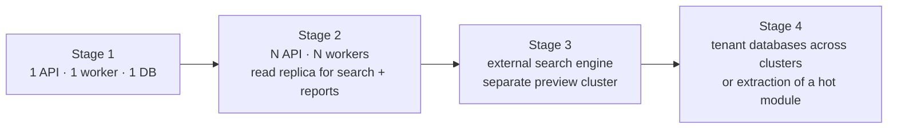

# 19 — Performance & Scalability

**Purpose:** the targets, the design decisions that meet them, and the limits that will be hit next.
**Audience:** backend engineers, ops.

## 1. Targets

| Dimension | Target | Notes |
| --- | --- | --- |
| Documents | 10M per deployment, 1M per large tenant | The dominant table |
| Revisions | 50M | ~5 per document |
| Files | 60M blobs, 200 TB | Deduplicated |
| Users | 10k per tenant, 500 concurrent | Peak at month-end and audit season |
| Approvals | 50k open tasks; 500 decisions/minute at peak | |
| Uploads | 2 GB single file; 100 concurrent uploads | Direct-to-storage, so the API is unaffected by size |
| Audit events | 500M, 10k/minute peak | Partitioned monthly |

| Operation | p95 | p99 |
| --- | --- | --- |
| Folder listing (100 items) | 200 ms | 500 ms |
| Document detail | 300 ms | 700 ms |
| Search (filtered, 1M docs) | 800 ms | 1.5 s |
| Presign upload/download | 150 ms | 400 ms |
| Approval decision | 400 ms | 900 ms |
| First preview page (cached) | 300 ms | 800 ms |

## 2. The decisions that make these reachable

| Decision | Effect |
| --- | --- |
| Bytes never pass through the API | File size is decoupled from application capacity; a 2 GB upload costs the API one presign |
| `ltree` paths on folders, departments and categories | Ancestor resolution is one indexed query, not a recursive CTE per request |
| Permission predicate pushed into SQL | No fetch-then-filter; pagination and counts stay correct and cheap |
| Search read model with GIN | Search never touches the live document tables |
| Decision cache in Redis, event-invalidated | ACL resolution is not repeated per row of a list |
| Everything slow is a job | Preview, OCR, indexing, exports, purge — none block a request |
| Keyset pagination | Deep pages cost the same as the first |
| Content-addressed dedupe | Storage grows with distinct content, not with copies |
| Partitioned audit and notification tables | Old data never slows current queries; retention is a partition drop |

## 3. Query discipline

- **No N+1, ever.** List endpoints use a single query with joins or a batched second query; the
  test suite asserts query counts on the hot endpoints.
- **Every list endpoint has a bounded page size** (≤ 100) and a covering index for its default sort.
- **Counts are estimated** above a threshold (`hasMore` plus an approximate total) — an exact count
  over a million filtered rows is the classic EDMS list-page killer.
- **No `SELECT *`** across wide rows; list projections select what the view shows.
- **Indexes are designed with the query**, and every index added in a phase names the query it
  serves in the migration comment.

## 4. Caching

| Layer | Content | Invalidation |
| --- | --- | --- |
| CDN | Preview images, thumbnails, static assets | Content-addressed URLs — immutable, never invalidated |
| Redis | Permission decisions, folder trees, tenant configuration, document type definitions | Event-driven, per-key |
| Application memory | Permission catalogue, enum tables, compiled workflow versions | Process lifetime, version-stamped |
| HTTP | `ETag`/`If-None-Match` on document detail and listings | Aggregate `version` |
| Query cache (client) | Per [16](./16-frontend-architecture.md) | Mutation-scoped |

Caches are optimisations only. A cold cache produces identical answers — anything else is a
correctness bug wearing a performance costume.

## 5. Background work

| Queue | Concurrency | Isolation |
| --- | --- | --- |
| `documents.preview` | High, CPU-bound pool | Separate worker deployment; a rendering storm cannot starve approvals |
| `documents.ocr` | Low, slow lane | Same |
| `search.index` | Medium, coalesced per document | |
| `workflow.timers` | Low | Delayed jobs, precise |
| `notifications.deliver` | Medium | Provider rate limits respected |
| `retention.run` | Serialised per tenant, off-peak | |
| `exports` | Low, streamed to storage | Large jobs never buffer in memory |
| `documents.bulk` | Medium, **capped per tenant** | Phase 16. N transactions per operation; the contended resource is one tenant's own audit chain |
| `webhooks.deliver` | High, **capped per tenant** | Phase 17. The slots are spent *waiting* on somebody else's server, not computing |
| `audit.stream` | Low, **serialised per tenant** | Phase 17. A push is a contiguous range of one chain; two at once would break the cursor |

Fairness: jobs carry their tenant id, and per-tenant concurrency caps stop one large tenant's bulk
import from monopolising a pool.

**That sentence was false until Phase 16, and this section should say so.** Jobs have carried their
tenant id since Phase 4 and nothing read it; `QueueDefinition.concurrency` is per *lane*, so one
tenant's five thousand jobs take every slot and every other tenant waits behind them. Nothing had
ever produced five thousand jobs, so nobody could have observed it — the claim was true of a
deployment nobody had.

It is now enforced. `QueueDefinition.perTenantConcurrency` is declared per lane and **absent by
default**, so every lane behaves exactly as it did; `documents.bulk` declares 2 against a lane
concurrency of 4, so four tenants' imports proceed together and no single tenant takes more than
half the lane however many operations it queues. The mechanism is a counter in Redis taken before
the handler runs and released after, with an expiry longer than the lane's own wall-clock budget so
a killed process cannot strand a tenant. A job that finds its tenant at the cap is **re-queued with
a short delay rather than failed**, because "wait your turn" is not a failure and must not consume
one of the lane's retry attempts.

Adding a cap to `documents.ocr` or `documents.preview` is now a one-line change in `@edms/domain`
rather than a change to the adapter. It has not been made: neither lane has a producer that one
tenant can flood, and a cap nobody needs is a bound somebody hits during an incident.

**Phase 17's two lanes are the second and third to declare a cap, and each contends on something
new.** `webhooks.deliver` is the first lane in the product whose work is an HTTP request to
*somebody else's server*: every other lane's slowest job is bounded by something this deployment
controls — a renderer's CPU cap, a query's row limit, a statement timeout — and a webhook's is
bounded by a receiver who may accept a connection and never answer. That is why its concurrency is
12 against work that computes almost nothing, why `webhook.timeoutSeconds` is a tenant setting with
a low default, and why it caps at 4: a tenant with eight endpoints subscribed to everything produces
eight deliveries per event, and one such tenant during a bulk import would otherwise be every slot
in the lane while everybody else's approval notifications wait behind a stranger's unresponsive URL.

`audit.stream` caps at **1**, which is not fairness at all — it is correctness. A push is a
contiguous range of one tenant's hash chain, and the next may not begin until the last one's cursor
has advanced; two concurrent pushes for one tenant would either send a range twice or advance past
events nobody sent, and the gap-free sequence that makes the stream worth trusting would stop being
a guarantee this end can make. Concurrency 2 across tenants with a per-tenant cap of 1 is what says
"two customers' sinks proceed together, one customer's sink is strictly serial with itself".

**What makes `documents.bulk` unusual is what it contends on.** A bulk operation is N transactions,
each writing an audit row onto a chain that serialises per tenant under an advisory lock — so the
expensive resource is not CPU and not a renderer pool, it is *one tenant's own chain*, and a second
tenant's bulk restore does not contend with it at all. That is precisely the shape a per-lane number
cannot express, and it is why this is the lane that declares the cap.

## 6. Scaling path

Stage 4's database half **already happened**, in Phase 2.5: every tenant has its own database
([ADR-0015](./adr/0015-database-per-tenant.md)). What remains of it is spreading those databases across
more than one cluster, which is a change to the catalogue rather than to the code — a tenant's entry
names its own connection string, so moving one is an edit and a restore.

| Stage | Trigger | Change |
| --- | --- | --- |
| 1 → 2 | CPU > 60% sustained, or p95 drifting | Horizontal API scale (stateless), replica for read-heavy reporting and search |
| 2 → 3 | Search p95 > 800 ms or index lag > 60 s | `OpenSearchAdapter` behind `SearchPort` ([ADR-0008](./adr/0008-postgres-first-search.md)); preview workers to their own cluster |
| 3 → 4 | One cluster's write volume dominates, or a module's profile diverges sharply | Move the busiest tenants' databases to another cluster — one catalogue entry each — or extract the preview/OCR module, whose boundaries were drawn to make it mechanical |

Stage 3 is not built. Stage 4's per-tenant database is, and it brought its own limit with it: each
tenant client owns a connection pool, so a process holds at most `DATABASE_MAX_TENANT_CLIENTS × DATABASE_POOL_SIZE`
connections and evicts the least recently used beyond that. A deployment with hundreds of tenants needs
a connection pooler in front of PostgreSQL before it needs anything else on this list.

## 7. Known limits and their first symptom

| Limit | Symptom | Response |
| --- | --- | --- |
| Postgres FTS at ~5M documents per tenant | Search p95 climbing, GIN maintenance cost | Stage 3 |
| Audit chain serialisation during a bulk operation — Phase 16's N + 1 rows per operation, all under one tenant's advisory lock | A large import's wall-clock growing linearly while other writes in the same tenant queue behind it | `bulk.maxObjects` caps one request, `bulk.synchronousLimit` queues anything larger, and `bulk.tenantConcurrency` bounds how much of the lane one tenant holds. Batching the per-object rows is **not** the response: they are what makes a document's own timeline complete, and 13 §2 argues why |
| Connections, at roughly `max_connections / DATABASE_POOL_SIZE` live tenants per process | Reconnect churn in the logs as clients are evicted; `too many clients` under burst | A connection pooler (PgBouncer, transaction mode — the tenant setting is transaction-local, so it is safe behind one) |
| Migration wall-clock, linear in tenants | A release taking a maintenance window rather than a deploy step | Batch by cluster; a long backfill is a job, not a migration |
| Folder with > 100k direct children | Listing and unique-name checks slow | Encourage sub-foldering; virtualised UI already handles it; add a covering index |
| One number sequence at extreme concurrency | Lock wait on `number_sequence` | The row lock is microseconds; if it ever shows, shard the sequence by adding a segment to the reset scope |
| Very large ACL subtrees on re-permission | Index re-projection backlog | Batch and coalesce; the subtree is re-projected asynchronously and reads re-check at open time |
| Audit write volume | Chain serialisation per tenant | Advisory lock is per tenant and held briefly; batch read-audit events (already done). **Phase 16 is the first real test of it**: a bulk operation over N documents writes N + 1 chained rows, measured at 26 rows for 25 objects with the chain intact and gap-free. The response is to bound the *batch* — `bulk.maxObjects`, `bulk.synchronousLimit`, `bulk.tenantConcurrency` — never to batch the rows, because a per-object row is what makes a document's own timeline complete |

## 8. Verification

Load testing is part of the definition of done for the phases that touch these paths — not a
pre-release afterthought. Scenarios, thresholds and the harness live in `edms/infra/loadtest/`:
folder listing at 1M documents, search under concurrency, 100 parallel uploads, 500 approvals per
minute, and a full-tenant index rebuild. Every phase records its measured numbers against the table
in §1, and a regression against the previous phase blocks the release.

## Phase 15 — what a report costs, and what bounds it

Reporting is the first capability in this product designed to aggregate across everything, so its
costs are stated rather than assumed.

| Claim | Bound | How it is held |
| --- | --- | --- |
| A report page is a bounded number of queries, independent of the tenant's size | 2–4 per page | Every report is one `findMany` plus one `count` over the same predicate, plus at most two lookups that resolve a *page's* identifiers to names in one statement each. Nothing is per row |
| A report's total obeys its own predicate | — | The `count` takes the same `where` the page does. A total computed without the ACL predicate would leak how much exists that the caller cannot see (08 §7) |
| An export costs one page of memory, whatever its size | `REPORTING_EXPORT_BATCH_SIZE` rows | CSV and the spreadsheet stream: a page is read, rendered and written, and the next replaces it. The generator is what makes it constant-memory, not the batch size |
| An export is bounded, and says when the bound bit | `REPORTING_EXPORT_MAX_ROWS` | `truncated` on the record, on the wire and in the audit row. A spreadsheet cut off at a round number looks exactly like a complete one |
| A PDF is bounded harder, because it cannot stream | `REPORTING_PDF_MAX_ROWS` | A PDF's cross-reference table states the byte offset of every object, so it is assembled whole. That is the format, not the library |
| The trend report reads a bounded slice | 50,000 instances | The one query in the phase that could scan a large table. It is bucketed in the process rather than by `date_trunc`, because a raw query cannot take the Prisma reach predicate and hand-writing its SQL would be a second implementation of the ACL walk |

**Nothing is cached**, and that is Phase 13's decision extended by one reason. Its reason: a stale
figure is one somebody acts on. The extra one: a report is permission-scoped, so a cache key would
have to include the caller's whole reach — `VisibilityFilter.fingerprint` exists precisely so that
is expressible, which makes it a temptation rather than an impossibility. It is refused anyway,
because the resolver already caches the *filter* (08 §8) where it is invalidated correctly, and
caching the rows would mean a second thing to invalidate on every document change in the tenant.
