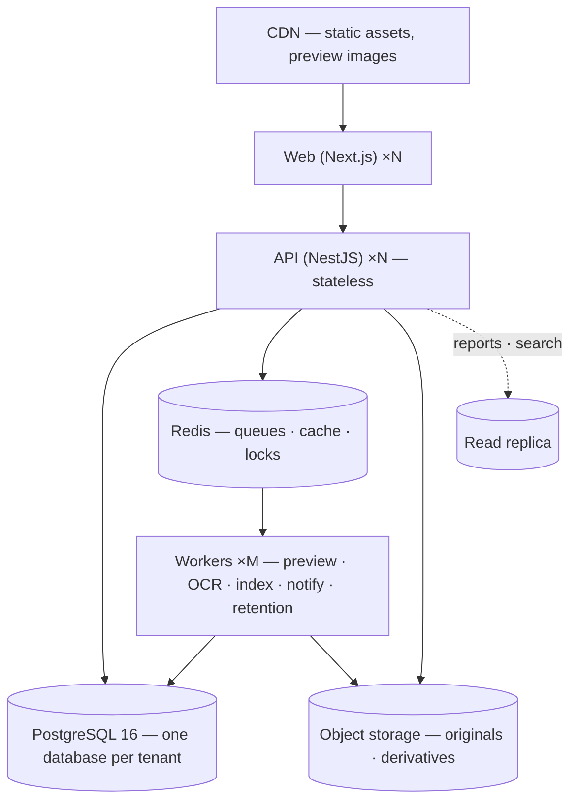
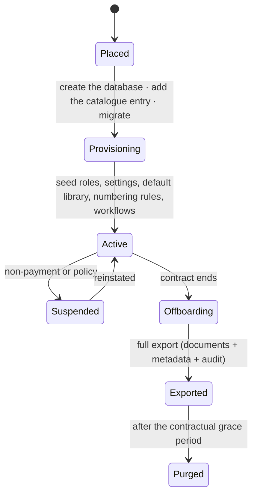

# 20 — Deployment Architecture

**Purpose:** environments, topology, pipeline, configuration, backup and recovery.
**Audience:** ops and release engineers.

## 1. Environments

| Environment | Purpose | Data | Who deploys |
| --- | --- | --- | --- |
| Local | Development | Seeded fixtures | Anyone, via compose |
| CI | Verification per pull request | Ephemeral, per run | The pipeline |
| Staging | Pre-production rehearsal | Anonymised sample, never production data | Automatic on merge to `main` |
| Production | Live | Real | Tagged release, manual approval |

Local development runs a compose stack: PostgreSQL 16, Redis 7, MinIO or LocalStack for S3, and a
mail catcher — the same shape as production, so the storage and queue paths are exercised from the
first day rather than stubbed.

## 2. Topology

- **API and web are stateless** — scale horizontally, no sticky sessions, no local disk.
- **Workers scale independently** by queue; the preview pool is CPU-shaped and sits in its own
  deployment with no database credentials ([14](./14-preview-architecture.md)).
- **Storage and its CDN are a separate origin** from the application, so user content can never
  inherit application privileges.
- **One database per tenant** ([ADR-0015](./adr/0015-database-per-tenant.md)). The API resolves which
  one from the tenant's placement and holds a bounded number of pools, evicting the least recently
  used. Past a few hundred tenants per process, a connection pooler in transaction mode goes in front —
  safe because the tenant setting is transaction-local rather than session-level.
- **Deployment targets are containers**; the same images run on Render, a Kubernetes cluster or a
  customer's on-premise host. The differences are configuration: `DEPLOYMENT_PROFILE=ON_PREMISE` with
  one tenant derived from the environment, the storage driver on local or MinIO, the mail driver on
  SMTP. No code change, and no build variant ([11](./11-storage-architecture.md)).

### What differs between cloud and on-premise

| | Cloud | On premise |
| --- | --- | --- |
| `DEPLOYMENT_PROFILE` | `CLOUD` | `ON_PREMISE` |
| Which tenants | `TENANT_CATALOGUE` or `TENANT_CATALOGUE_PATH` | `TENANT_SLUG` + `TENANT_ID`, no catalogue |
| Databases | One per customer, templated from the catalogue | One |
| Storage | Object storage; `LOCAL` is refused in production | Local filesystem or MinIO, permitted in production |
| Mail | Hosted provider | SMTP |

Nothing above is a code path. The profile is read by the tenant registry and by boot validation, and by
nothing else — business logic that branched on it would behave differently for a customer who bought the
same product.

## 3. Configuration

- Every value is an environment variable, validated at boot by a typed schema. **An invalid or
  missing production value fails startup**; it never degrades silently to a development default.
- `.env.example` documents every variable with a placeholder — never a real value.
- Secrets come from the platform's secret store, are rotatable without a code change, and are never
  logged.
- Feature switches are per tenant in the database, not per environment in configuration, so staging
  and production run the same build.

Key variables: `DATABASE_URL` (restricted, `NOBYPASSRLS` role), `DATABASE_MIGRATION_URL` (owner
role, pipeline only), `REDIS_URL`, `STORAGE_DRIVER` + provider credentials, `SEARCH_DRIVER`,
`OCR_DRIVER`, `AV_DRIVER` + endpoint, `MAIL_DRIVER` (+ `MAIL_SMTP_*` for on-premise, Phase 18),
`JWT_*`, `CORS_ORIGINS`, `OUTBOUND_HTTP_ALLOWLIST`, `METRICS_DRIVER` + `METRICS_SCRAPE_TOKEN`.

**Four secrets, four rotation clocks.** `JWT_ACCESS_SECRET`, `AUDIT_CHECKPOINT_SECRET`,
`SIGNATURE_WITNESS_SECRET` and — from Phase 18 — `MFA_TOTP_SEALING_KEY` are each required in
production and each cost something different to rotate: minutes, a re-verification, **seven years**,
and nothing at all respectively.
[ADR-0020](./adr/0020-key-management-and-rotation.md) argues why the deployment's secret store *is*
the key management service and what the product owes instead; the per-key procedure is in
[`docs/operations/deployment.md`](../operations/deployment.md) §4.

## 4. Pipeline

```mermaid
graph LR
    PR[Pull request] --> V["pnpm validate"]
    V --> L[lint + format:check]
    L --> T[typecheck]
    T --> U[unit + integration tests]
    U --> B[build all]
    B --> M[migration dry-run on a scratch DB]
    M --> E[e2e smoke]
    E --> ST[deploy staging on merge]
    ST --> SM[staging smoke + seeded audit checks]
    SM --> REL[tag → manual approval → production]
```

Every gate is blocking. A failing test is never skipped to go green
([rulebook §10](https://github.com/tam2om/munaxa/blob/main/PLATFORM_ENGINEERING_STANDARDS.md#10-tests)).

**The integration gate runs against two real tenant databases**, not one. The suite exists because
the defects it was written for are properties of a database — row-level security applying to the
table owner, a revocation rolled back by the exception reporting it — and the tenant-isolation suite
added in Phase 2.5 *skips rather than passes* when only one database is configured. A pipeline with
one database would therefore have reported the product's most important assertions as a green build
while never running them.

The job bootstraps the way the documentation says an operator does: create the databases, apply the
cluster roles, then run `scripts/migrate-tenants.mjs` against the same catalogue format the API
reads. Nothing in it is a CI-only shortcut, which is what stops the pipeline and the documented
procedure from drifting apart — and it means a release that would leave one customer's database
unmigrated fails here rather than in production.

### Migrations

| Rule | Reason |
| --- | --- |
| Applied migrations are never edited | Environments would diverge permanently |
| Migrations run as the owner role, the app as a restricted role | RLS cannot be bypassed by the application |
| Every release migrates **every** tenant database | Half the customers running against a schema the code no longer matches is worse than none of them migrated |
| The runner reads the same catalogue the API reads | A separate list is how a tenant comes to be missed |
| A failed run names the tenant it stopped on, and every step is idempotent | The re-run continues rather than restarting |
| Expand → migrate → contract for any breaking change | Deploys stay rolling; old and new code coexist |
| Every migration is reversible or documents why it is not | Rollback must be a decision, not a discovery |
| Data backfills are jobs, not migrations | A migration that runs for an hour is an outage |

Deploys are rolling with health gates: `/health/live` and `/health/ready` (ready means the database,
Redis and storage all answer). Workers drain their in-flight jobs before exiting.

### What Phase 18 added to this section

**The images exist.** `Dockerfile` builds three targets — `api`, `web`, `worker` — from one commit,
on `node:22-bookworm-slim` rather than Alpine, because Prisma's glibc query engine is the tested
path and an OpenSSL mismatch is the classic container that builds and cannot connect. They run as
the image's unprivileged `node` user under `dumb-init`, because Node is a poor PID 1 and does not
forward the SIGTERM that makes "workers drain before exiting" true. The registry token is a build
**secret**, never a build argument: an argument is recorded in the image's history and is the
ordinary way a token leaks.

Two properties of the images are decisions rather than defaults. **LibreOffice and Tesseract are
build arguments on the worker target alone** — both are real system packages this product shells
out to, both are large (roughly 600 MB and 120 MB), and an image without one cannot be configured
into having it, which is why presence is a property of the image and *calling* remains a property
of `OFFICE_DRIVER` and `OCR_DRIVER`. And **no Node dependency was added**: `sharp`,
`@pdf-lib/fontkit`, `ldapjs` and `cbor` each block a capability named by Phases 7, 16 and 17, and
every one is a lockfile change rather than a Dockerfile change. A base image with the libraries
pre-installed would look like progress and change nothing.

**The release procedure is a runbook**, not a paragraph here:
[`docs/operations/deployment.md`](../operations/deployment.md). Its order is fixed — migrate every
tenant, then workers, then API, then web — and it names the one gate this section had asserted and
never had: a load-test run against staging, from `infra/loadtest/`, whose thresholds are §1 of
[19](./19-performance-and-scalability.md).

## 5. Observability

| Signal | Tool | Notes |
| --- | --- | --- |
| Logs | Structured JSON with correlation id, tenant id, user id, **trace id** | Never a secret or a personal identifier. Redaction is at the logger, not at each call site |
| Errors | The structured log stream. **Not Sentry** — see below | |
| Metrics | Ten names, exported by **pull** under `METRICS_DRIVER=PROMETHEUS`, catalogued in `core/observability/metrics.ts` | Phase 18 |
| Traces | **One span per request**, and none below it — see below | Phase 18 |
| Business dashboards | Documents by status, approvals overdue, retention due, purge executed | Drives the operator's day |

Alerts that page: audit chain break, RLS or grant change, `SCAN_INFECTED`, checksum mismatch, queue
dead-letter growth, ready-check failure, index lag > 5 minutes, error rate above baseline.

### What Phase 18 bound, and the two rows it rewrote

`METRICS` and its label rule have existed since Phase 0.5 with **nothing bound to them**, and the
Phase 0.5 debt report says why: *"which backend a deployment scrapes is an operational decision, and
binding one now would make it an architectural one"*. Phase 18 binds it without making that choice —
`METRICS_DRIVER=NONE|PROMETHEUS`, the way `STORAGE_DRIVER` and `MAIL_DRIVER` already work, with
`NONE` a no-op rather than a refusal because a deployment with no metrics *works* and is simply
unobserved.

**`PROMETHEUS` is a pull endpoint** — `GET /api/metrics`, behind its own bearer token, because a
metrics body is queue depths, error rates and authorisation-refusal counts by permission, which is
no tenant's data and a great deal of reconnaissance. Pull rather than push is also what keeps
Phase 17's boundary intact: a push exporter would either depend on an operator allow-listing their
own collector or become the second outbound path 17 §6 says nothing may add. It is the same
argument Phase 17 made for the SIEM `PULL` sink, reached independently.

**The label rule became a catalogue.** Each of the ten names declares its kind and the exact labels
it accepts, and the exporter drops anything else — so the tenant id that would take a metrics
backend down is unrepresentable rather than discouraged, with a series bound as the backstop and a
`series_dropped` counter so a cap is never silent.

**The Traces row above used to promise "request → use case → repository → adapter", and this section
now says what is emitted instead.** A span per repository call is a span for every row a list draws,
on the most-loaded route in the product, forwarded to a collector that charges per span. What is
emitted is **one span per request**: W3C `traceparent` parsed, propagated onto every log line, and
echoed back — so a deployment between a customer's ingress and their webhook collector is one trace
in their tooling rather than three. The use-case layer is carried as a *histogram*
(`message.duration`), which answers "is this handler slow" without emitting a tree.

**The Errors row used to say Sentry, and no build has ever contained its SDK.** `SENTRY_DSN` and
`OTEL_EXPORTER_OTLP_ENDPOINT` are now **refused at boot** rather than accepted and ignored: an
operator who sets one believes errors are being exported, and discovers otherwise during the
incident it was set for. Both become real with one lockfile change, named in the Phase 18 report.

## 6. Backup and recovery

| Asset | Method | Retention | RPO | RTO |
| --- | --- | --- | --- | --- |
| PostgreSQL | Continuous WAL archiving + nightly base backup, **per tenant database** | 35 days PITR, monthly for 12 months | 5 min | 2 h |
| Object storage | Versioning + cross-region replication | Per tenant retention policy | 15 min | 4 h |
| Redis | None — rebuildable | — | — | Minutes |
| Search index | None — rebuildable from source | — | — | Hours (rebuild) |
| Audit checkpoints | Written to a separate store from the database | 7 years | Immediate | Immediate |

Restores are **tested quarterly** into an isolated environment, and the test is only passed when the
audit hash chain verifies end to end after the restore. An untested backup is not a backup.

**The procedure is [`docs/operations/backup-and-restore.md`](../operations/backup-and-restore.md)**
(Phase 18), and it adds two things to the table above. Each row's *absence* is now argued rather
than assumed — Redis is not backed up because nothing in it is a record, and the search index is not
because restoring a stale one would answer queries confidently with a corpus that no longer exists.
And the quarterly test gained a fourth condition beside the chain: **a pass of the integrity sweep
over the restored tenant**, because Phase 18 is the phase that made "the blobs are the blobs" a
question the product can answer rather than a sentence in this document.

The runbook also states, in the runbook rather than in a footnote, that **no restore of this product
has ever been performed** — there is no deployment to have performed one against. The components are
each tested against a real PostgreSQL; the composition is not, and the first quarterly test is its
first execution rather than an emergency.

## 7. Disaster recovery

| Scenario | Response |
| --- | --- |
| API or worker instance lost | Replaced automatically; stateless |
| Database primary lost | Promote the replica; reconnect; verify the audit chain |
| Region lost | Restore into the secondary region from replicated storage and PITR; DNS switch |
| Storage object lost or corrupted | **Since Phase 18 the product usually reports this rather than a customer**: the nightly integrity sweep re-reads blobs, quarantines any whose bytes no longer hash to the recorded checksum, writes `INTEGRITY_MISMATCH` with both digests and raises the alert. Restore from versioning or replication, then re-run the sweep — a successful re-read is the only thing that clears the quarantine, deliberately, because a blob marked good by a human is what the control exists to prevent. If unrecoverable, mark the revision and raise a compliance incident — never silently substitute |
| Ransomware or destructive action | PITR to before the event; object versioning restores blobs; the hash chain identifies exactly what was touched and when |
| Tenant-level mistake (mass delete) | Soft delete makes this recoverable without a restore — the recycle bin is the first line of defence ([ADR-0010](./adr/0010-soft-delete-and-retention.md)) |
| One tenant needs a point-in-time restore | Restore that tenant's database alone, to the minute, without touching anybody else's — which a shared database could not offer ([ADR-0015](./adr/0015-database-per-tenant.md)) |

Each scenario is a procedure in
[`docs/operations/disaster-recovery.md`](../operations/disaster-recovery.md) (Phase 18), which adds
the two steps that come before every one of them — *do not destroy the evidence*, and *verify the
chain before anybody is pointed at recovered data* — and states what this table cannot: **the RTOs
in §6 are targets taken from the design, not measurements.** No restore has been performed, so they
are what the architecture was built to allow rather than what it has been shown to achieve. There is
also no automated failover for any row above, which is the honest state rather than an ambition:
half of one fails over when it should not and does not when it should.

## 8. Tenant provisioning and offboarding

**Placement comes first**, and the order is not negotiable: a tenant is given a database, added to the
catalogue and migrated *before* it is provisioned, because provisioning writes into that database and
there is no other one to fall back on. The identifier in the catalogue entry is what routes every later
request, so it is chosen at placement and never regenerated — provisioning reads it rather than inventing
it, which is also what lets the whole bootstrap be one transaction.

Suspension makes a tenant read-only rather than invisible: their evidence stays intact, and the status is
read from the tenant row inside the transaction rather than from the catalogue, because a value read at
boot is stale for as long as the process lives. Offboarding always produces a verifiable export —
documents with their metadata, revisions and the audit trail with its checkpoints — before anything is
purged, and purging is now dropping a database rather than deleting rows from a shared one.
