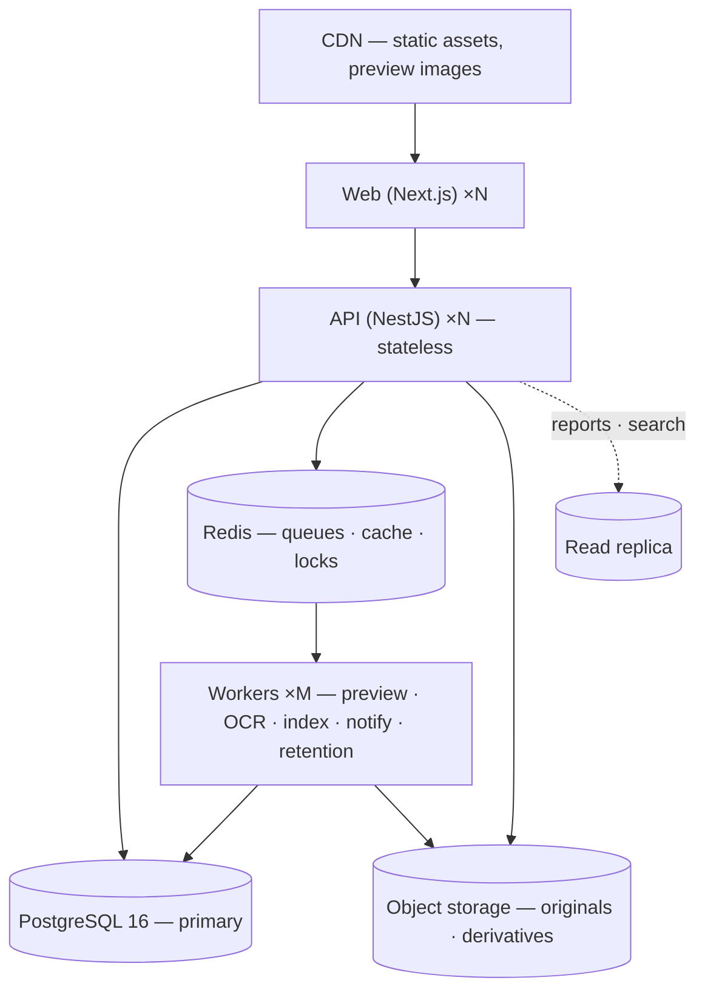
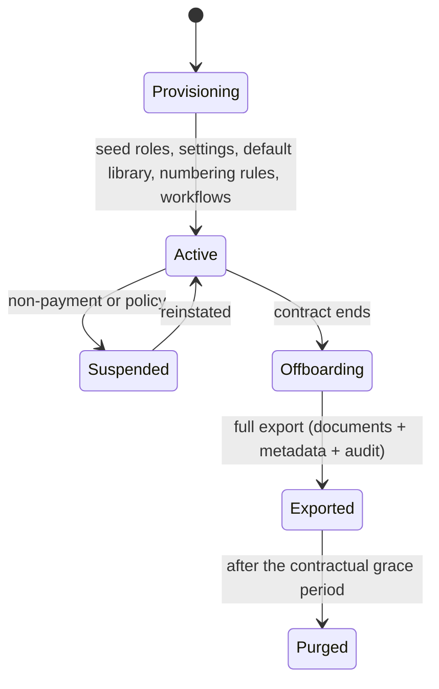

# 20 — Deployment Architecture

**Purpose:** environments, topology, pipeline, configuration, backup and recovery.
**Audience:** ops and release engineers.

## 1. Environments

| Environment | Purpose | Data | Who deploys |
| --- | --- | --- | --- |
| Local | Development | Seeded fixtures | Anyone, via compose |
| CI | Verification per pull request | Ephemeral, per run | The pipeline |
| Staging | Pre-production rehearsal | Anonymised sample, never production data | Automatic on merge to `main` |
| Production | Live | Real | Tagged release, manual approval |

Local development runs a compose stack: PostgreSQL 16, Redis 7, MinIO or LocalStack for S3, and a
mail catcher — the same shape as production, so the storage and queue paths are exercised from the
first day rather than stubbed.

## 2. Topology

- **API and web are stateless** — scale horizontally, no sticky sessions, no local disk.
- **Workers scale independently** by queue; the preview pool is CPU-shaped and sits in its own
  deployment with no database credentials ([14](./14-preview-architecture.md)).
- **Storage and its CDN are a separate origin** from the application, so user content can never
  inherit application privileges.
- **Deployment targets are containers**; the same images run on Render, a Kubernetes cluster or a
  customer's on-premise host. On-premise installs swap the storage driver to local or MinIO and the
  mail driver to SMTP — no code change ([11](./11-storage-architecture.md)).

## 3. Configuration

- Every value is an environment variable, validated at boot by a typed schema. **An invalid or
  missing production value fails startup**; it never degrades silently to a development default.
- `.env.example` documents every variable with a placeholder — never a real value.
- Secrets come from the platform's secret store, are rotatable without a code change, and are never
  logged.
- Feature switches are per tenant in the database, not per environment in configuration, so staging
  and production run the same build.

Key variables: `DATABASE_URL` (restricted, `NOBYPASSRLS` role), `MIGRATION_DATABASE_URL` (owner
role, pipeline only), `REDIS_URL`, `STORAGE_DRIVER` + provider credentials, `SEARCH_DRIVER`,
`OCR_DRIVER`, `AV_DRIVER` + endpoint, `MAIL_DRIVER`, `JWT_*`, `OIDC_*`, `CORS_ORIGINS`,
`SENTRY_DSN`.

## 4. Pipeline

```mermaid
graph LR
    PR[Pull request] --> V["pnpm validate"]
    V --> L[lint + format:check]
    L --> T[typecheck]
    T --> U[unit + integration tests]
    U --> B[build all]
    B --> M[migration dry-run on a scratch DB]
    M --> E[e2e smoke]
    E --> ST[deploy staging on merge]
    ST --> SM[staging smoke + seeded audit checks]
    SM --> REL[tag → manual approval → production]
```

Every gate is blocking. A failing test is never skipped to go green
([rulebook §10](../../../PLATFORM_ENGINEERING_STANDARDS.md#10-tests)).

### Migrations

| Rule | Reason |
| --- | --- |
| Applied migrations are never edited | Environments would diverge permanently |
| Migrations run as the owner role, the app as a restricted role | RLS cannot be bypassed by the application |
| Expand → migrate → contract for any breaking change | Deploys stay rolling; old and new code coexist |
| Every migration is reversible or documents why it is not | Rollback must be a decision, not a discovery |
| Data backfills are jobs, not migrations | A migration that runs for an hour is an outage |

Deploys are rolling with health gates: `/health/live` and `/health/ready` (ready means the database,
Redis and storage all answer). Workers drain their in-flight jobs before exiting.

## 5. Observability

| Signal | Tool | Notes |
| --- | --- | --- |
| Logs | Structured JSON with correlation id, tenant id, user id | Never a secret or a personal identifier |
| Errors | Sentry, with the correlation id linking to the audit trail | |
| Metrics | Request rate/latency/error by route; queue depth, job latency, failure rate by queue; storage bytes and blob count per tenant; index lag; number-sequence contention | |
| Traces | Request → use case → repository → adapter, and the outbox hop into workers | |
| Business dashboards | Documents by status, approvals overdue, retention due, purge executed | Drives the operator's day |

Alerts that page: audit chain break, RLS or grant change, `SCAN_INFECTED`, checksum mismatch, queue
dead-letter growth, ready-check failure, index lag > 5 minutes, error rate above baseline.

## 6. Backup and recovery

| Asset | Method | Retention | RPO | RTO |
| --- | --- | --- | --- | --- |
| PostgreSQL | Continuous WAL archiving + nightly base backup | 35 days PITR, monthly for 12 months | 5 min | 2 h |
| Object storage | Versioning + cross-region replication | Per tenant retention policy | 15 min | 4 h |
| Redis | None — rebuildable | — | — | Minutes |
| Search index | None — rebuildable from source | — | — | Hours (rebuild) |
| Audit checkpoints | Written to a separate store from the database | 7 years | Immediate | Immediate |

Restores are **tested quarterly** into an isolated environment, and the test is only passed when the
audit hash chain verifies end to end after the restore. An untested backup is not a backup.

## 7. Disaster recovery

| Scenario | Response |
| --- | --- |
| API or worker instance lost | Replaced automatically; stateless |
| Database primary lost | Promote the replica; reconnect; verify the audit chain |
| Region lost | Restore into the secondary region from replicated storage and PITR; DNS switch |
| Storage object lost or corrupted | Restore from versioning or replication; verify the checksum; if unrecoverable, mark the revision and raise a compliance incident — never silently substitute |
| Ransomware or destructive action | PITR to before the event; object versioning restores blobs; the hash chain identifies exactly what was touched and when |
| Tenant-level mistake (mass delete) | Soft delete makes this recoverable without a restore — the recycle bin is the first line of defence ([ADR-0010](./adr/0010-soft-delete-and-retention.md)) |

## 8. Tenant provisioning and offboarding

Suspension makes a tenant read-only rather than invisible: their evidence stays intact. Offboarding
always produces a verifiable export — documents with their metadata, revisions and the audit trail
with its checkpoints — before anything is purged.
