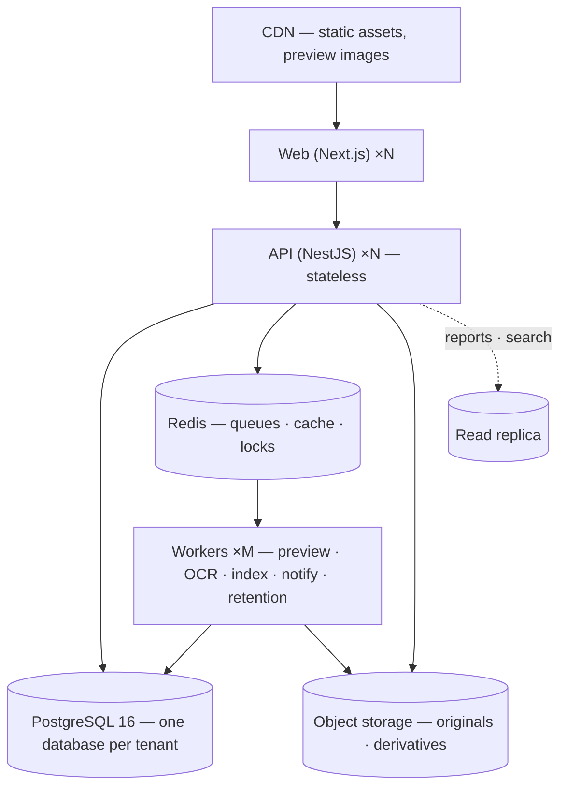
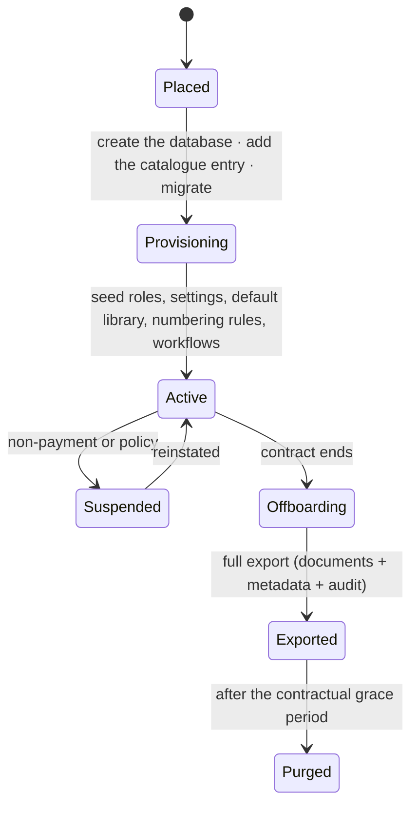

# 20 — Deployment Architecture

**Purpose:** environments, topology, pipeline, configuration, backup and recovery.
**Audience:** ops and release engineers.

## 1. Environments

| Environment | Purpose | Data | Who deploys |
| --- | --- | --- | --- |
| Local | Development | Seeded fixtures | Anyone, via compose |
| CI | Verification per pull request | Ephemeral, per run | The pipeline |
| Staging | Pre-production rehearsal | Anonymised sample, never production data | Automatic on merge to `main` |
| Production | Live | Real | Tagged release, manual approval |

Local development runs a compose stack: PostgreSQL 16, Redis 7, MinIO or LocalStack for S3, and a
mail catcher — the same shape as production, so the storage and queue paths are exercised from the
first day rather than stubbed.

## 2. Topology

- **API and web are stateless** — scale horizontally, no sticky sessions, no local disk.
- **Workers scale independently** by queue; the preview pool is CPU-shaped and sits in its own
  deployment with no database credentials ([14](./14-preview-architecture.md)).
- **Storage and its CDN are a separate origin** from the application, so user content can never
  inherit application privileges.
- **One database per tenant** ([ADR-0015](./adr/0015-database-per-tenant.md)). The API resolves which
  one from the tenant's placement and holds a bounded number of pools, evicting the least recently
  used. Past a few hundred tenants per process, a connection pooler in transaction mode goes in front —
  safe because the tenant setting is transaction-local rather than session-level.
- **Deployment targets are containers**; the same images run on Render, a Kubernetes cluster or a
  customer's on-premise host. The differences are configuration: `DEPLOYMENT_PROFILE=ON_PREMISE` with
  one tenant derived from the environment, the storage driver on local or MinIO, the mail driver on
  SMTP. No code change, and no build variant ([11](./11-storage-architecture.md)).

### What differs between cloud and on-premise

| | Cloud | On premise |
| --- | --- | --- |
| `DEPLOYMENT_PROFILE` | `CLOUD` | `ON_PREMISE` |
| Which tenants | `TENANT_CATALOGUE` or `TENANT_CATALOGUE_PATH` | `TENANT_SLUG` + `TENANT_ID`, no catalogue |
| Databases | One per customer, templated from the catalogue | One |
| Storage | Object storage; `LOCAL` is refused in production | Local filesystem or MinIO, permitted in production |
| Mail | Hosted provider | SMTP |

Nothing above is a code path. The profile is read by the tenant registry and by boot validation, and by
nothing else — business logic that branched on it would behave differently for a customer who bought the
same product.

## 3. Configuration

- Every value is an environment variable, validated at boot by a typed schema. **An invalid or
  missing production value fails startup**; it never degrades silently to a development default.
- `.env.example` documents every variable with a placeholder — never a real value.
- Secrets come from the platform's secret store, are rotatable without a code change, and are never
  logged.
- Feature switches are per tenant in the database, not per environment in configuration, so staging
  and production run the same build.

Key variables: `DATABASE_URL` (restricted, `NOBYPASSRLS` role), `MIGRATION_DATABASE_URL` (owner
role, pipeline only), `REDIS_URL`, `STORAGE_DRIVER` + provider credentials, `SEARCH_DRIVER`,
`OCR_DRIVER`, `AV_DRIVER` + endpoint, `MAIL_DRIVER`, `JWT_*`, `OIDC_*`, `CORS_ORIGINS`,
`SENTRY_DSN`.

## 4. Pipeline

```mermaid
graph LR
    PR[Pull request] --> V["pnpm validate"]
    V --> L[lint + format:check]
    L --> T[typecheck]
    T --> U[unit + integration tests]
    U --> B[build all]
    B --> M[migration dry-run on a scratch DB]
    M --> E[e2e smoke]
    E --> ST[deploy staging on merge]
    ST --> SM[staging smoke + seeded audit checks]
    SM --> REL[tag → manual approval → production]
```

Every gate is blocking. A failing test is never skipped to go green
([rulebook §10](https://github.com/tam2om/munaxa/blob/main/PLATFORM_ENGINEERING_STANDARDS.md#10-tests)).

### Migrations

| Rule | Reason |
| --- | --- |
| Applied migrations are never edited | Environments would diverge permanently |
| Migrations run as the owner role, the app as a restricted role | RLS cannot be bypassed by the application |
| Every release migrates **every** tenant database | Half the customers running against a schema the code no longer matches is worse than none of them migrated |
| The runner reads the same catalogue the API reads | A separate list is how a tenant comes to be missed |
| A failed run names the tenant it stopped on, and every step is idempotent | The re-run continues rather than restarting |
| Expand → migrate → contract for any breaking change | Deploys stay rolling; old and new code coexist |
| Every migration is reversible or documents why it is not | Rollback must be a decision, not a discovery |
| Data backfills are jobs, not migrations | A migration that runs for an hour is an outage |

Deploys are rolling with health gates: `/health/live` and `/health/ready` (ready means the database,
Redis and storage all answer). Workers drain their in-flight jobs before exiting.

## 5. Observability

| Signal | Tool | Notes |
| --- | --- | --- |
| Logs | Structured JSON with correlation id, tenant id, user id | Never a secret or a personal identifier |
| Errors | Sentry, with the correlation id linking to the audit trail | |
| Metrics | Request rate/latency/error by route; queue depth, job latency, failure rate by queue; storage bytes and blob count per tenant; index lag; number-sequence contention | |
| Traces | Request → use case → repository → adapter, and the outbox hop into workers | |
| Business dashboards | Documents by status, approvals overdue, retention due, purge executed | Drives the operator's day |

Alerts that page: audit chain break, RLS or grant change, `SCAN_INFECTED`, checksum mismatch, queue
dead-letter growth, ready-check failure, index lag > 5 minutes, error rate above baseline.

## 6. Backup and recovery

| Asset | Method | Retention | RPO | RTO |
| --- | --- | --- | --- | --- |
| PostgreSQL | Continuous WAL archiving + nightly base backup, **per tenant database** | 35 days PITR, monthly for 12 months | 5 min | 2 h |
| Object storage | Versioning + cross-region replication | Per tenant retention policy | 15 min | 4 h |
| Redis | None — rebuildable | — | — | Minutes |
| Search index | None — rebuildable from source | — | — | Hours (rebuild) |
| Audit checkpoints | Written to a separate store from the database | 7 years | Immediate | Immediate |

Restores are **tested quarterly** into an isolated environment, and the test is only passed when the
audit hash chain verifies end to end after the restore. An untested backup is not a backup.

## 7. Disaster recovery

| Scenario | Response |
| --- | --- |
| API or worker instance lost | Replaced automatically; stateless |
| Database primary lost | Promote the replica; reconnect; verify the audit chain |
| Region lost | Restore into the secondary region from replicated storage and PITR; DNS switch |
| Storage object lost or corrupted | Restore from versioning or replication; verify the checksum; if unrecoverable, mark the revision and raise a compliance incident — never silently substitute |
| Ransomware or destructive action | PITR to before the event; object versioning restores blobs; the hash chain identifies exactly what was touched and when |
| Tenant-level mistake (mass delete) | Soft delete makes this recoverable without a restore — the recycle bin is the first line of defence ([ADR-0010](./adr/0010-soft-delete-and-retention.md)) |
| One tenant needs a point-in-time restore | Restore that tenant's database alone, to the minute, without touching anybody else's — which a shared database could not offer ([ADR-0015](./adr/0015-database-per-tenant.md)) |

## 8. Tenant provisioning and offboarding

**Placement comes first**, and the order is not negotiable: a tenant is given a database, added to the
catalogue and migrated *before* it is provisioned, because provisioning writes into that database and
there is no other one to fall back on. The identifier in the catalogue entry is what routes every later
request, so it is chosen at placement and never regenerated — provisioning reads it rather than inventing
it, which is also what lets the whole bootstrap be one transaction.

Suspension makes a tenant read-only rather than invisible: their evidence stays intact, and the status is
read from the tenant row inside the transaction rather than from the catalogue, because a value read at
boot is stale for as long as the process lives. Offboarding always produces a verifiable export —
documents with their metadata, revisions and the audit trail with its checkpoints — before anything is
purged, and purging is now dropping a database rather than deleting rows from a shared one.
