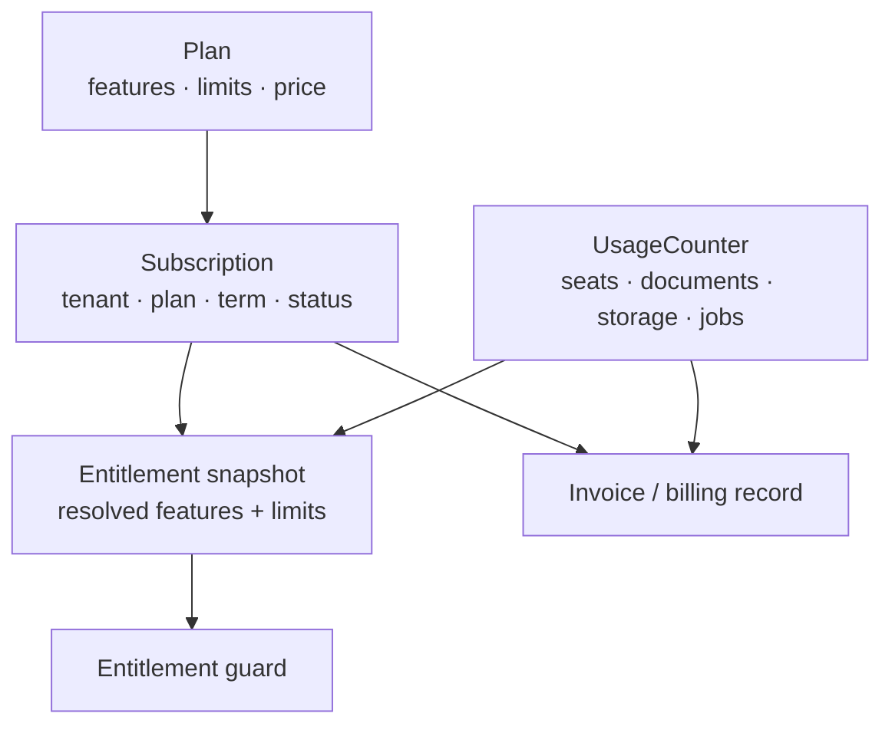
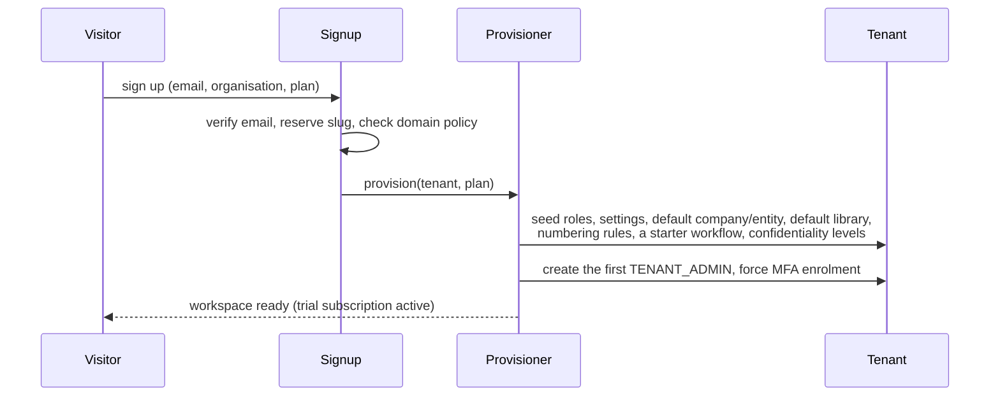

# 21 — SaaS Commercial Architecture

**Purpose:** the commercial layer around the product — tenancy as a business relationship,
subscriptions, entitlements, metering, provisioning, and cross-tenant operations.
**Audience:** backend engineers; whoever prices the product.

This document covers what the SaaS *business* needs. The product architecture (00–20) does not
change because of it: everything here is additive, and every mechanism sits beside the permission
model rather than inside it.

## 1. The commercial model

| Decision | Choice | Recorded in |
| --- | --- | --- |
| Isolation | Multi-tenant, shared database, row-level isolation, RLS backstop | [ADR-0002](./adr/0002-multi-tenant-isolation-model.md) |
| Dedicated-database tenants | Supported later by routing, not by a second data model | [19](./19-performance-and-scalability.md) §6 stage 4 |
| On-premise | The same code with a single tenant and local drivers | [20](./20-deployment-architecture.md) §2 |
| Plans and limits | Data, not code; enforced centrally | [ADR-0012](./adr/0012-entitlements-as-data-enforced-centrally.md) |
| Cross-tenant operations | A separate, permission-gated, fully audited console | [ADR-0013](./adr/0013-operator-console-as-separate-surface.md) |

Why shared-database multi-tenancy is right for this product, stated once so it is not re-litigated:
a tenant costs rows rather than infrastructure, onboarding is a transaction rather than a deploy,
one migration and one backup serve everyone — and because `tenant_id` is on every row and every job,
moving a large or regulated tenant to its own database later is a routing change, not a migration of
the model. The cost is that isolation is a property that must be continuously proven, which is what
the five enforcement layers and the Phase 0.5 isolation tests are for.

## 2. Domain additions

One new bounded context, **Commerce**, plus a **Platform** context for cross-tenant operations.



| Aggregate | Owns | Notes |
| --- | --- | --- |
| `Plan` | Feature flags, limits, price points, billing period | Versioned; a published version is immutable, so a price change never rewrites history |
| `Subscription` | Tenant, plan version, term, status, trial dates, cancellation | One live subscription per tenant |
| `Entitlement` | The resolved set of features and limits for a tenant | Derived from plan + overrides; cached, recomputed on change |
| `UsageCounter` | Metered quantities per tenant per period | Seats, documents, storage bytes, preview/OCR jobs, API calls |
| `BillingRecord` | Invoices, payment state | Provider-agnostic; the payment provider is a port |

Subscription status drives tenant status ([20](./20-deployment-architecture.md) §8): `TRIALING`,
`ACTIVE`, `PAST_DUE` (read-only for writes that grow usage), `SUSPENDED` (read-only entirely),
`CANCELLED` → offboarding export → purge. **A tenant in arrears never loses read access to their own
records before the contractual export window** — withholding a customer's controlled documents is
not a collections strategy, and for a compliance product it is a liability.

## 3. Entitlements vs permissions

These are two different questions and must never be merged:

| | Question | Failure | HTTP |
| --- | --- | --- | --- |
| **Permission** | May *this user* do this? | Authorisation failure | `403` (or `404` cross-scope) |
| **Entitlement** | Does *this tenant's plan* include this? | Commercial limit | `402 Payment Required` with an upgrade hint |

Both are checked; entitlement first, because "your plan does not include workflow designer" is a
clearer answer than "forbidden". Neither can grant what the other denies.

```ts
@RequirePermission(Permission.WORKFLOW_MANAGE)
@RequireFeature(Feature.CUSTOM_WORKFLOWS)
@EnforceLimit(Limit.DOCUMENTS)          // checked before creation, not after
```

Enforcement points, all central — [ADR-0012](./adr/0012-entitlements-as-data-enforced-centrally.md):

| Kind | Example | Enforced at |
| --- | --- | --- |
| Feature | OIDC federation, custom workflows, OCR, API access, webhooks, legal hold | Guard on the route, plus the `capabilities` payload so the UI shows an upgrade path rather than a dead button |
| Hard limit | Seats, storage bytes, document count | Before the mutating use case commits — an upload presign is refused, not the completed upload |
| Soft limit | Preview/OCR jobs per month, API calls per minute | Throttled and reported, not refused, with an administrator notification at 80% and 100% |
| Retention ceiling | Maximum retention period on lower plans | Configuration validation at policy save time |

**Rule:** an entitlement check never appears inside a domain rule. Domain code decides whether a
document *may* be published; commerce decides whether the tenant *bought* the capability. Mixing
them makes the business logic untestable without a subscription fixture.

## 4. Metering

Usage is derived from the same domain events the rest of the system consumes
([ADR-0011](./adr/0011-transactional-outbox-for-async-work.md)), never from ad-hoc counters
sprinkled through use cases.

| Metric | Source event | Billing shape |
| --- | --- | --- |
| Seats | `UserActivated` / `UserDisabled` | Peak or end-of-period active users |
| Documents | `DocumentCreated` / `DocumentPurged` | Point-in-time count |
| Storage bytes | `FileObjectCreated` / `FileObjectDeleted`, net of dedupe | Average or peak over the period |
| Derived storage | Preview/OCR artefacts | Reported separately; excluded from quota by default ([11](./11-storage-architecture.md) §7) |
| Processing jobs | `PreviewCompleted`, `OcrCompleted` | Metered, soft-limited |
| API calls | Gateway counter | Rate-limited, metered on the API-access plan |

Counters are aggregated per tenant per period into `usage_counter`, reconciled nightly against the
source tables, and any drift is **reported, never silently corrected** — a billing number that
quietly changes is worse than one that is wrong and known.

Storage is the dominant variable cost, so it must be visible before it is priced: the administrator
UI shows live, deleted-but-retained, and derived bytes separately
([ADR-0010](./adr/0010-soft-delete-and-retention.md) consequences).

## 5. Provisioning and lifecycle



Provisioning is **one transaction plus idempotent seed jobs**: a half-provisioned tenant is
retryable and never leaves a workspace without an administrator. Every seeded object is ordinary
configuration a tenant can then change — nothing seeded is special-cased in code.

Custom domains: a tenant may claim a subdomain (`acme.docs.munaxa.com`) at provisioning and a custom
domain later, verified by DNS record, with certificates issued automatically. The tenant is resolved
from the host **only to select the login screen and branding** — never as an authorisation input.
The `tenant_id` claim in the token remains the sole isolation authority
([ADR-0002](./adr/0002-multi-tenant-isolation-model.md)).

## 6. Payment provider

Behind a port, like every other external system:

```ts
export interface BillingPort {
  createCustomer(tenant: TenantId, profile: BillingProfile): Promise<BillingCustomerId>;
  startSubscription(customer: BillingCustomerId, plan: PlanVersionId): Promise<SubscriptionRef>;
  changePlan(ref: SubscriptionRef, plan: PlanVersionId): Promise<void>;
  reportUsage(ref: SubscriptionRef, metric: MetricKey, quantity: number, period: Period): Promise<void>;
  cancel(ref: SubscriptionRef, at: CancellationPoint): Promise<void>;
}
```

- **The provider is never the source of truth for entitlements.** It is the source of truth for
  *payment*; the subscription record in this database decides what the tenant may do. A provider
  outage must never open or close features.
- Webhooks from the provider are verified, idempotent, and reconciled against local state on a
  schedule — never trusted as the only signal.
- Card data never touches this system; the provider's hosted flow owns it.

## 7. What this adds to the build order

The [development recommendations](../reports/development-recommendations.md) put administration at
Phase 2. Commerce belongs there too, not at the end:

| Phase | Commerce work |
| --- | --- |
| 1 | `tenant`, `subscription` and `plan` tables exist; every tenant has a subscription, even if every plan is unlimited |
| 2 | Entitlement resolution + the two guards, wired but permissive; usage counters projected from events |
| 3+ | Each feature phase declares its `Feature` key and its `Limit` as it lands |
| Later | Payment provider adapter, self-service signup, custom domains, the operator console |

The point is **not** to build billing early. It is that the entitlement guard and the usage
projection exist before there are twenty modules to retrofit — the same argument as audit and the
outbox. A permissive guard costs almost nothing; adding one later costs a sweep of every endpoint.

## 8. What this must never do

| Never | Why |
| --- | --- |
| Use the host header, subdomain or plan as an isolation input | Isolation is the signed `tenant_id` claim, full stop |
| Put an entitlement check inside a domain rule | Business logic becomes untestable and commercially coupled |
| Let a payment provider's state decide access | An outage would lock customers out of their own records |
| Delete or withhold a tenant's documents for non-payment before the contractual window | Read-only, export, then purge — in that order |
| Meter from hand-written counters in use cases | They drift, and billing drift is a trust incident |
| Special-case a tenant in code | If a tenant needs different behaviour, it is a plan feature or a setting |
