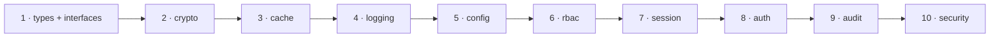

# Adopting the Munaxa Platform — a guide for the next product

**Audience:** the engineer starting Platform adoption for Munaxa School, Munaxa Work, Finance, CRM,
ERP or anything after them.
**Companion to:** [The Munaxa Architecture Reference Manual](./munaxa-architecture-reference-manual.md).
**Based on:** the Munaxa Docs migration — ten phases, four Platform releases, one phase that
stopped rather than working around a gap.

Everything here was learned by doing it. Where something cost a day, it says so.

---

## Before you start: where the other products actually are

Surveyed during this program, so you are not guessing:

| Product | Platform packages consumed | Audit trail | Implication |
|---|---|---|---|
| **Munaxa Docs** | All thirteen | Hash-chained, three formats, checkpointed | The reference implementation |
| **Munaxa School** | UI, theme, tokens, icons, config-* only | `AuditLog` with **no `sequence`, no `hash`** — an append log, not a chain | Greenfield for every security package |
| **Munaxa Work** | UI, theme, config-* only | **No audit table.** Per-row audit *columns* only | Greenfield, and simpler than School |

Both are **easier** than Docs was, because neither has the constraint that made Docs hard: years of
existing digests that cannot be rehashed. Adopt `@munaxa/audit` before you have history, not after.

---

## Recommended adoption order

The order matters. It is roughly "least coupled first", and each step de-risks the next.



| # | Package | Why here | Rough effort (Docs) |
|---|---|---|---|
| 1 | `types`, `interfaces` | Types only. Nothing breaks. Do it first so branded ids and ports are available | hours |
| 2 | `crypto` | Self-contained. **Prove hash compatibility first** if you have stored passwords | 1 day |
| 3 | `cache` | Adopt `CachePort` **before** rate limiting and sessions — both depend on it | 1 day |
| 4 | `logging` | Low risk, immediate value | 1 day |
| 5 | `config` | Do it before session and auth, so their settings land in the right place | 2–3 days |
| 6 | `rbac` | Independent of session | 2 days |
| 7 | `session` | Needs `cache`. Idle + absolute deadlines | 3 days |
| 8 | `auth` | Needs `session`, `crypto`. **Prove refresh-token hash compatibility first** | 3 days |
| 9 | `audit` | Largest. Four phases in Docs — but Docs had history to preserve | 1–2 weeks with history, days without |
| 10 | `security` | Rate limiting needs `cache`. Do it early if you have **no** limiter today | 1–2 days |

> **If you have no rate limiting today, move step 10 to the front.** Docs shipped for five phases
> believing it had a limiter because a rules file existed. See the first pitfall below.

---

## The five pitfalls that actually cost time

### 1. A declaration is not a control

**What happened.** `RATE_LIMIT_RULES` described Docs' limits from Phase 0.5. `@nestjs/throttler`
was in `package.json`. **Neither had a single call site.** For five phases, sign-in, password reset,
presign and export were unlimited — and two of my own audit reports described it as "per-process",
because I read the filename and not the call graph.

**What to do.** For every security control you believe you have, grep for the **binding**, not the
declaration: the `APP_GUARD`, the middleware registration, the import. Then write a test that
asserts the control *refuses*, not that it is configured.

```bash
# Do this for rate limiting, CSRF, headers, validation pipes — everything.
grep -rn "APP_GUARD\|APP_INTERCEPTOR\|app.use(" src/ | grep -i "<control>"
```

### 2. Prove compatibility empirically. Never assume it

Three near-misses in Docs, each of which would have been an outage:

| Migration | The assumption | What proving it cost |
|---|---|---|
| Refresh tokens | "The hashes must match" | 2 hours. They matched — **without** the pepper. Adding it would have signed out every user |
| TOTP | "Same RFC, same parameters" | 2 hours. 50 secrets, both directions, drift windows |
| Audit digests | "The formats reproduce the bytes" | Caught a double-hash bug that made **every** record read as tampered |

**The template.** Write a test that generates with one implementation and verifies with the other,
in **both** directions, across many inputs — then migrate. Keep the test afterwards: it fails if a
future Platform release changes a parameter, which is worth knowing *before* somebody adopts it.

> Authenticators are the sharpest case: a password can be reset, an authenticator cannot be
> un-broken. A mismatch signs out every MFA-enrolled user at once, with no fallback.

### 3. Defaults are where a config migration silently breaks

Aliases handle variable *names*. `fromSeconds` handles *units*. Nothing handles **defaults**, and
four of Docs' ten Platform-owned fields defaulted differently. The worst: idle timeout is 15 minutes
in the Platform and was 8 hours in Docs — an installation that never set the variable would have
started signing its users out every fifteen minutes.

**The trap inside the trap.** `parseConfig` reads a field's own key **before** its aliases. If you
inject a default under the canonical name while the operator had set the legacy name, you silently
discard what they set — and the deployment *looks* configured.

```ts
// Check the canonical name AND every alias before filling in.
const names = [key, ...(definition.aliases ?? []).map((a) => a.name)];
if (names.every((name) => (source[name] ?? '') === '')) source[key] = fallback;
```

Write a test named something like *"never lets a supplied default shadow the variable the operator
set"*. It is the one that catches this.

### 4. Adopting a field means keeping its bounds

The Platform's durations have no ceiling; Docs refused an access token longer than an hour.
Adopting the field and dropping the bound is **a weakening dressed as a migration.** Restate every
product bound as a `defineConfig` refinement so it still fails at startup, in the same aggregated
message, naming the variable the operator set.

### 5. Stop rather than work around

Docs' P4.7 stopped because `verifyChain` could only start at genesis. It documented the limitation
as an **executable spec**, the Platform closed it additively in 2.4.1, and the migration resumed.

Cost: one release cycle. The alternatives — flattening five failure codes into three, or verifying
years of trail from genesis nightly — would have been permanent.

**Stopping was only available because the limitation was expressible as a test rather than an
opinion.** If you cannot write the failing test, you have not understood the gap well enough to
report it.

---

## Per-package notes

### `config` — the second-hardest

- `pickSchema` first: adopting `PLATFORM_SCHEMA` whole drags in `MUNAXA_ENCRYPTION_KEY`, a required
  secret for a capability you probably have not wired.
- `remapSchema` to point each field at the variable you already deploy. **Rename nothing.**
- `fromSeconds` / `fromMilliseconds` where your variable counts in a different unit.
- **Do not** use `extendConfig` unless you are porting all your fields to the Platform DSL. Two
  parsers with one aggregated failure is the honest expression of "Platform validates Platform
  configuration, product validates product configuration".
- Keep `NODE_ENV` product-side if it drives *your* production rules and your default differs.

### `audit` — the largest

If you have **no history**, this is straightforward: define your vocabulary as a string union, use
`AuditService<YourAction>`, let the Platform mint ids, use the default canonical format. Days.

If you have history, in order:
1. Express your historical digests as `CanonicalFormat`s. **Return material, not a digest** — the
   Platform applies `sha256` to what `canonicalize` returns. Returning a digest hashes it twice and
   every record reads as tampered, which looks exactly like tamper detection working.
2. Assert them against your **original hashing function**, not a stored fixture.
3. Migrate the writer. If your digest covers your record id, use `generateId` — it runs before
   hashing.
4. Migrate verification. If you verify incrementally, use `VerifyChainOptions.from`.
5. Keep checkpoint *signing* yours. The Platform cannot authenticate a head and correctly declines
   to pretend otherwise.

### `security` — quickest security win

`RateLimiter` needs a `CachePort`, so adopt `cache` first. Register the guard **first** in the
chain so anonymous floods are refused early. Set `onDegraded` — fail-open is right, silent
fail-open is not.

**Known limitation:** `RateLimitTarget` carries no request body, so per-account login throttling
cannot be expressed in the guard. Enforce it in your login service where the identifier is known,
and make sure it neither becomes an enumeration oracle nor lets an attacker lock out a known
account. (Roadmap #3 would close this in the Platform.)

---

## Checklists

### Per-package adoption

- [ ] Consumer survey **before** writing code: names, types, **defaults**, and how the capability is *operated*
- [ ] Compatibility proven empirically where stored data is involved
- [ ] Product bounds restated as refinements
- [ ] No environment variable renamed; no deployment artefact edited
- [ ] Old implementation deleted — no duplicate remains (`grep` for it)
- [ ] Gates: install · lint · typecheck · test · **test:integration** · build
- [ ] A test that asserts the *behaviour*, not the configuration

### Before declaring adoption complete

- [ ] `grep -rn "from '@munaxa/[a-z]*/'"` returns nothing (no deep imports)
- [ ] No capability is implemented in both places
- [ ] Every remaining local implementation has a written reason
- [ ] Platform consumed from the registry only — no `workspace:`, tarballs, overrides or local paths
- [ ] Pinned `^2.4.1` or later (**never 2.4.0** — uninstallable)

### Before production

- [ ] Rate limiting **bound and asserted refusing**
- [ ] RLS coverage verified **by query**, not by reading the migration
- [ ] App role is neither superuser nor `BYPASSRLS` — by query
- [ ] Audit table grants are `INSERT`/`SELECT` only — by query
- [ ] Cookies `Secure` in **every** non-local environment (check `staging`, not just `production`)
- [ ] `pnpm audit --prod` clean
- [ ] Alerting wired for audit chain-break and rate-limiter degradation
- [ ] **A restore rehearsal actually performed** — the one thing documentation cannot substitute for

---

## Two things to copy verbatim

**Discovery-based RLS.** Do not maintain a list of tenant-scoped tables. Discover every table with
a `tenant_id` column and apply `ENABLE` + `FORCE ROW LEVEL SECURITY` and the policy, re-run after
every migration. A hand-maintained list is a hole waiting to open; discovery makes the omission
impossible rather than merely detectable. `FORCE` matters specifically — without it the table owner
bypasses the policy, and the owner is who migrations run as.

**A metrics label catalogue.** Declare which labels each metric accepts, and enforce it. Labels
must be bounded sets drawn from something declared in code. A tenant id or an IP address as a label
is an unbounded cardinality explosion that takes the metrics backend down *during the incident it
was added for* — which is exactly when somebody reaches for it.

---

## When to push back on the Platform

Do not adopt something because it exists. Docs kept several implementations deliberately:

| Kept local | Reason |
|---|---|
| Metrics label catalogue | The product's is **richer** than `MetricsPort` |
| Checkpoint signing | The key must live where the Platform cannot reach |
| Audit vocabulary and canonical formats | Content, not machinery |
| Upload policy | Product content rules |
| `JWT_AUDIENCE` | Platform field is a list; the product compares a single string |

**The test is not size. It is: would a second product want this to mean the same thing?**

If the answer is yes and the Platform cannot express it — **write the failing test, stop, and file
it.** That is how the Platform got four releases' worth of the right features instead of speculative
ones.
