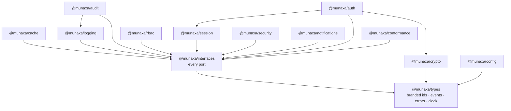
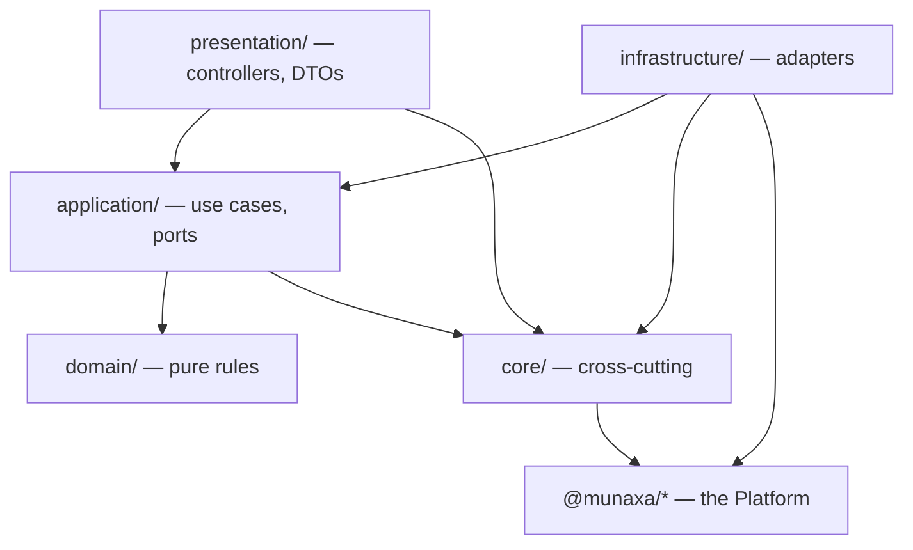
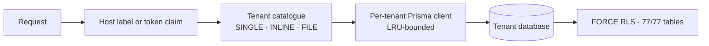
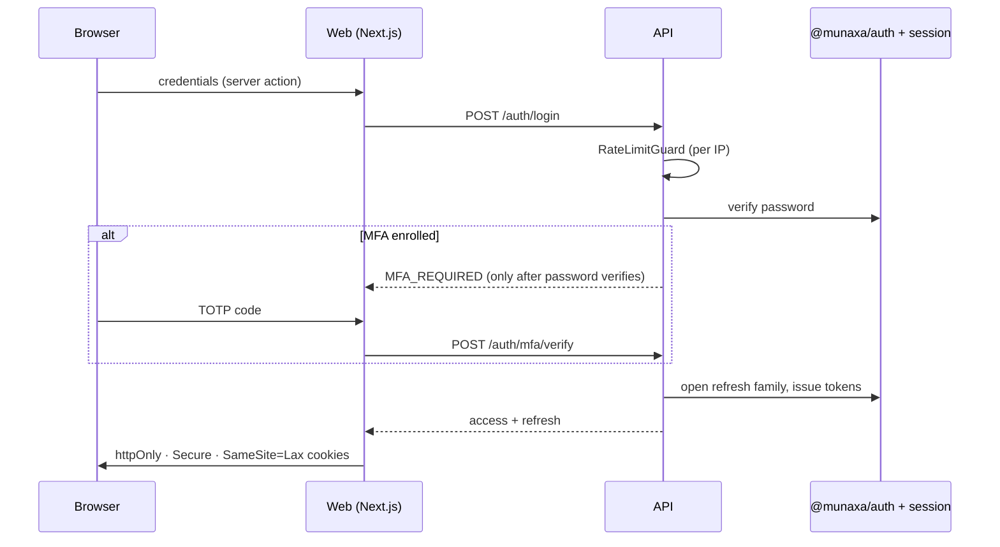
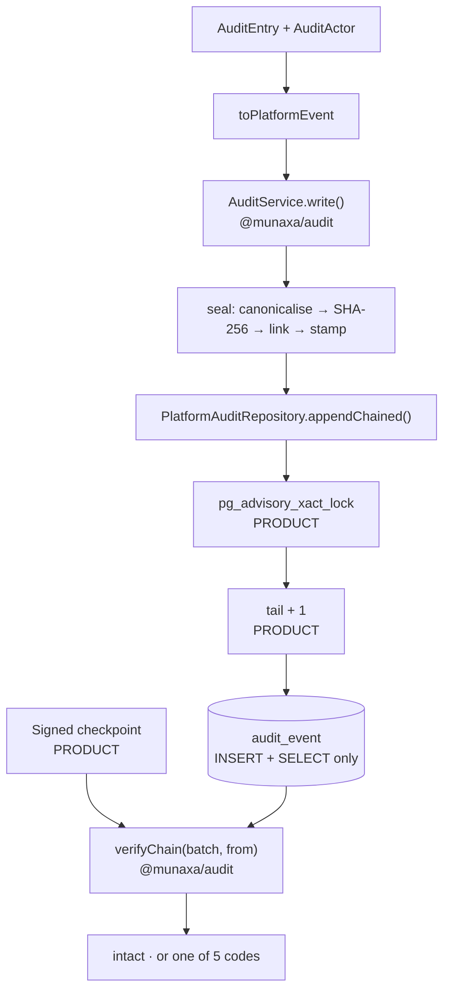
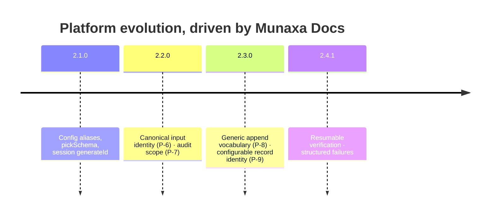

# The Munaxa Architecture Reference Manual

**Status:** authoritative · **Version:** 1.0 · **Platform:** 2.4.1 · **Reference implementation:** Munaxa Docs

This manual describes the architecture **as implemented and verified**, not as designed. Every
claim below is traceable to code, to a migration, or to a test that was executed. Where something
is intended but not built, it says so.

Four labels are used throughout and they mean different things:

| Label | Meaning |
|---|---|
| **Implemented** | The code exists and ships |
| **Verified** | Executed in this program against a real database, a real Redis, or a real registry install — not read from source |
| **Known limitation** | Implemented, with a boundary that is deliberate and stated |
| **Future enhancement** | Not built. Named so nobody assumes it |

### Deliverable index

| # | Deliverable | Where |
|---|---|---|
| 1 | Architecture Reference Manual | This document |
| 2 | Platform Ownership Matrix | §3.1 |
| 3 | Product Ownership Matrix | §3.2 |
| 4 | Platform Evolution Timeline | §14 |
| 5 | Security Architecture Guide | §12 |
| 6 | Deployment Architecture Guide | §13 |
| 7 | Future Product Migration Guide | [`future-product-migration-guide.md`](./future-product-migration-guide.md) |
| 8 | Platform Enhancement Roadmap | §18 |
| 9 | Architecture Decision Index | §20 |
| 10 | Executive Engineering Summary | §1 and §19 |

---

## 1. Executive Summary

### Why the Platform exists

Seven products would otherwise each implement password hashing, session rotation, refresh-token
replay detection, permission evaluation and a tamper-evident audit trail. Not badly — but
differently, and *differently* is the whole problem. Six of them would be correct and the seventh
would have the bug, and nobody would know which.

The Platform exists so that a security decision is made once, reviewed once, and fixed once.

### Platform philosophy

**The Platform owns mechanisms. Products own meaning.**

The Platform knows what a session timeout *is* — that it has an idle deadline and an absolute one,
and that one cannot exceed the other. It has no opinion on how many pages a preview may render.
It knows how to hash-chain a record; it does not know that `DOCUMENT_CHECKED_IN` is an event.

Four rules follow, and every one of them was tested by a real migration:

1. **Zero third-party runtime dependencies.** Node built-ins only. Every external capability —
   Redis, a database, a logger — arrives through a port in `@munaxa/interfaces`. A product on
   Cloudflare Workers and a product on a customer's own server consume the same package.
2. **Secure by default.** The zero-argument configuration is the hardened one.
3. **Additive evolution.** Four releases in this program; none broke a consumer. `verifyChain(records)`
   means today exactly what it meant in 2.0.0.
4. **The Platform never assumes it owns ordering, trust, or vocabulary.** `appendChained` hands the
   adapter the head. `verifyChain` takes a resume point and declines to authenticate it. Both are
   the same instinct: name the boundary rather than guess across it.

### Product philosophy

**Products stay thin, but not empty.**

Munaxa Docs did not become a shell. It kept ~100 configuration fields, an 80-action audit
vocabulary, three historical canonical digest formats, a per-tenant advisory lock, a signed
checkpoint store and an upload policy. What it gave up was the *machinery* under all of that.

The test for where something belongs is not size. It is: **would a second product want this to
mean the same thing?** A session timeout, yes. A document check-in, no.

### Deployment philosophy

One artefact, many shapes. The same container runs a single-tenant on-premise installation and a
multi-tenant hosted fleet; the difference is configuration, not a code path. `DEPLOYMENT_PROFILE`
is consulted in exactly two places — tenant catalogue resolution and production validation — and
deliberately nowhere else. Business logic that branched on it would be business logic that behaves
differently for a customer who bought the same product.

### Security philosophy

**Defence in depth, and every layer must be able to say what it proves.**

Not "we have RLS" but "77 of 77 tenant-scoped tables carry `FORCE ROW LEVEL SECURITY` and a
policy, verified by query, and the SQL discovers its tables rather than listing them so the
omission is impossible rather than merely detectable."

Not "the audit trail is tamper-evident" but "the application role holds `INSERT` and `SELECT` on
`audit_event` and nothing else, there is an append-only trigger on top, and the verifier
distinguishes three accusations from two 'cannot check' outcomes so an unrecognised format never
pages somebody about an intruder who was never there."

The corollary, learned the hard way in Phase 5: **a control that nothing calls is not a control.**
`RATE_LIMIT_RULES` described this product's limits for five phases with no call site anywhere.

---

## 2. Platform Architecture

Thirteen packages, versioned in lockstep, published to GitHub Packages under `@munaxa/*` with
restricted access.



`@munaxa/types` and `@munaxa/interfaces` are the root. Nothing depends on a sibling capability
package — `auth` depends on `session` and `crypto`, and that is the deepest edge in the graph.

| Package | Purpose | Key public API | Extension points |
|---|---|---|---|
| **types** | Branded ids, the security event vocabulary, `PlatformError`, `Clock` | `TenantId`, `UserId`, `SecurityEvent`, `AnyAuditEvent`, `unsafeId`, `systemClock`, `parseDuration` | `SecurityEvent<TPayload, TName>` — a product supplies its own vocabulary |
| **interfaces** | Every port. No implementation | `CachePort`, `LoggerPort`, `MetricsPort`, `AuditRepositoryPort<TName>`, `AuditSealer<TName>`, `ChainHead`, `AuditSequence` | The whole package is the extension point |
| **crypto** | Password hashing, key derivation, envelope encryption | `PasswordHasherRegistry`, `ScryptPasswordHasher`, `toBase64Url` | `PasswordHasher` — a product registers a legacy verifier |
| **config** | Schema DSL, secrets, flags, tenant layering | `PLATFORM_SCHEMA`, `defineConfig`, `extendConfig`, `pickSchema`, `remapSchema`, `fromSeconds`, `parseConfig`, `nestConfig` | `pickSchema` + `remapSchema` + refinements |
| **cache** | `CachePort` implementations | Redis and in-process adapters | `CachePort` |
| **logging** | Structured logging | `StructuredLogger` | `LoggerPort` |
| **audit** | Hash-chained trail: canonicalise, seal, append, verify | `AuditService<TName>`, `verifyChain`, `CanonicalFormat`, `CanonicalFormatRegistry`, `ChainBreakCode` | `canonicalFormat`, `generateId`, `AuditRepositoryPort<TName>`, `VerifyChainOptions.from` |
| **rbac** | Permission evaluation, role hierarchy | `hasPermission`, `RoleHierarchy`, `defaultRoles` | Custom role graphs |
| **session** | Session lifecycle, refresh families | `SessionManager`, `RefreshFamily`, `RefreshStorePort`, `sessionStoreOverFamilies` | `SessionStorePort`, `RefreshStorePort`, `generateId` |
| **security** | Rate limiting, headers, CSRF, normalisation, risk, threats | `RateLimiter`, `rateLimitHeaders`, `BASELINE_RATE_LIMIT_RULES` | `RateLimitRule[]`, `onDegraded` |
| **notifications** | Security notification delivery | `NotificationService`, transports | Transport ports |
| **auth** | Login, MFA/TOTP, refresh rotation, password policy, reset | `RefreshTokenService`, `LoginService`, `MfaService`, `totpCode`, `verifyTotp` | Stores, `PasswordHasher` |
| **conformance** | Executable port conformance suites | `createCache`-style suites | Run against your adapter |

### Versioning and backward compatibility — **Verified**

**Lockstep.** All thirteen share a version through a changesets `fixed` group. A consumer never
reasons about a compatibility matrix.

**Additive only.** Every release in this program added optional fields, optional options or type
parameters with defaults. The evidence is concrete: the 78 pre-existing audit tests passed
**unmodified** through 2.4.1, and `verifyChain(records)` on an intact chain still returns exactly
`{ valid, checked }` — asserted on `Object.keys`, because consumers deep-equal against it.

**Publishing.** `pnpm publish`, never `npm publish`. This is not a style preference: `pnpm`
rewrites `workspace:^` dependency ranges and npm does not. **Verified the hard way** — 2.4.0 was
published with npm, reached the registry with unrewritten ranges, and is uninstallable. 2.4.1 is
identical in code and correct. GitHub Packages does not support `npm deprecate`, so 2.4.0 cannot be
marked; the changelog is the only signal. **Consume ^2.4.1 or later.**

---

## 3. Product Architecture

### 3.1 Platform Ownership Matrix

| Capability | Owner | Why |
|---|---|---|
| Password hashing, KDF | Platform | One decision, reviewed once |
| Cache semantics (`setIfAbsent`, `compareAndSet`) | Platform | Every at-most-once guarantee reduces to these |
| Structured logging | Platform | Redaction rules must not vary |
| Configuration schema, parsing, validation DSL | Platform | Failing at startup with every problem listed is a mechanism |
| Session lifecycle, idle + absolute deadlines | Platform | A timeout means the same thing everywhere |
| Refresh rotation, replay detection, family revocation | Platform | The subtlest security logic in the stack |
| Permission evaluation, role hierarchy | Platform | Wildcards legal in a grant, never in a check |
| Audit canonical serialisation | Platform | Versioned formats are a mechanism |
| Audit sealing, digest, chain linkage, sequence advance | Platform | — |
| Audit append, transaction participation | Platform | — |
| Audit verification, incremental + checkpoint-resumed | Platform | — |
| Rate limiting algorithm and counters | Platform | Sliding window and token bucket are not product knowledge |
| Security headers, CSRF, input normalisation | Platform | — |

### 3.2 Product Ownership Matrix

| Capability | Owner | Why it does **not** belong in the Platform |
|---|---|---|
| Audit vocabulary (80 actions) | Product | A document check-in is not a security event. `SECURITY_EVENTS` stays closed so one query works across products |
| Historical canonical formats (v1/v2/v3) | Product | Three digests this product's rows were written under. No other product has them |
| Advisory lock, gap-free `tail + 1` sequence | Product | Ordering. The Platform deliberately leaves it to the adapter |
| **Signed checkpoint trust** | Product | The HMAC key must live where the Platform cannot reach: not in the database holding the chain, not in the bucket holding the export |
| Rate limit **rules** | Product | Which surfaces matter, and at what cost, is a product judgement |
| Upload policy, archive limits | Product | EDMS content rules |
| Metrics label catalogue | Product | Richer than the Platform's `MetricsPort` — propose upstream rather than replace |
| ~100 configuration fields | Product | Preview caps, CSV profiles, driver rules |
| `JWT_AUDIENCE` | Product | The Platform's field is a list; this product compares `aud` to a single string |
| `NODE_ENV` | Product | Different default, and it triggers *product* production rules |
| Read-audit buffer | Product | The Platform seals each record; when and how many to hold is §5 policy |
| Tenant catalogue and resolution | Product | Deployment topology |

### 3.3 Infrastructure-owned and tenant-owned

**Infrastructure-owned** — enforced below the application, so a bug in it cannot bypass them:
row-level security policies, `audit_event` grants and its append-only trigger, database role
privileges, TLS termination, object-storage bucket policy.

**Tenant-owned** — settings a tenant administrator changes: retention policies, confidentiality
levels, numbering rules, approval routing, notification digests, metadata fields. **Deliberately
not tenant-overridable:** anything cryptographic, audit-related, or isolation-related. A tenant
cannot turn off audit logging.

---

## 4. Dependency Architecture

### Layering — **Implemented and enforced**



Enforced by `no-restricted-imports` in `eslint.config.mjs`, not by convention:

| Rule | Enforced |
|---|---|
| `domain/` imports no framework, no persistence, no transport | Yes |
| `domain/` may not depend on the layers above it | Yes |
| `application/` may not name an adapter or a persistence library | Yes |
| `application/` may not import `infrastructure/` or `presentation/` | Yes |
| A module may not reach into another module's `domain/`, `infrastructure/` or `presentation/` | Yes |
| `core/` and `ports/` may never depend on a module | Yes |

**This has architectural consequences, and they are the good kind.** The audit vocabulary union
lives in `@edms/domain` — a shared package — precisely because no file in `apps/api` may import all
nineteen module catalogues. The rule did not obstruct the design; it *located* it.

Likewise `PlatformChainVerifier` sits in `infrastructure/` because it needs the row-to-record
mapping, so the application layer reaches it through a `CHAIN_VERIFIER` port. The port exists
because the rule exists, and the result is better than a direct call.

### Anti-corruption layers — **Implemented**

Three, and each has a distinct job:

| Adapter | Translates | Notable property |
|---|---|---|
| `platform-audit.mapping.ts` | `audit_event` row ↔ `AuditRecord` | Both directions in one file, deliberately: the digest covers the row and is computed from the record, so a disagreement would verify against itself while attesting something else |
| `platform-chain.verifier.ts` | Platform `ChainBreakCode` → product `BreakReason` | Renames the two "cannot verify" codes rather than folding them into tamper reasons |
| `core/config/platform.ts` | `MUNAXA_*` fields ← this product's env names | `remapSchema` + `fromSeconds`; no variable renamed |

**Reads are permissive where writes are strict.** The append path refuses an action outside the
vocabulary; the row mapper casts. The table is append-only and outlives its code, so a row written
under a retired action must stay readable.

---

## 5. Multi-Tenant Architecture

**Correction to a common assumption: this is not a shared database.** ADR-0015 supersedes ADR-0002.
Each tenant has its own database, its own storage location and its own search index.



### Isolation layers — **Verified**

| Layer | Mechanism | Verified |
|---|---|---|
| 1 | Signed token claim carries `tenantId` | — |
| 2 | Request-scoped `AsyncLocalStorage` context | — |
| 3 | `TenantIsolationGuard` refuses a request naming another tenant in query, body or params | — |
| 4 | Separate database per tenant | ADR-0015 |
| 5 | `FORCE ROW LEVEL SECURITY` + `tenant_isolation` policy | **77 of 77 tables, by query** |
| 6 | Application role is neither superuser nor `BYPASSRLS` | **By query** |

Layer 5 survives layer 4 on purpose. Database-per-tenant makes cross-tenant leakage require a
connection error rather than a query error — but RLS costs nothing to keep and catches the case
where a client is routed wrongly.

**The isolation SQL discovers its tables rather than listing them.** A hand-maintained list is a
hole waiting to open: somebody adds a tenant-scoped table three phases later, forgets the list, and
isolation is missing for exactly that table with nothing to say so. Discovery makes the omission
impossible instead of merely detectable. **Copy this verbatim.**

`FORCE` matters specifically: without it the table owner bypasses the policy, and the owner is who
migrations run as.

---

## 6. Authentication Architecture



| Concern | State |
|---|---|
| Password hashing | `@munaxa/crypto`; `LegacyScryptVerifier` retained **verify-only** |
| Refresh rotation, replay detection, family revocation | `@munaxa/auth` `RefreshTokenService` |
| Idle / absolute session deadlines | Platform-enforced; idle ≤ absolute is a config refinement |
| Concurrency | 10 per user; **oldest evicted, newest never refused** — denying locks a user out of the device in their hand for no security gain |
| `tokenVersion` | Invalidates every token on credential change |
| `permissionVersion` | Invalidates cached permission decisions on a role change |
| MFA | TOTP, RFC 6238, HMAC-SHA1, 30 s, 6 digits, ±1 step |
| Enumeration | `MFA_REQUIRED` returned only *after* the password verifies |

### TOTP Platform compatibility — **Verified**

Proven, not assumed. Identical codes over 50 secrets across many time steps, cross-verified in both
directions, identical drift windows, identical secret encoding.

This matters because a mismatch does not degrade gracefully: it signs out every MFA-enrolled user
at once with no fallback — a password can be reset, an authenticator cannot be un-broken. The test
runs whether or not anyone migrates, so a future Platform change to period, digits, algorithm or
encoding fails **before** somebody adopts it.

**Known limitation.** Per-account login throttling is not enforced. The account being attempted is
in the request body; the Platform's `RateLimitTarget` does not carry it. Per-IP limiting is in
place. See §18 and the Phase 5 report.

**Not implemented: account lockout.** A product decision, not an oversight — lockout is itself a
denial-of-service vector against a known account. A decaying throttle is the recommendation.

---

## 7. Authorization Architecture

Four guards, ordered, closed by default:

```mermaid
graph LR
  R[Request] --> RL[RateLimitGuard]
  RL --> AU[AuthenticationGuard<br/>@Public or refuse]
  AU --> TI[TenantIsolationGuard]
  TI --> RB[RbacGuard<br/>@munaxa/rbac]
  RB --> AC[AclGuard<br/>object-level walk]
  AC --> H[Handler]
```

`@munaxa/rbac` evaluates permissions and the role hierarchy (a cycle-rejecting DAG with memoised
effective permissions). **Wildcards are legal in a grant and never in a check** — that asymmetry is
the whole safety property.

Object-level ACL is the product's: hierarchical, deny-precedence, inheritance-break truncates the
chain (ADR-0005, ADR-0016). Resolved decisions are cached under `permissionVersion`, so a role
change invalidates without a sweep.

**Two disclosure rules, and both are deliberate.** A cross-scope read returns `NotFoundError`, not
`ForbiddenError`, so the API never leaks another tenant's existence. And a denial for an identifier
that names *nothing* is **not** audited — a trail distinguishing "denied" from "absent" would
answer, for anyone who later reads it, the existence question the 404 was written to withhold.

---

## 8. Audit Architecture

The most instructive part of this program: four phases and three Platform releases.



| Concern | Owner | Detail |
|---|---|---|
| Canonical serialisation | Platform | Versioned `CanonicalFormat`; `formatVersion` on each row; absent means 1 |
| The three historical formats | Product | Docs v1/v2/v3, offset to registry versions 901–903 |
| Sealing, digest, linkage, sequence advance | Platform | — |
| Record identity | Product strategy, Platform hook | `generateId(sequence, recordedAt)`, called **before** hashing |
| Ordering | Product | Advisory lock, gap-free `tail + 1`, BigInt |
| Transaction participation | Platform contract, product adapter | `AuditAppendOptions.transaction`; `joinsTransactions: true` |
| Verification | Platform | `verifyChain(records, { from, formats })` |
| Checkpoint **trust** | Product | HMAC key outside database and bucket |

### Three properties worth copying

**Mint before hash.** All three Docs formats cover the event id, so an id derived from the digest —
the Platform's default — is circular. `generateId` runs before hashing. Without it the append path
could not have been expressed without weakening something.

**Historical compatibility is asserted against the original function, not a fixture.**
`platform-canonical.spec.ts` compares the Platform's formats to `chainHash` itself — what wrote
every row in every deployment. The table refuses the `UPDATE` that would rehash a row, so if the
two ever disagree the evidence is gone. That is why `chainHash` survives deletion: removing it
would remove the comparison.

**Five outcomes, three of which are accusations.**

| Code | Accusation? |
|---|---|
| `DIGEST_MISMATCH` | Yes — a field was altered |
| `LINK_MISMATCH` | Yes — a record inserted/removed mid-chain, or a batch not following its head |
| `SEQUENCE_GAP` | Yes — a record removed, taking its link with it |
| `UNVERIFIABLE_FORMAT` | **No** — this build cannot check it |
| `UNVERIFIABLE_RECORD` | **No** — the format needs an identifier the record lacks |

All five fail the pass and all five refuse a checkpoint, because a range that was not verified must
not be attested. Only three accuse anybody.

### Incremental verification — **Implemented and verified**

The daily pass resumes from a signed checkpoint and walks in batches of 5,000, carrying the head
forward — never taking it from the slice, which would verify the batch against itself.

A record removed from the **front** of a batch is now detectable, which it was not before 2.4.1:
every record present still chains to the one before it, so only the position the checkpoint names
catches it.

---

## 9. Configuration Architecture

**Two validators, one aggregated failure.** Platform-owned settings are parsed by `@munaxa/config`;
the ~100 product fields by zod. Both run on every boot and their problems are reported together —
an operator learns everything wrong in one restart.

Ten settings are Platform-owned: signing secret, Redis URL, log level, four token/session
lifetimes, concurrent-session cap, token issuer, trusted origins.

### Three problems every adopter will hit

**Units.** These variables counted whole seconds; Platform fields are durations in milliseconds.
`fromSeconds('JWT_ACCESS_TTL_SECONDS')` restates the encoding **at the source**, so `900` still
means fifteen minutes without the Platform relaxing what it accepts.

**Bounds.** The Platform's durations have no ceiling; this product refuses an access token longer
than an hour. Every product bound is restated as a `defineConfig` refinement. Adopting a field and
dropping its bound is a weakening dressed as a migration.

**Defaults.** Four of ten differ. Idle timeout is 15 minutes in the Platform and 8 hours here — an
installation that never set it would have started signing users out every fifteen minutes. Supplied
through the *source*, never by redefining the field (which `extendConfig` refuses, correctly).

> **The trap.** `parseConfig` reads a field's own key **before** its aliases. Injecting a default
> under the canonical name while the operator had set the legacy name silently discards what they
> set. Check the canonical name *and every alias* before filling in. There is a test for exactly
> this, and there should be one in your product too.

**No variable was renamed. No deployment artefact changed.** Verified by grep across CI,
`.env.example`, deployment docs and the identity README.

---

## 10. Caching Architecture

`CachePort` is the Platform's, re-exported by the product rather than re-declared. Munaxa Docs
previously had its own near-identical port, and the difference mattered: the local one lacked
`setIfAbsent` and `compareAndSet`, and **every at-most-once guarantee in the Platform reduces to
those two** — MFA replay protection, one-time codes, notification deduplication.

Redis-backed in every real deployment. Consumers: resolved permission decisions (keyed by
`permissionVersion`), settings, OIDC discovery, API-key throttle, and **the rate limiter's
counters** — which is what makes limits authoritative across replicas.

**Invalidation is by version, not by sweep.** Bumping `permissionVersion` makes every cached
decision unreachable without touching a key. **The cache is an optimisation only: a cold cache must
produce the same answer, never a different one.**

Note the units: the Platform takes `{ ttl }` in **milliseconds**; the retired local port took
seconds positionally.

---

## 11. Logging & Observability

| Concern | State |
|---|---|
| Structured logging | `@munaxa/logging` `StructuredLogger` |
| Redaction | Platform strips credential-shaped payload keys; error messages never carry values |
| Correlation IDs | Middleware-assigned, propagated, exposed as `X-Correlation-Id` |
| Tracing | W3C trace context parsed and propagated |
| Audit | 80 actions, hash-chained, append-only |
| Metrics | Enforced label catalogue |
| Health | Liveness and readiness; metrics behind a scrape token production requires |

**The metrics label catalogue is the piece to copy.** Labels are bounded sets drawn from something
declared in code — a queue name, a route template, a status class, a rule id. A tenant id or an IP
as a label is an unbounded cardinality explosion that takes the metrics backend down *during the
incident it was added for*. The catalogue enforces this rather than documenting it, and it is
**richer than the Platform's `MetricsPort`** — which is why it stays local and is proposed upstream.

**Known limitation.** `audit.chain-broken` is published to the outbox and logged at error; no
consumer delivers it. The log line is the alert today. Deployments must alert on
`audit.chain.verified{intact=false}` — a metric emitted on **both** paths precisely so the alerting
condition is not "the number stopped moving", which is indistinguishable from the job not running.

---

## 12. Security Architecture Guide

### Rate limiting — **Implemented and verified**

`RateLimitGuard` is the **first** global guard, so an anonymous flood is refused before anything
expensive happens. Twelve rules across five surfaces, per IP / user / tenant / session, adaptive on
authentication paths. Counters in Redis, so the published limit is the actual limit across replicas
and through a rolling deploy — asserted by a test with two guard instances and one store.

**Fail-open, loudly.** A store failure allows the request, raises `ratelimit.degraded` and logs at
error. Allowing is the right trade — a Redis blip must not take sign-in down — but a limiter open
for a week unnoticed is what that trade actually costs, so silence is not an option the code
permits.

### Security headers — **Implemented**

CSP (`default-src 'none'`, `frame-ancestors 'none'`, `base-uri 'none'`, `form-action 'none'`),
HSTS (2 years, `includeSubDomains`, `preload`), `Referrer-Policy: strict-origin-when-cross-origin`,
`X-Content-Type-Options`, `X-Frame-Options: DENY`, CORP `same-site`, Permissions-Policy with every
feature off, `X-Powered-By` removed. No obsolete headers.

**COOP/COEP deliberately absent.** Both govern browsing-context relationships of *documents*; this
API returns only JSON. Adding them satisfies a scanner and changes nothing.

### Cookies, CSRF, CORS

`httpOnly`, `Secure` in every environment but `development` and `test`, `SameSite=Lax`, `path=/`.
`Lax` rather than `Strict` so a link from an email does not arrive signed out; the tokens are
useless to another origin because no script can read them.

**CSRF: not applicable by construction.** There is no browser-side API client. The access token
lives in an `httpOnly` cookie read only by Next.js server actions; the API authenticates by
`Authorization: Bearer`, which a cross-site form cannot set. CORS is explicit, credentialed and
never `*`.

### Threat model summary

| Threat | Control |
|---|---|
| Credential stuffing | Per-IP rate limiting, adaptive. **Per-account is a known gap** |
| Session theft | `httpOnly` + `Secure` + rotation + replay detection + family revocation |
| Cross-tenant access | Six layers (§5) |
| Audit tampering | Grants, trigger, hash chain, signed off-box checkpoints |
| Malware upload | Sniffed MIME before declared, scan before reachable, archive bomb bounds |
| SSRF | Allow-list empty by default; insecure outbound refused in production |
| Data exfiltration via export | Rate limited, audited, authorised |
| Supply chain | Lockfile, registry-pinned Platform, `pnpm audit` clean |

---

## 13. Deployment Architecture Guide

**Implemented today:** Docker (single image, `Dockerfile`), Docker Compose for local, PostgreSQL 16,
Redis, S3-compatible object storage, and an on-premise single-tenant profile. Deployment,
backup/restore and disaster-recovery procedures are in `docs/operations/`.

**Cloudflare, Render and Kubernetes:** the architecture is deployment-agnostic by construction —
every external capability arrives through a port, and the Platform uses Node built-ins only — but
**no Cloudflare, Render or Kubernetes manifest exists in this repository.** Recording that plainly
rather than describing infrastructure that is not there.

### Platform distribution

GitHub Packages (`npm.pkg.github.com`), restricted access, `@munaxa` scope, lockstep versions.

**Upgrade strategy.** Bump all `@munaxa/*` together (lockstep makes this one edit), `pnpm install`,
typecheck, run the full suite including integration. Because releases are additive, a bump that
typechecks and passes is very likely correct — but the audit and configuration suites are the ones
that would catch a semantic change, so never skip integration.

**Rollback strategy.** Pin the previous version and reinstall. Additive-only means a downgrade is
safe **unless** you have started using a capability the older version lacks — which is exactly what
happened here: a build using `VerifyChainOptions.from` cannot roll back below 2.4.1.

> **Never consume 2.4.0.** Its tarballs carry unrewritten `workspace:^` ranges and cannot be
> installed. GitHub Packages does not support `npm deprecate`, so it cannot be marked on the
> registry.

---

## 14. Platform Evolution Timeline

Four releases. Every one was driven by a consumer discovering something the Platform could not
express — never by speculation.



### 2.1.0 — Configuration and session adoptability

- **Discovered by** Munaxa Docs, during the pre-migration consumer survey — *before* the code was written.
- **Problem.** `PLATFORM_SCHEMA` names variables `MUNAXA_*` and renders flat. An existing deployment cannot rename variables across every installation simultaneously. Whole-schema adoption also forced a required `MUNAXA_ENCRYPTION_KEY` on a product not using field encryption.
- **Root cause.** The schema assumed a greenfield deployment.
- **Enhancement.** Env aliases with `decode`, `pickSchema`, nested paths, schema-level refinement.
- **Lesson.** **Adoptability is a feature.** A boundary nobody crosses provides no value; incremental adoption beats an all-or-nothing one.

### 2.2.0 — Canonical input identity (P-6) and audit scope (P-7)

- **Discovered by** Munaxa Docs, attempting to express three historical digests.
- **Problem.** All three Docs formats hash the record id. `CanonicalInput` had no `recordId`, so historical digests were inexpressible.
- **Root cause.** The Platform's own id derives from the digest, so it never needed the id as an input — an assumption invisible until a consumer's digest covered its own id.
- **Enhancement.** `recordId`/`externalId` on `CanonicalInput`, `requires` on `CanonicalFormat`, verification refuses a format whose required field is absent rather than hashing `undefined`. P-7 settled scope: **Option A for the vocabulary, Option B for the framework** (ADR-0020).
- **Lesson.** Distinguish the *machinery* from the *vocabulary*. Generalising the first is nearly free; generalising the second destroys the property it was bought for.

### 2.3.0 — Generic append vocabulary (P-8) and record identity (P-9)

- **Discovered by** Munaxa Docs, migrating the audit *writer* after 2.2.0 had made verification expressible.
- **Problem.** `AuditRepositoryPort`, `AuditSealer` and `AuditService` were hard-wired to `SecurityEventName`, so a product could verify its own records but not append them. And a product whose digest covers its id needs the id minted **before** hashing, which the platform-derived id makes circular.
- **Root cause.** Read and write paths generalised at different times.
- **Enhancement.** `TName extends string` threaded through the append pipeline; `generateId(sequence, recordedAt)` called before hashing.
- **Lesson.** **Generalise both directions at once.** A read path a product can use and a write path it cannot is a half-migration that looks finished.

### 2.4.1 — Resumable verification and structured failures

- **Discovered by** Munaxa Docs, in a phase that **stopped rather than working around it**.
- **Problem.** `verifyChain` initialised `previousHash` and the expected sequence to `null`, so it could only start at genesis. This product never verifies from genesis — it resumes from a signed checkpoint in batches of 5,000. Handing it a continuation batch produced `LINK_MISMATCH` on intact evidence: **a fabricated break, nightly, at the highest severity a compliance alert has.**
- **Root cause.** `verifyChain` was designed for the shape the Platform verifies — a whole chain, in memory, from genesis. The append side already knew it did not own ordering; verification is the same problem and did not get the same treatment.
- **Enhancement.** `VerifyChainOptions.from?: ChainHead | null`, plus `code`, `brokenAtId`, `expectedHash`/`actualHash`, `expectedPreviousHash`/`actualPreviousHash`, `expectedSequence`.
- **Lesson.** **Survey a consumer for how a capability is _operated_, not only for what it computes.**

---

## 15. Lessons Learned

### What worked

**Surveying the consumer before writing Platform code.** This caught three gaps before 2.1.0
shipped. The one thing that survey missed — defaults — cost the most in P4.6.

**Stopping instead of working around.** P4.7 stopped, documented the limitation as an *executable
spec*, and the Platform closed it additively. Cost: one release cycle. The alternatives —
flattening five failure codes into three, or verifying seven years of trail from genesis nightly —
would have been permanent. **Stopping was only available because the limitation was expressible as
a test rather than an opinion.**

**Proving compatibility empirically before migrating.** Refresh-token hashes before P4.4B; TOTP in
Phase 5. Both would have signed out every user if assumed.

**Asserting against the original, not a fixture.** The canonical-format tests compare to
`chainHash` itself. A fixture would have frozen a possibly-wrong value.

**Enforced layering.** ESLint boundaries did not obstruct the design; they *located* it.

### What failed

**Describing a file instead of checking a call graph.** For two phases I reported "the local rate
limiter is per-process, so the limit is multiplied by the replica count." There was no limiter.
`RATE_LIMIT_RULES` had **no call site anywhere** and `@nestjs/throttler` was never imported. The
correct severity was Critical, not Medium. **A control that nothing calls is not a control, and
`grep` for the *binding*, not the declaration.**

**Using `npm publish` where `pnpm publish` was required.** 2.4.0 reached the registry uninstallable.
Caught only by the clean-install verification — which is precisely why that step exists.

**Two double-hash bugs.** Docs' canonical formats initially returned `sha256(material)` while the
Platform hashes whatever `canonicalize` returns. Every record read as tampered — and the failure
looked exactly like tamper detection working correctly.

### Architectural mistakes to avoid

| Mistake | Consequence |
|---|---|
| Declaring a control without binding it | Five phases with no rate limiting |
| A format returning a digest rather than material | Every record reads as tampered |
| Generalising the read path but not the write | A migration that looks finished and is not |
| Assuming a capability is operated the way you built it | A verifier that fabricates breaks nightly |
| Injecting a default under a canonical name without checking aliases | Deployment looks configured and is not |
| Two names for one fact | They disagree eventually |

### When the Platform should evolve, and when it should not

**Should:** the capability is a mechanism; two or more products would want the same meaning; the
change is additive; a consumer has hit the gap with real code.

**Should not:** it is vocabulary; the product's version is *richer* (metrics labels); it is content
rather than machinery (canonical formats, upload policy); it requires the Platform to hold trust it
cannot justify (checkpoint signing keys).

---

## 16. Reference Implementation

Munaxa Docs is the reference because it is the only product that has adopted **every** Platform
capability, under real constraints: seven years of hypothetical audit history that could not be
rehashed, deployments whose environment variables could not be renamed, and enrolled authenticators
that could not be broken.

### Patterns to copy

| Pattern | Where |
|---|---|
| Discovery-based RLS SQL, re-run after every migration | `infra/sql/post-migrate/01-tenant-isolation.sql` |
| Byte-compatibility asserted against the original function | `core/audit/platform-canonical.spec.ts` |
| Empirical compatibility proof before migrating | `totp-platform-compatibility.spec.ts` |
| Env aliases + `fromSeconds` + restated bounds | `core/config/platform.ts` |
| Metrics label catalogue with enforcement | `core/observability/metrics.ts` |
| Port + adapter where layering forbids a direct call | `CHAIN_VERIFIER` |
| Two-replica assertion for distributed limits | `rate-limit.guard.spec.ts` |
| Vocabulary union with `satisfies` conformance per catalogue | `@edms/domain/enums/audit-actions.ts` |

### Patterns **not** to copy

| Anti-pattern | Why |
|---|---|
| `RATE_LIMIT_RULES` as it stood before Phase 5 | A declaration with no binding |
| A hand-maintained defaults table (`DOCS_DEFAULTS`) | A workaround for a missing Platform feature — see §18 |
| Duplicating the vocabulary literals | Necessary here because of layering; derive if your layout permits |
| `outbox-dispatch`'s fixed 100 ms sleep | Flaky. Poll `pg_locks` |
| Publishing with `npm publish` in a pnpm workspace | Produces uninstallable tarballs |

---

## 17. Future Product Guidance

See **[`future-product-migration-guide.md`](./future-product-migration-guide.md)**.

Munaxa School and Munaxa Work were surveyed during this program. Neither consumes any `@munaxa/*`
runtime security package today; both consume UI, theme, tokens and config packages only. School's
`AuditLog` has no `sequence` and no `hash` — it is an append log, not a chain. Work has no audit
table at all, only per-row audit columns.

---

## 18. Platform Enhancement Roadmap

### Confirmed improvements — a consumer hit each with real code

| # | Enhancement | Evidence |
|---|---|---|
| 1 | **`CheckpointPort`** — sign/verify/store, key strictly the product's | Every product doing incremental verification rebuilds this machinery |
| 2 | **Schema default override** — `withDefaults(schema, {...})` | The largest friction in P4.6; four of ten fields needed a hand-maintained table |
| 3 | **Body-aware rate-limit subject** — `RateLimitTarget.subject?: string` | Root cause of the per-account login gap. Closes it without the Platform ever parsing a body |
| 4 | **`redactConfig` composing with `nestConfig`** | The natural composition needs a cast |

### Future ideas — plausible, no consumer has hit them

- A metrics label catalogue in `MetricsPort` (Docs' version is richer; upstream it).
- Richer verification provenance — which format registry version verified a record.
- A conformance suite for `AuditRepositoryPort` ordering guarantees.

### Rejected — should remain product-specific

| Idea | Why rejected |
|---|---|
| Move audit vocabularies into the Platform | Destroys the property `SECURITY_EVENTS` was bought for: one query across every product |
| Platform-owned canonical formats per product | They are content, not machinery. Three digests belonging to one product's history |
| Platform-owned checkpoint **trust** | The Platform cannot tell a signed checkpoint from the first row of the batch being verified. Claiming otherwise would be a guarantee it cannot provide |
| Platform-owned upload policy | EDMS content rules |
| Replacing Docs' metrics catalogue | The product's is stricter |
| Platform-owned advisory locking / sequence allocation | Ordering is the store's. `appendChained` is correct as it stands |

---

## 19. Production Readiness Summary

| Dimension | Assessment |
|---|---|
| **Architecture maturity** | **High.** Hexagonal, enforced by lint. Ownership boundaries settled and documented. Four releases without a breaking change |
| **Security posture** | **Strong**, with one High gap. Zero Critical open; six isolation layers verified live; zero known dependency vulnerabilities |
| **Operational readiness** | **Good**, with one caveat. Startup validation, graceful shutdown, bounded resources, retries, backpressure. **A restore rehearsal has not been performed** |
| **Platform maturity** | **High.** Thirteen packages, lockstep, additive, one complete consumer, executable conformance suites |
| **Product maturity** | **High.** 685 unit + 591 integration tests, all passing |

### Known risks

| Risk | Severity | Mitigation |
|---|---|---|
| Per-account login throttling absent | **High** | Per-IP limiting in place; roadmap #3 closes it |
| Chain-break alert has no delivery path | Medium | Alert on `audit.chain.verified{intact=false}` — must be in the runbook |
| **Restore never rehearsed** | Medium | **Should gate go-live.** The only readiness claim resting on documentation rather than evidence |
| 2.4.0 uninstallable and unmarkable | Low | Pin `^2.4.1`; changelog documents it |

### Residual technical debt

| Item | Effort | Blocks production |
|---|---|---|
| Per-account login throttle | 1–2 d | No |
| Chain-break alert delivery | 1 d | No |
| `outbox-dispatch` flaky test | 2 h | No |
| Refresh-token pepper (needs dual-read) | 2 d | No |
| Legacy scrypt verifier removal | Blocked on data | No |
| TOTP migration to `@munaxa/auth` | 1 d | No — compatibility proven |

---

## 20. Architecture Decision Index

Twenty product ADRs in [`adr/`](./adr/), one Platform ADR pair in the Platform repository.

| ADR | Decision |
|---|---|
| 0001 | Product root placement |
| 0002 | Multi-tenant isolation model — **superseded by 0015** |
| 0003 | Document / revision / file identity separation |
| 0004 | Numbering assigned at approval |
| 0005 | Hierarchical ACL with deny precedence |
| 0006 | Declarative workflow engine |
| 0007 | Storage port and content addressing |
| 0008 | Postgres-first search |
| 0009 | Append-only hash-chained audit |
| 0010 | Soft delete and retention |
| 0011 | Transactional outbox for async work |
| 0012 | Entitlements as data, enforced centrally |
| 0013 | Operator console as a separate surface |
| 0014 | Materialised path as text |
| 0015 | **One database, storage location and search index per tenant** |
| 0016 | Inheritance break truncates the chain |
| 0017 | Electronic signature as witnessed attestation |
| 0018 | Machine identity as a delegated subject |
| 0019 | Webhooks are not notifications |
| 0020 | Key management and rotation |

**Platform ADRs** (in `munaxa-platform`): **0020** — what `@munaxa/audit` is for (Option A for the
vocabulary, Option B for the framework). **0021** — verification resumes from a caller-supplied head.

### Supporting documents

- Architecture: `docs/architecture/00`–`21`
- Operations: `docs/operations/` — deployment, backup/restore, disaster recovery, penetration testing
- Security: `docs/security/phase-5-production-readiness.md`
- Migration history: `docs/platform-migration/` — P4 through P4.7
