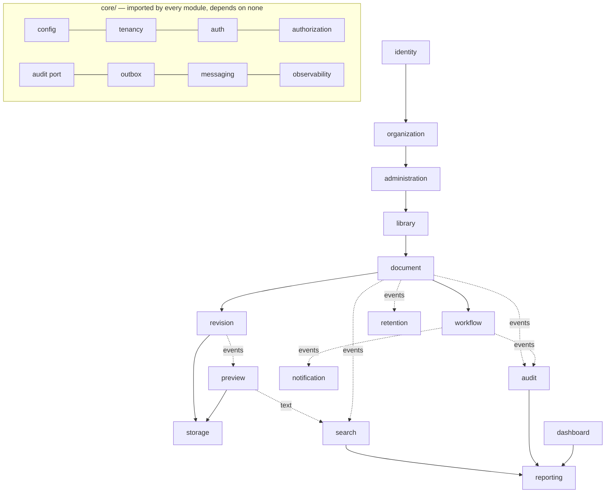

# Phase 0.5 — Architecture Compliance Report

**Purpose:** the formal architecture gate between the Phase 0.5 skeleton and Phase 1 development.
**Audience:** the architecture owner, the platform team, and whoever starts Phase 1.
**Scope:** this repository at the completion of Phase 0.5, inspected directly. No claim below is
made about code that does not exist.
**Date:** 2026-08-03. Point-in-time evidence — historical once Phase 1 begins.

---

## 1. Executive summary

Phase 0.5 built the technical skeleton of Munaxa Docs and validated that the Phase 0 architecture
survives contact with a compiler. The result is 197 TypeScript files across three applications
and four packages, roughly 9 200 lines including the Prisma schema and the database security SQL,
with **zero business features**: no upload, no approval, no workflow, no revision, no document.

| | |
| --- | --- |
| **Overall architecture quality** | High. The Phase 0 design translated with two corrections and no contradictions |
| **Readiness for Phase 1** | **92%** — everything an implementer needs exists; one build-gate item and one migration remain |
| **Recommendation** | **READY AFTER MINOR FIXES** |

### Strengths

1. **The dependency rule is enforced, not described.** Layer and module boundaries are ESLint
   rules in `apps/api/eslint.config.mjs`; a domain file importing Nest, or a module importing
   another module's internals, fails the build.
2. **Every cross-cutting decision has exactly one home.** Tenant context, authorization, audit,
   the outbox, the message pipeline and error translation each exist once, in `core/`, and are
   consumed rather than reimplemented.
3. **Defaults fail closed.** The stand-in ACL resolver denies everything; the stand-in token
   verifier rejects every token; unconfigured providers throw naming the variable that fixes
   them; production refuses to boot on a placeholder driver.
4. **The container resolves.** `apps/api/src/__tests__/composition.spec.ts` builds the real
   application module and asserts the defaults — which is what turns "the ports are declared"
   into "the ports are bound".
5. **Multi-tenancy is five layers deep and the deepest one is SQL.** Token → context → guard →
   client → RLS policies on a `NOBYPASSRLS` role, with the policies written and committed.

### Weaknesses

1. `pnpm-lock.yaml` is not updated for the new workspace members (see §21, R1). Every other
   check passed against the real platform packages built from source.
2. No initial migration: `prisma migrate dev` needs a live database.
3. Test coverage is unit-level only — 56 tests over the pieces that exist. There is nothing to
   integration-test yet.
4. The frontend is a shell without screens, and `/login` — which the shell and the edge
   middleware both redirect to — does not exist yet.

### Critical risks

None. The two highest-rated risks (R1, R2 in §21) are both **high**, both mechanical, and both
clear in a single Phase 1 task.

---

## 2. Repository analysis

### Structure

```text
munaxa-docs/
├── apps/
│   ├── api/        @edms/api      NestJS 11 — 132 source files, modular monolith
│   ├── web/        @edms/web      Next.js 15 App Router — shell, providers, guards
│   └── worker/     @edms/worker   BullMQ lanes, retry policy, dead-letter routing
├── packages/
│   ├── domain/     @edms/domain     permissions, roles, scopes, enums, base entities
│   ├── contracts/  @edms/contracts  envelopes, problem details, paging, capabilities
│   ├── i18n/       @edms/i18n       EN + AR catalogues, typed keys
│   └── utils/      @edms/utils      pure helpers, no domain meaning
├── prisma/         schema: tenant, audit_event, outbox_message, idempotency_key
├── infra/          compose stack, database roles, RLS, audit immutability
└── docs/           architecture (binding) + reports (this file)
```

This matches [`01-monorepo-and-folder-structure.md`](../architecture/01-monorepo-and-folder-structure.md)
§2 with one deviation, recorded in §17: the architecture named an `admin` and a `mobile` app;
Phase 0.5 built `web` (the document workspace, as named in
[`00-system-architecture.md`](../architecture/00-system-architecture.md) §3) and no mobile app,
since no phase before 17 requires one.

### Reusable components — what already existed and was consumed, not rebuilt

| Asset | Source | How it is used |
| --- | --- | --- |
| Component library, shell, layouts | `@munaxa/ui` | `AppShell`, `EmptyState`, `ErrorState`, `Spinner`, `Button`, `LocaleProvider` in the web app |
| Design tokens, themes | `@munaxa/theme` | `@import '@munaxa/theme/css/docs'` — the only visual difference from sibling products |
| TypeScript configuration | `@munaxa/config-typescript` | `base.json` for packages, `nestjs.json` for API and worker, `nextjs.json` for web |
| Lint configuration | `@munaxa/config-eslint` | `base.js`, `nest.js`, `next.js`, each extended with product boundary rules |
| Workspace, task graph, CI | This repository, pre-existing | Unchanged; new packages were registered into them |

**No component, token, theme or helper was copied into this repository.** The web app's ESLint
config forbids importing `@munaxa/platform` directly, so a product cannot reach around the
public surface of `@munaxa/ui`.

| Category | Finding |
| --- | --- |
| **Unused components** | None. Every file is reachable from an application entry point, a test, or is a contract a later phase consumes |
| **Duplicate components** | None found. The one candidate — paging types in both `@edms/utils` and `@edms/contracts` — is deliberate: `utils` holds the runtime helper, `contracts` holds the wire schema, and the schema imports the helper's bounds |
| **Missing components** | Per-module `domain/`, `infrastructure/` and `presentation/` implementations (by design); an outbox dispatcher; vendor adapters; screens |

---

## 3. Clean Architecture validation

| Layer | Location | Verified |
| --- | --- | --- |
| Presentation | `modules/*/presentation/`, `core/observability/health/` | Only the health controller exists; it carries `@Public(reason)` on every route |
| Application | `modules/*/application/ports.ts` | Repository and service interfaces + DI tokens, 15 modules |
| Domain | `modules/*/domain/events.ts`, `@edms/domain` | Event contracts and the ubiquitous language. Pure |
| Infrastructure | `infrastructure/`, `core/prisma/` | Clock, Redis cache, unconfigured provider adapters, Prisma client |
| Shared | `@edms/utils`, `@edms/contracts`, `@edms/i18n` | Pure, isomorphic, framework-free |
| Core | `apps/api/src/core/` | Config, errors, tenancy, auth, authorization, audit, outbox, messaging, http, observability, security |

**Dependency direction.** Enforced by `no-restricted-imports` rules, per layer:

- `modules/*/domain/**` may not import `@nestjs/*`, `@prisma/*`, `express`, `ioredis`, `bullmq`,
  or any layer above it.
- `modules/*/application/**` may not import a persistence library or an adapter.
- `modules/**` may not import another module's `domain/`, `infrastructure/` or `presentation/`.
- `core/**` and `ports/**` may not import a module at all.

**Layer violations found: none.** Two were designed out during the build and are worth recording,
because both were real and both would have been permanent:

1. The audit and outbox ports originally took a `PrismaTransaction` parameter, which put a Prisma
   type into the application layer's vocabulary. Replaced with an ambient transaction held in
   `AsyncLocalStorage` (`core/prisma/unit-of-work.ts`), so a repository joins its caller's
   transaction without any port naming Prisma.
2. `ports/` briefly risked importing from `modules/`. The lint rule above was added and the
   dependency inverted.

**Circular dependencies: none.** The module graph in §5 is acyclic by construction; every
upward edge is an event, not a call.

**Business logic in infrastructure: none** — the only adapters that exist are a clock, a cache and
five that refuse. **Infrastructure logic in domain: none** — the domain packages compile without
`@types/node`, which is the mechanical proof (an attempt to use `Error.captureStackTrace` was
removed for exactly this reason).

---

## 4. Domain-driven design validation

Every context named in the Phase 0.5 brief maps to a module or, where the brief named a
cross-cutting concern, to `core/`. Each module carries a `README.md` stating what it owns, what it
depends on, and which core port it binds.

| Context | Module | Owns | Depends on | Overlap risk |
| --- | --- | --- | --- | --- |
| Identity | `identity` | User, Role, RolePermission, sessions, MFA, Delegation | — | Delegation ↔ Workflow: the task records both actors; Workflow never resolves delegations itself |
| Organization | `organization` | Company, Entity, Branch, Department | Identity | Scope tree is shared with Library; Library owns ACLs, Organization owns nodes |
| Administration | `administration` | Types, categories, fields, numbering rules and sequences, retention policies, confidentiality, settings | Organization | Numbering ↔ Document: Administration issues, Document consumes at approval |
| Library | `library` | Library, Folder, ACL entries | Organization, Administration | Binds `ACL_RESOLVER`; nothing else may resolve permissions |
| Document | `document` | Document, metadata values, tags, links, check-out lock | Library, Administration | The product's root aggregate; publishes 12 events |
| Revision | `revision` | DocumentRevision, compare, restore | Document, Storage | Revision status vs document status: two machines, deliberately distinct |
| Workflow | `workflow` | Definitions and versions, instances, stages, tasks | Document, Identity | Instances bind to a definition **version**, so editing never mutates a running approval |
| Storage | `storage` | FileObject, UploadSession, dedupe, the antivirus gate | — (port only) | Sole caller of `STORAGE_PORT` and `ANTIVIRUS_PORT` |
| Preview | `preview` | PreviewArtifact, thumbnails, OCR results | Storage | Artefacts are disposable and rebuildable; never authoritative |
| Search | `search` | Index projection, query, saved searches | Document, Preview | Read model only; rebuildable at any time |
| Audit | `audit` | AuditEvent, hash chain, export | — (written by all) | Binds `AUDIT_WRITER`; append-only interface, no update or delete |
| Notification | `notification` | Templates, messages, delivery, preferences | Identity | Renders; the adapter delivers |
| Retention | `retention` | Schedules, legal holds, disposition, purge | Document, Storage | The only path that destroys data |
| Reporting | `reporting` | Report definitions, read models, exports | Search, Audit, Workflow | Reads read models, never another module's tables |
| Dashboard | `dashboard` | Composition over other modules' read models | Reporting, Workflow, Document, Search | Owns no data, by design — prevents a second definition of "overdue" |
| **Security** | `core/` | AuthN, tenancy, RBAC, ACL, policy, audit writing, rate limits, headers | — | See §17: a security *module* would either duplicate the data or invert the dependencies |

**Improvements recommended:** none structural. One naming note: the brief's "Organization" and
the architecture's "Organization" both mean the scope tree, not the tenant; the tenant is
`Tenant` in the schema and never a module.

---

## 5. Module dependency graph



Solid edges are synchronous calls into the owning module's **application service**. Dashed edges
are **domain events**, delivered asynchronously through the outbox. The rule — *a module may call
downward and publish upward* — is what keeps the graph acyclic.

| Category | Finding |
| --- | --- |
| **Allowed** | Every solid edge above, plus every module → `core/` and → `@edms/*` |
| **Forbidden, and blocked by lint** | Module → another module's `domain/`, `infrastructure/`, `presentation/`; `core/` → any module; `domain/` → any framework; product → any other AXA product (CI `boundaries` job) |
| **Circular** | None |
| **Shared** | `core/`, `ports/`, and the four `@edms/*` packages. `@edms/domain` and `@edms/utils` are leaves |
| **Future problems** | Reporting depends on three modules and will accumulate more. If it starts reading tables rather than read models, it becomes the reason schemas cannot change — worth a review gate at Phase 15 |

---

## 6. Interface coverage

| External dependency | Port | Bound to (Phase 0.5) | Test double |
| --- | --- | --- | --- |
| Object storage | `StoragePort` | `UnconfiguredStorageAdapter` (refuses, names `STORAGE_DRIVER`) | — (adapter refuses deterministically) |
| Search | `SearchPort`, `IndexPort` | Unbound until Phase 8 | — |
| OCR | `OcrPort` | `UnconfiguredOcrAdapter` | — |
| Preview | `PreviewPort`, `RendererRegistry` | `UnconfiguredPreviewAdapter` | — |
| Email / in-app | `NotificationPort` | `UnconfiguredNotificationAdapter` | — |
| Antivirus | `AntivirusPort` | `UnconfiguredAntivirusAdapter` — **no permissive default in any environment** | — |
| Clock | `ClockPort` | `SystemClockAdapter` | `FakeClock` |
| Cache | `CachePort` | `RedisCacheAdapter` | `FakeCache` |
| Locks | `LockPort` | Unbound until first use | `FakeLock` |
| Queues | `QueuePort` | Unbound until the dispatcher | `RecordingQueue` |
| Database | `UnitOfWork`, repository interfaces | `PrismaUnitOfWork` | — |
| Token verification | `TokenVerifier` | `NoIssuerTokenVerifier` (rejects everything) | — |
| Authorization | `AclResolver` | `DenyAllAclResolver` (denies everything) | — |
| Policy / entitlements | `PolicyEvaluator`, `FeatureFlags` | Unbound until Administration | — |
| Audit | `AuditWriter` | Unbound until the Audit module | — |
| Outbox | `OutboxWriter`, `OutboxDispatcher` | Unbound until Phase 1 | — |

**Missing abstractions: none identified.** Every external system named in
[`02-backend-architecture.md`](../architecture/02-backend-architecture.md) §4 has a port, and each
port is named for the capability rather than the vendor — there is no `S3Service`, no
`TesseractService`, no `Bucket` or `ContainerClient` in any signature.

**Concrete implementations reachable from a use case: none.** The only class a future use case
can inject is a token.

**Violations: none.** The one to watch: `RedisCacheAdapter` is bound directly as well as behind
`CACHE_PORT`, because the health probe overrides it in tests. It is never injected by class
anywhere else.

---

## 7. Repository pattern validation

| Check | Result |
| --- | --- |
| Interfaces in `application/`, implementations in `infrastructure/` | Yes — 37 repository interfaces across 15 modules; no implementations yet |
| Repositories return domain records, not Prisma models | Yes — every signature names a module-owned `*Record` type or a primitive |
| Aggregate-scoped, not screen-scoped | Yes — list views are separate query services (`DocumentQueryService`, `SearchService`), so no list is forced through an aggregate |
| Transaction boundaries owned by the use case | Yes — `UnitOfWork.run()` opens the transaction; repositories join it ambiently via `requireTransaction()`, which throws if none is active |
| No business logic | Verified by reading: the only conditional logic in any interface is a documented contract (`decideIfPending` returns false when someone decided first) |
| Future extensibility | A second persistence technology would implement the same interfaces; nothing above `infrastructure/` would change |

One design decision worth defending: **repositories take no transaction parameter.** The ambient
unit of work removes the failure mode where one call in a use case is handed the outer client and
commits alone — and it is what allows the application layer to declare persistence contracts
without importing Prisma.

---

## 8. Service layer validation

| Kind | Present | Notes |
| --- | --- | --- |
| Application services | 22 interfaces + tokens | The only surface a module exposes to another module |
| Domain services | None yet | Pure rules arrive with the entities that need them |
| Infrastructure services | `PrismaService`, `RedisCacheAdapter`, `SystemClockAdapter` | No business rules; verified by reading |
| Background services | Queue definitions, retry policies, schedule, `JobHandler` contract | No consumers registered — Phase 1 |

| Principle | Assessment |
| --- | --- |
| Single responsibility | Held. `DashboardService` composes rather than computes; `NumberingService` issues numbers and does nothing else |
| Dependency injection | Every dependency is a token; no service constructs a collaborator |
| No duplicated logic | The permission decision exists once (`AclResolver`), the transaction boundary once (`UnitOfWork`), the audit envelope once, the error mapping once |

---

## 9. Database readiness

Reviewed against [`05-database-design.md`](../architecture/05-database-design.md). Phase 0.5 models
only the cross-cutting foundation: `tenant`, `audit_event`, `outbox_message`, `idempotency_key`.

| Check | Result |
| --- | --- |
| Normalisation | 3NF. `jsonb` appears only where the shape is genuinely tenant-defined (`tenant.settings`) or is an event payload |
| Primary keys | UUID v7, application-generated, time-ordered — index locality without an enumerable sequence |
| Foreign keys | Present and explicit; `onDelete: Restrict` on audit and outbox so a tenant row cannot take the trail with it |
| Unique constraints | `tenant.slug`; `(tenant_id, key)` on idempotency |
| Indexes | Four on `audit_event` — subject timeline, actor, chain order, correlation; two on `outbox_message` — the dispatcher's due query and aggregate lookup; expiry sweep on idempotency |
| Soft delete | `deleted_at` on `tenant`; **deliberately absent from `audit_event`** — audit outlives its subject |
| Audit fields | `created_at`/`updated_at` present; `created_by`/`updated_by` arrive with the first table that has an actor |
| Tenant isolation | `tenant_id` on every table but `tenant`; RLS policies committed in `infra/sql/01-roles-and-rls.sql` |
| Future scalability | `audit_event` and `notification_message` are designed for monthly range partitioning; processed outbox rows are deleted after seven days |
| Bottlenecks | The outbox dispatcher is a single writer per instance by design (`FOR UPDATE SKIP LOCKED` makes that safe to scale horizontally). The `number_sequence` row lock is the one contention point in the whole design, and it is held for microseconds |

**No migrations were generated** — that needs a live database (see §21, R2). The schema validates
and the client generates.

---

## 10. Multi-tenant validation

| Layer | Mechanism | Evidence |
| --- | --- | --- |
| 1 Token | `tenantId` is a signed claim | `core/auth/access-token.ts` — no method accepts a tenant from the caller |
| 2 Context | Request-scoped `AsyncLocalStorage` | `core/tenancy/tenant-context.ts`; `requireContext()` throws rather than defaulting |
| 3 Guard | Any request *naming* a tenant is refused | `TenantIsolationGuard`, registered globally; 5 tests including the no-context case |
| 4 Data | `withTenant()` sets `app.tenant_id` transaction-locally | `core/prisma/prisma.service.ts` — `set_config(..., true)` cannot leak to the next borrower of a pooled connection |
| 5 Database | RLS on a `NOBYPASSRLS` role | `infra/sql/01-roles-and-rls.sql`, applied before the first migration |

| Check | Result |
| --- | --- |
| Cross-tenant read | Blocked at layers 3–5; a bug at layer 4 still returns zero rows |
| Cross-tenant write | Blocked by the same policies' `WITH CHECK` |
| Tenant ownership | Every model carries `tenant_id`; the file names the one deliberate exception and why |
| Data leakage | Cross-scope reads return 404, not 403 (`AclGuard` raises `NotFoundError`) so existence is not leaked |
| Issues | **One residual**: the SQL includes a query that lists tenant-scoped tables without a policy, but nothing runs it yet. Recommended as a CI step against a migrated database (§22) |

---

## 11. Security review

| Area | Status | Evidence |
| --- | --- | --- |
| Authentication | Contract only; **fails closed** | `NoIssuerTokenVerifier` rejects every token until Identity ships |
| Authorization | Three-question model wired; **fails closed** | `RbacGuard` (capability) → `AclGuard` (reach) → use case (state); `DenyAllAclResolver` until Library ships |
| RBAC | Catalogue of 35 permissions, 8 seeded roles | `@edms/domain`; a permission outside the catalogue does not typecheck |
| Permission inheritance | Scope chain and deny-precedence encoded in the port's contract; administrative permissions immune to broken inheritance | `survivesBrokenInheritance()`, tested |
| Policy engine | `PolicyEvaluator` + `FeatureFlags` ports, separating entitlements from flags | `core/authorization/policy.port.ts` |
| CSRF | Bearer tokens for the API; refresh cookie `httpOnly`/`Secure`/`SameSite=Lax` | `apps/web/src/lib/session.ts` |
| XSS | React escaping; no `dangerouslySetInnerHTML` anywhere; strict headers | `next.config.ts` |
| Injection | No string-built SQL. The single raw call is `set_config` with a bound parameter; sort fields are allow-listed per endpoint | `sortQuerySchema` |
| Upload validation | Pipeline contract with order fixed: sniff → size/quota → scan; unreachable until `CLEAN` | `core/security/upload-validation.ts` |
| Storage security | Presigned, short-lived, single-object, method-bound; bytes never traverse the API | `StoragePort` |
| Audit integrity | Hash chain + append-only grants + a trigger that refuses `UPDATE`/`DELETE` even for a superuser session | `hash-chain.ts` (5 tests: edit, removal, reorder), `infra/sql/02-audit-immutability.sql` |
| Rate limiting | Per-surface rules, per IP **and** per identity on auth | `core/security/rate-limit.ts` |
| Encryption | At rest by the provider, TLS in transit, HSTS preload | `security.headers.ts` |
| Session security | Short access token, rotating refresh, `permVersion` forcing re-evaluation | `access-token.ts` |
| Secrets management | Validated at boot; `.env.example` holds placeholders; error messages name variables, never values — tested | `configuration.spec.ts` |
| Logging | Redaction configured at the logger, not per call site | `observability/logger.ts` |

**Risks found:** none unmitigated. Two observations: the API's own CSP is `default-src 'none'`,
which is right for a JSON API but must not be copied to the web app (which needs its own
nonce-based policy); and rate-limit *rules* exist while the enforcement middleware does not —
Phase 1 must wire `@nestjs/throttler` to them before the first public endpoint.

---

## 12. Storage architecture review

| Check | Result |
| --- | --- |
| Abstraction | `StoragePort` in the application's vocabulary; no bucket, container or SDK type in any signature |
| Provider independence | Driver chosen in one factory in `InfrastructureModule`; adding S3 is a class plus one case |
| Cloud readiness | Local, S3, Azure Blob, R2 and GCS accepted by configuration and validated at boot |
| File isolation | Content-addressed keys, per-tenant dedupe by `(tenant_id, checksum)`, reference counting before deletion |
| Future migration | `copy()` on the port exists precisely so a driver migration is a job rather than a rewrite |
| Preview architecture | Renderer registry per format; sandbox limits are part of the request type, not a deployment convention |
| Thumbnails | `PreviewArtifactKind.THUMBNAIL`, disposable and rebuildable |
| Virus scanning | Mandatory gate with no permissive default; `REACHABLE_SCAN_STATUS` is `CLEAN` and nothing else |

---

## 13. API architecture review

| Concern | Status |
| --- | --- |
| Routing | `/api/v1` via global prefix + URI versioning; resource-oriented, tenant never in the path |
| Versioning | `API_VERSION` in `@edms/contracts` — one constant shared by API and client |
| Error handling | RFC 7807 + machine-readable code, localised, correlation id on every response; no stack, SQL or path ever leaves |
| Pagination | Offset by default with `total`; cursor schema for lists that outgrow it; page size bounded at 100 and **rejected** rather than clamped |
| Filtering / sorting | Sort fields allow-listed per endpoint by construction |
| Validation | `ValidationPipe` with `whitelist` + `forbidNonWhitelisted`, plus a zod pipe for shared contracts, plus a message-level validation behaviour |
| Middleware | Correlation id → authentication (establishes the ALS context) → guards → interceptors |
| Authorization | Four global guards; `RoutePermissionRegistry` fails the boot if a mutating route declares neither a permission nor a public reason |
| Response consistency | Collections enveloped, single resources bare, dates ISO-8601, `bigint` serialised as decimal strings |
| OpenAPI | Generated from decorators, served outside production — and configuration **refuses to boot** if it is enabled in production |

---

## 14. Frontend architecture review

| Concern | Status |
| --- | --- |
| Module structure | `app/` route groups + `features/` contract documented; no feature may reach into another's internals (lint) |
| Layouts | `(auth)` and `(workspace)` shells; the workspace layout is an async server component that redirects before rendering |
| Routing | App Router; typed routes deferred (technical debt #3) |
| State management | TanStack Query as the only cache; no global client store; session resolved server-side and passed down |
| Permission guards | Edge middleware answers "is there a session"; everything else is the server's `capabilities` object. The UI decides nothing |
| Theme system | `@munaxa/theme/css/docs` — verified by a real `next build` against the platform packages |
| Lazy loading | Route-level splitting by default; admin and reports stay out of the workspace bundle by construction |
| Shared components | Every component from `@munaxa/ui`; importing `@munaxa/platform` directly is a lint error |
| Error boundaries | `error.tsx` shows the correlation id and nothing else — no message, no stack |
| Loading / empty states | `loading.tsx` and `not-found.tsx` from platform components, strings from `@edms/i18n` |
| RTL | `lang`/`dir` set server-side from the session locale; logical properties only |

---

## 15. Performance review

| Target | Readiness |
| --- | --- |
| Millions of documents | Index strategy defined per access path; list reads bypass aggregates through query services |
| Thousands of users | Stateless API; permission decisions cached per `(user, scope, permission)` with event-driven invalidation |
| Large uploads | Presigned multipart, resumable, never through the API; 1 MB body limit enforces it |
| Concurrent workflows | Single-decision task update (`decideIfPending`) makes a double approval a conflict, not a race |
| Large revisions | Revisions are inserts; published rows are never updated |
| Search indexing | Coalesced per document in its own lane; rebuild is safe against a live index |
| Background jobs | Eight lanes with per-lane concurrency, retry, timeout and dead-letter routing — tested |
| Caching | `CachePort` with mandatory TTLs; `deleteByPrefix` scans in batches rather than issuing `KEYS` |
| Queues | Delayed jobs give deadlines and escalation without polling |
| Database | Statement timeout and idle-in-transaction timeout set on the application role |

**Unverified:** no load test has been run, because there is nothing to load. The targets in
[`19-performance-and-scalability.md`](../architecture/19-performance-and-scalability.md) become
testable at Phase 3.

---

## 16. Scalability review

| Dimension | Assessment |
| --- | --- |
| Horizontal | API and workers are stateless; the outbox dispatcher uses `SKIP LOCKED`, so N instances cooperate rather than collide |
| Vertical | Pool size, statement timeout and per-lane concurrency are configuration, not code |
| Storage growth | Content addressing + reference counting + lifecycle tiering at the provider |
| Search growth | Behind a port; an external engine replaces the adapter with no use-case change |
| Workflow growth | Delayed jobs scale with Redis, not with a polling loop |
| Notification growth | Per-recipient rows, digest frequencies, monthly partitioning planned |
| Future microservices | Module boundaries are drawn so extraction is mechanical: no shared tables, no cross-module repository calls |
| Future event-driven | Already event-driven internally; the outbox is the seam an external broker would attach to |

---

## 17. Maintainability review

| Concern | Assessment |
| --- | --- |
| Folder structure | One shape for every module, documented in `modules/README.md` and in each module's own README |
| Naming | Ports named for capabilities; events are past-tense facts; `snake_case` in SQL, `camelCase` in TypeScript |
| Separation of concerns | Each cross-cutting concern exists once |
| Code organisation | 197 files, the largest 213 lines; the biggest are event catalogues and the configuration schema, both of which are lists |
| Extensibility | Adding a provider is a class plus a case; adding a module is a folder plus a README; adding a permission is one commit across a documented set of places |
| Complexity | The two non-obvious mechanisms are the ambient transaction and the message pipeline. Both are documented at their definition, and both are covered by tests |
| Technical debt | Ten items, all deliberate — [`phase-0.5-technical-debt.md`](./phase-0.5-technical-debt.md) |

**Deviations from Phase 0, recorded rather than silently absorbed:**

1. `apps/web` rather than `apps/admin` + `apps/mobile`. The system architecture names the web
   workspace as the client; no mobile client is required before Phase 17.
2. `tsconfig` and ESLint extend the platform's shared configs (`base.json`/`nestjs.json`/
   `nextjs.json`, `base.js`/`nest.js`/`next.js`) — which is stronger reuse than the
   architecture's assumption of a local root config.
3. The `Security` capability from the Phase 0.5 brief is `core/`, not a module (§4).

---

## 18. Testability review

| Concern | Status |
| --- | --- |
| Unit testing | 56 tests over configuration, permissions, paging, uuid, text sanitisation, i18n, the hash chain, both guards, the mediator, the queue definitions and the composition root |
| Integration testing | Structure and doubles ready; nothing to integrate yet |
| End-to-end | Deferred to the first screens |
| Mock infrastructure | `FakeClock`, `FakeCache`, `FakeLock`, `RecordingQueue` in `src/testing/`, excluded from the build |
| Fixtures / factories | `aRequestContext()`, `anAdminContext()`, `aTenantId()`, `aUserId()` — overrides in, defaults filled |
| Dependency injection | Every collaborator is a token, so no test needs a real database, clock or network |
| Decorator metadata in tests | Solved: the API and worker transform tests with SWC, because esbuild does not emit `design:paramtypes` and Nest DI needs it |

The composition test deserves specific mention: it builds the **real** `AppModule` and asserts
that the container resolves and that the defaults deny. That is the test that catches a port
declared but never bound.

---

## 19. DevOps readiness

| Concern | Status |
| --- | --- |
| Docker | `infra/docker-compose.yml` — Postgres 16, Redis 7, MinIO, all health-checked; the SQL security files run at first start |
| Environment configuration | Typed, validated at boot, fails fast; `.env.example` documents every variable |
| Logging | Structured JSON with redaction configured centrally |
| Monitoring | `Metrics` port with the alerting metric names fixed in one place; no exporter bound (debt #9) |
| Tracing | OTLP endpoint accepted by configuration; instrumentation deferred |
| Health checks | Three endpoints: liveness (touches nothing), readiness (probes dependencies with per-probe timeouts), detail |
| CI/CD | Existing workflow runs format, lint, typecheck, test, build, plus the cross-product boundary check. **Will fail on `--frozen-lockfile` until the lockfile is refreshed** (§21 R1) |
| Secrets | Never committed; the registry credential is injected per environment by design |
| Deployment strategy | Documented in Phase 0; unchanged by this phase |

---

## 20. Compliance readiness

| Standard | Architectural readiness | Gap |
| --- | --- | --- |
| ISO 9001 | Document control, approval, revision, retention are the product's core; all modelled | Needs the features themselves |
| ISO 27001 | Access control, audit, encryption, segregation of duties, incident response all have a home | Operational evidence (reviews, drills) |
| SOC 2 | Tamper-evident audit trail, change management via CI gates, least-privilege database roles | Continuous monitoring evidence |
| GDPR | Data minimisation in audit payloads; erasure by anonymising the actor while preserving trail integrity is designed | Erasure workflow, DPA, residency configuration |
| HIPAA (architecture only) | Encryption, access control, audit and retention are compatible | BAA, key management, physical controls — out of architectural scope |
| Document retention | Policies, schedules, legal hold and disposition review are modelled end to end | Phase 10 |
| Audit requirements | Append-only, hash-chained, verified daily, exportable | Verification job and export are Phase 9 |
| Electronic signatures | Not designed. The approval record captures actor, delegation, time and decision — the substrate a signature would bind to | A future ADR |

---

## 21. Risk assessment

| # | Risk | Severity | Description | Impact | Likelihood | Fix | Priority |
| --- | --- | --- | --- | --- | --- | --- | --- |
| R1 | Stale lockfile | **High** | `pnpm-lock.yaml` predates the new workspace members; the authoring environment had no `read:packages` credential for `@munaxa/*` | CI fails at install; nothing else is affected | Certain until fixed | `pnpm install` with a token, commit the lockfile | Before merge |
| R2 | No initial migration | **High** | The schema is authored and validates; the SQL is not generated | No database to develop against | Certain until fixed | `prisma migrate dev --name init` against a local stack | Phase 1, task 1 |
| R3 | Rate limiting not enforced | Medium | Rules are defined; no middleware consumes them | An unprotected auth endpoint the day one exists | Likely if forgotten | Wire `@nestjs/throttler` to `RATE_LIMIT_RULES` | With the first public endpoint |
| R4 | No RLS coverage check in CI | Medium | A future tenant-scoped table can be added without a policy | Isolation hole invisible until exploited | Possible | Run the committed coverage query in CI against a migrated database | Phase 1 |
| R5 | Outbox has no dispatcher | Medium | Events would be written and never delivered | Silent absence of async work | Certain until built | Implement `OutboxDispatcher` with the first event | Phase 1 |
| R6 | `/login` missing behind two redirects | Low | Shell and middleware both redirect there | An unauthenticated visitor sees not-found | Certain until fixed | Ships with authentication screens; re-enable typed routes then | Phase 1 |
| R7 | Reporting may drift toward reading tables | Low | Read-model discipline is documented, not enforced | Schema ossification | Possible, later | Add a lint boundary when Reporting gains its first query | Phase 15 |
| R8 | Renderer sandboxing is contract-only | Low | Limits are typed; no sandbox exists yet | A renderer exploit if the contract is ignored | Possible | Implement rendering in a container with no egress | Phase 7 |

---

## 22. Improvement recommendations

**Architecture.** Add the RLS coverage query (already written, at the foot of
`infra/sql/01-roles-and-rls.sql`) as a CI step against a migrated database — it turns a
convention into a gate. Consider an ADR for electronic signatures before Phase 16, since it
constrains how approvals are recorded.

**Performance.** Establish the p95 budgets from
[`19-performance-and-scalability.md`](../architecture/19-performance-and-scalability.md) as a
load test in Phase 3, when there is a document to read. Measuring before then measures the
framework.

**Security.** Wire rate limiting before the first public endpoint (R3). Add an automated
dependency advisory check to CI.

**Scalability.** Partition `audit_event` at creation rather than retrofitting it (debt #10).

**Maintainability.** Keep each module's README current in the same commit as its code — the
module contracts are the map, and a stale map is worse than none.

**Developer experience.** Add a `pnpm dev:stack` script that starts compose, applies migrations
and seeds a development tenant, so a new engineer reaches a running system in one command.

**Testing.** Establish the integration-test pattern with the first repository, so it is a copy
rather than a debate for the fourteen that follow.

**Deployment.** Add a staging deploy to CI once the API has an endpoint worth deploying.

---

## 23. Architecture scorecard

| Category | Score | Reasoning |
| --- | --- | --- |
| Architecture | 95 | Layers, boundaries and composition all present and enforced |
| DDD | 93 | Every context has a module, an owner and a contract; entities await their phases |
| Clean Architecture | 96 | Dependency rule enforced by lint; no violations; two potential leaks designed out |
| Security | 90 | Five isolation layers, fail-closed defaults, tamper-evident audit; rate limiting not yet enforced |
| Performance | 85 | Indexes, lanes, caching and read models designed; nothing measured yet |
| Scalability | 90 | Stateless, event-driven, extraction-ready |
| Maintainability | 94 | One shape per module, one home per concern, documented deviations |
| Testing | 82 | Strong unit coverage of what exists, complete double set; no integration or E2E yet |
| DevOps | 86 | Compose stack, health probes, typed config, CI — blocked only by the lockfile |
| Documentation | 96 | Architecture set, module contracts, this report, technical debt, inline rationale |
| **Overall** | **90.7** | |

---

## 24. Phase 1 readiness checklist

| # | Item | Status | Note |
| --- | --- | --- | --- |
| 1 | Workspace registered (apps, packages, task graph) | **PASS** | 3 apps, 4 packages, turbo picks them up |
| 2 | Shared configuration consumed from the platform | **PASS** | tsconfig and ESLint from `@munaxa/*` |
| 3 | Clean Architecture layers exist in every module | **PASS** | 15 modules, one shape |
| 4 | Layer boundaries enforced automatically | **PASS** | `no-restricted-imports` per layer |
| 5 | No circular dependencies | **PASS** | Graph acyclic; upward edges are events |
| 6 | Dependency injection configured | **PASS** | Composition test resolves the real container |
| 7 | Repository interfaces defined | **PASS** | 37 across 15 modules |
| 8 | Service interfaces defined | **PASS** | 22 |
| 9 | Ports for every external capability | **PASS** | 9 port files, 12 interfaces |
| 10 | Base entity contracts | **PASS** | `@edms/domain/base-entity.ts` |
| 11 | Domain event contracts | **PASS** | 56 events across 14 modules, versioned payloads |
| 12 | Command / query / event buses + pipeline | **PASS** | Mediator with four behaviours, order tested |
| 13 | API foundation (versioning, errors, paging, middleware) | **PASS** | No business endpoint exists |
| 14 | Health, readiness, liveness | **PASS** | Three endpoints, separated deliberately |
| 15 | OpenAPI configured | **PASS** | Refuses to serve in production |
| 16 | Frontend foundation (layouts, providers, guards, states) | **PASS** | No pages beyond the shell |
| 17 | Storage abstraction | **PASS** | Five drivers accepted; none implemented |
| 18 | Viewer / preview abstraction | **PASS** | Renderer registry per format |
| 19 | Search abstraction | **PASS** | Search, index, OCR ports |
| 20 | Notification abstraction | **PASS** | Channels declared; two available |
| 21 | Security foundation (RBAC, ACL, policy, headers, upload pipeline) | **PASS** | Enforcement middleware for rate limits outstanding (R3) |
| 22 | Background processing (queues, retries, DLQ, scheduler) | **PASS** | Definitions and contracts; no consumers |
| 23 | Test foundation (unit, doubles, factories) | **PASS** | 56 tests, all green |
| 24 | Integration and E2E structure | **PASS** | Structure present; nothing to test yet |
| 25 | DevOps foundation (compose, env, logging, health, CI) | **PASS** | — |
| 26 | Database foundation (schema, enums, indexes, RLS) | **PASS** | Schema validates; client generates |
| 27 | Initial migration applied | **FAIL** | R2 — needs a live database |
| 28 | `pnpm install --frozen-lockfile` succeeds | **BLOCKED** | R1 — needs a `read:packages` credential the authoring environment did not have |
| 29 | `pnpm format:check` | **PASS** | Clean |
| 30 | `pnpm lint` | **PASS** | 11/11 tasks |
| 31 | `pnpm typecheck` | **PASS** | 11/11 tasks |
| 32 | `pnpm test` | **PASS** | 56 tests |
| 33 | `pnpm build` | **PASS** | 7/7, including a real `next build` against the platform |
| 34 | Zero business functionality | **PASS** | No upload, approval, workflow, revision or document behaviour |
| 35 | Zero TODOs, zero placeholder code | **PASS** | Verified by search |

Items 30–33 were verified with the platform packages built from source and linked, since the
registry was unreachable from the authoring environment. Everything they check is real; only the
install step in item 28 remains unproven.

---

## 25. Final recommendation

### READY AFTER MINOR FIXES

The architecture is sound, the skeleton implements it faithfully, and every gate except one
passes. Two things must happen before Phase 1 development begins, and both are mechanical:

1. **Refresh `pnpm-lock.yaml`** with registry access (R1). Until then CI cannot install.
2. **Generate and apply the initial migration** (R2). Until then there is no database.

Recommended in the first Phase 1 sprint, in this order:

3. Wire rate-limit enforcement to the rules that already exist (R3).
4. Implement the outbox dispatcher with the first event that needs it (R5).
5. Add the RLS coverage query to CI against a migrated database (R4).
6. Ship the authentication screens, and re-enable typed routes in the same commit (R6).

Nothing in this list changes a boundary, a contract or a decision. The architecture holds.
