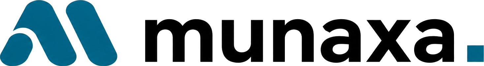

# Munaxa Design System

The visual language for the Munaxa School OS: a **violet / coral / aqua** palette on deep‑indigo
surfaces, geometric display type, mono numerics, and a first‑class **bilingual EN/AR (LTR/RTL)**
layout system with **light + dark** themes.

> **Source of truth = [`munaxadesignsystem/client/src/index.css`](../../munaxadesignsystem/client/src/index.css).**
> Every app derives its palette from that file: the shared Tailwind tokens in
> [`packages/config-tailwind/preset.ts`](../../packages/config-tailwind/preset.ts) and the per-app
> CSS variables ([`apps/admin/src/app/globals.css`](../../apps/admin/src/app/globals.css),
> `munaxalanding`, `munaxademo`) all mirror its brand. If anything ever disagrees with
> `munaxadesignsystem`, `munaxadesignsystem` wins.

## Files

| File | Purpose |
| --- | --- |
| [`munaxadesignsystem/`](../../munaxadesignsystem) | **The live reference.** Interactive app — toggle EN/ع (RTL) and Dark/Light; every token & component re-renders live. Tokens defined in [`client/src/index.css`](../../munaxadesignsystem/client/src/index.css). |
| [`../integrations/jofotara/finance-card-preview.html`](../integrations/jofotara/finance-card-preview.html) | Worked example: the Finance student card rendered from these tokens (EN/AR + light/dark). |

## Where it lives in code

| Concern | Location |
| --- | --- |
| Tailwind tokens (colors, radius, shadow, gradient, fonts) | `packages/config-tailwind/preset.ts` |
| CSS variables — light (`:root`) + dark (`.dark`) | `apps/admin/src/app/globals.css` |
| Fonts (Sora / Inter / JetBrains Mono via `next/font`) | `apps/admin/src/app/layout.tsx` |
| Theme + locale switch (☾/☀, EN/AR) | `apps/admin/src/components/theme-locale-toggle.tsx` |
| Shared UI kit | `apps/admin/src/components/ui/` |
| App shell (nav rail, top bar, RTL) | `apps/admin/src/components/app-shell.tsx` |

## Logo

The Munaxa logo is the teal **M** mark with the **munaxa▪** wordmark, supplied as a family of
lockups (each keyed to transparent, with a light-theme and a dark-theme — white-text — variant):

| Variant | File (design-system) | Where to use |
| --- | --- | --- |
| **Horizontal lockup** | `horizontal-lockup-{light,dark}.png` | Headers, nav, dashboards, all portals, API docs |
| **Primary / Stacked** | `primary-logo-{light,dark}.png`, `stacked-logo-{light,dark}.png` | Login, hero, splash, print (invoices, ID cards, letterhead) |
| **Wordmark** | `wordmark-{light,dark}.png` | Footers, email signature, legal pages |
| **Symbol (M mark)** | `symbol.png` (single, both themes) | Collapsed rail, loading/empty states, avatars, watermark |
| **App icon** | `app-icon.png` (teal tile) | Mobile / desktop / PWA launcher |
| **Favicon** | `favicon.png` (M mark) | Browser tab, tiny UI |

Apps show the matching theme variant automatically (a `dark:` CSS swap on web, `Theme.brightness`
on mobile). The symbol/app-icon/favicon are single teal assets that read on both themes.

- **Reusable component:** `apps/admin/src/components/logo.tsx` / `munaxademo/src/components/logo.tsx`
  (`<Logo variant="horizontal|stacked|wordmark|symbol" size={…} />`); landing uses
  `landing/src/components/site/wordmark.tsx`; mobile uses `munaxa_logo.dart`. All scale by **height**.
- **Web copies:** each app vendors downscaled PNGs in its `public/` (served `unoptimized` — the
  Cloudflare/OpenNext optimizer chokes on the full-res art).
- **Favicons / app icons** are generated from `favicon.png` (M mark → `favicon.ico`, `icon.png`)
  and `app-icon.png` (tile → `apple-icon.png`, mobile launcher) by `scripts/gen-icons.py`.

## Tokens

### Brand
| Token | Value | Notes |
| --- | --- | --- |
| `violet` / primary | `#7A3FFF` | primary brand; `violet.light` `#B97BFF` |
| `coral` | **dark `#FF8E6E` · light `#D9534F`** | theme‑aware |
| `aqua` | **dark `#4DF4E1` · light `#0D9488`** | theme‑aware |
| `grad-primary` | `linear-gradient(135deg,#7A3FFF,#B97BFF 60%,#FF8E6E 120%)` | primary buttons, logo, active nav |

`coral`/`aqua` are exposed to Tailwind as `hsl(var(--coral) / <alpha-value>)` so alpha modifiers
(`text-coral/40`, `bg-aqua/10`) work and the hue follows the active theme.

### Surfaces & text
| | Dark | Light |
| --- | --- | --- |
| bg | `#0B0518` | `#F7F5FF` |
| elevated | `#140A2E` | `#FFFFFF` |
| card | `#1A0F38` | `#FFFFFF` |
| card‑2 | `#221547` | `#F0ECFA` |
| fg / muted / dim | `#F4F0FF` / `#B5ACD4` / `#8B83A8` | `#1E0B4D` / `#5A4D7A` / `#8B80A8` |

Semantic shadcn tokens (`background`, `card`, `primary`, `secondary`, `muted`, `accent`,
`destructive`, `border`, `input`, `ring`) are HSL channels in `globals.css` and flip with the theme.

### Scale
- **Radius:** `sm 8px` · `md 14px` · `lg 22px` · `xl 32px`
- **Shadow:** `card` (soft elevation + inset hairline) · `glow` (violet primary glow)
- **Type:** display **Sora**, body **Inter**, mono **JetBrains Mono** (numbers, IDs, money, code)

## Components (UI kit)

`Button` (gradient / outline / ghost / destructive; sm/md/lg) · `Card` (+ Header/Title/Content/
Footer) · `Badge` (tones: `default` violet, `success` aqua, `warning` coral, `danger`, `muted`) ·
`Input` / `Select` · `Field` (mono micro‑label) · `Table` (THead/TBody/TR/TH/TD) · `Spinner`.
Pattern examples (KPI stat card, collections banner, money cell) are shown in the `munaxadesignsystem` reference.

## Bilingual & RTL rules

- Use **logical properties** (`*-inline-start/-end`, `text-align: start`) — never hard left/right.
- The locale toggle sets `dir="rtl"` on `<html>`; the whole app mirrors (nav rail, tables, forms).
- **Numbers, money, IDs and dates stay LTR** inside RTL (`direction:ltr; unicode-bidi:embed` on the
  mono utility). Provide both `nameEn` and `nameAr`; the Arabic block is always `dir="rtl"`.

## Usage rules

1. **Don't introduce new patterns** — compose existing UI‑kit components and tokens.
2. **Never hardcode hex** in components — use the Tailwind token classes so themes stay consistent.
   This is **lint-enforced**: an ESLint `no-restricted-syntax` rule in
   [`apps/admin/eslint.config.mjs`](../../apps/admin/eslint.config.mjs) errors on hex color
   literals in `src/**` (string or template), caught by `turbo lint` / CI.
3. Gradient is for **primary actions only** (and the logo / active nav); accents are for emphasis.
4. Money is always mono, **3‑dp JOD**, LTR.
